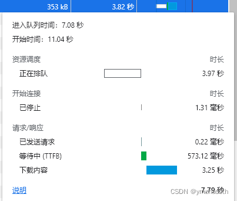

# js实现图片预加载

## 前言

网站如果包含很多图片等静态资源文件，那打包后的文件会非常大。不做处理会导致非常糟糕的浏览体验

## 一、图片处理

### 1、压缩

首先就是压缩静态资源的大小。相机照片一张就能轻松破10M，微信、钉钉等都会自动压缩图片视频。

[TinyPNG](https://tinypng.com/) : 傻瓜式操作，一键压缩，画质不变

[squoosh](https://squoosh.app/) : 简单好用的在线图片压缩工具，可选画质、尺寸等参数

[img-compressor](https://github.com/IronPans/img-compressor) : 一个简单高效的JS图片压缩库，项目中有上传图片的，可以控制图片体积，就像微信钉钉一样

图片过多时，效果受限，无法从根本上解决

### 2、云存储

将图片等资源存储在云上，使用外链方式引入

需先下载后加载，下载速度不能保证，体验可能仍然很糟糕

## 二、图片预加载

图片预加载就是在当前页面加载完毕后，预先加载其它页面所需的图片，这样，切换到该页面时，浏览器就不需要再去请求该图片，直接渲染即可



如上图所示，网络状况一般，清空浏览器缓存，首屏加载的情景下，一张353kB的图片加载时间是很长的

### 实现

参考：

> [3种Javascript图片预加载的方法详解](https://zhuanlan.zhihu.com/p/453000943)

以vue项目为例，window.onload完毕后，开始预加载图片

使用 [require.context](https://webpack.docschina.org/guides/dependency-management/#requirecontext) 批量引入图片

然后使用每一张图片：`new Image().src = curr_image`

```javascript
export default {
  name: 'App',
  created() {
    window.onload = () => {
      const firstPriorityImgs = require.context('@/assets/images/preload/first', false, /\.(jpg|jpeg|png)$/)
      const secondPriorityImgs = require.context('@/assets/images/preload/second', false, /\.(jpg|jpeg|png)$/)
      const otherImgs = require.context('@/assets/images/preload', false, /\.(jpg|jpeg|png)$/)
      const avatars = require.context('@/assets/images/avatars', false, /\.(jpg|jpeg|png)$/)
      this.preloadImg(firstPriorityImgs)
      this.preloadImg(secondPriorityImgs)
      this.preloadImg(avatars)
      this.preloadImg(otherImgs)
    }
  },
  methods: {
    preloadImg (preloadImgs) {
      preloadImgs?.keys()?.forEach(img => {
        new Image().src = preloadImgs(img)
      })
    }
  }
}
```

首屏包含的图片无需预加载，window.onload意味着文档及图片加载完毕，也就是说，首屏加载完毕时才会去执行上述的图片预加载代码

具体效果，可以使用浏览器调试工具查看

**注意**：将大量的图片都预加载，可能会阻塞后续的任务！

## 三、总结

适当的预加载图片可以提升用户体验，但它不会提高网站的性能

除了第一部分外，可以通过其它方式提高网站性能

### 懒加载

[HTMLImageElement.loading](https://developer.mozilla.org/zh-CN/docs/Web/API/HTMLImageElement/loading) : 图片可以通过设置 `loading` 属性值为 lazy 的方式，实现图片的懒加载（图片仅在马上要出现在可视视口中时开始加载）

``

### 延迟加载

> [图片延迟加载策略](https://juejin.cn/post/6844903469950697485)

首屏的加载速度至关重要，当首页的图片过多时，可以只加载首屏可见区域的图片，其它延迟加载

HTMLImageElement 本身的懒加载也是延迟加载

参考文章中的延迟加载策略，可以自定义一些策略，比如：

图片先全部使用默认图片替换

通过延迟、监听window.scroll事件替换上图片的真实url
