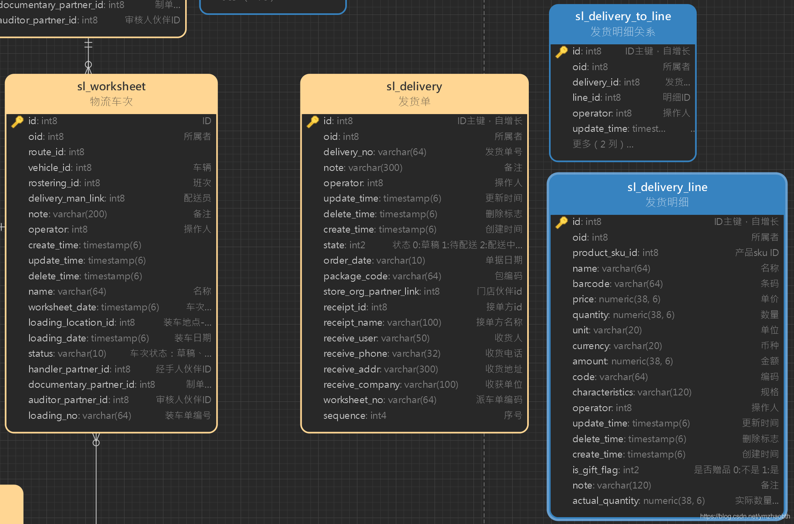
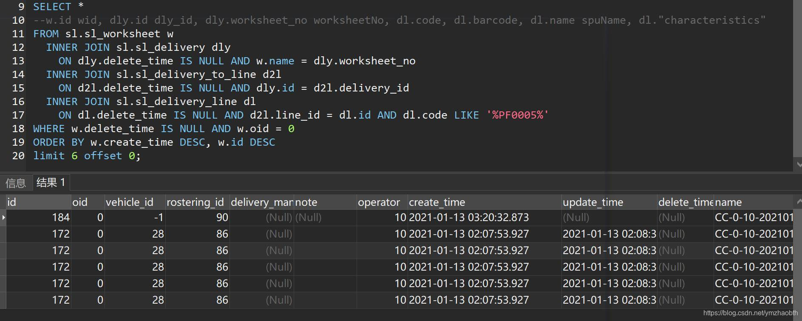

# 实例：MyBatis-Plus 自定义联表分页查询-动态 sql 实现

## 系列文章

[第一篇：实例：MyBatis-Plus 自定义分页查询](./custom-paged-query.md)

[第二篇：实例：MyBatis-Plus 自定义联表分页查询](./custom-paged-query-join-sql.md)

第三篇：实例：MyBatis-Plus 自定义联表分页查询-动态 sql 实现

## 一、简介

高级检索所检索的项中，往往会存在对若干关联表的检索。

拿具体的业务来举个例子

数据库模型如下图所示：

**派车单**(worksheet)关联若干**发货单**(delivery)、**车辆**(vehicle)

派车单高级检索功能，名称、派车日期等检索项在派车表内，但以所配送的具体产品编号(在 delivery_line 中)作为检索项时，就必须做相应联表查询。

联表查询简单，但高级检索中可能不仅仅只需要做一次联表查询（例中，还可能同时检索车辆表中的信息）。此时，如何手写 sql 来满足任何情况下的查询呢？mybatis 的动态 sql 可以！



## 二、关键代码

WorksheetServiceImpl.java:

```java
    /**
     * 派车单高级检索
     * @param param 检索项
     * @return
     */
    public IPage<WorksheetDetailsBean> queryWorksheet(SlWorksheetQueryExeParam param) throws Exception {
        Page<Worksheet> page1 = new Page<>(param.getPage(), param.getPagesize());
        return worksheetMapper.selectPageCusNew(page1, param);
    }
```

WorksheetMapper.java:

```java
    /**
     * 派车单高级检索
     * @param page1 分页对象
     * @param param 检索项
     * @return
     */
    IPage<WorksheetDetailsBean> selectPageCusNew(
            Page<Worksheet> page1,
            @Param("qryPm") SlWorksheetQueryExeParam param
    );
```

`WorksheetMapper.xml`:

出于需求，此 sql 查询结果映射到了另一个类。

否则，直接指定结果类就好。用 `resultType="com.xxxxx.api.model.WorksheetDetailsBean"` 代替 `resultMap="worksheetWithStoreAndSkuNum"`

```xml
    <select id="selectPageCusNew" resultMap="worksheetWithStoreAndSkuNum">
        SELECT DISTINCT w.* FROM sl.sl_worksheet w
        <if test="qryPm.vehicleNo != null and qryPm.vehicleNo != ''">
            INNER JOIN sl.sl_vehicle v
                ON v.delete_time IS NULL AND w.vehicle_id = v.id AND v.license LIKE '%${qryPm.vehicleNo}%'
        </if>
        <if test="qryPm.productCode != null and qryPm.productCode != ''
        or qryPm.productName != null and qryPm.productName != ''">
            INNER JOIN sl.sl_delivery dly
                ON dly.delete_time IS NULL AND w.name = dly.worksheet_no
            INNER JOIN sl.sl_delivery_to_line d2l
                ON d2l.delete_time IS NULL AND dly.id = d2l.delivery_id
            INNER JOIN sl.sl_delivery_line dl
                ON dl.delete_time IS NULL AND d2l.line_id = dl.id
                <if test="qryPm.productCode != null and qryPm.productCode != ''">
                    AND dl.code LIKE '%${qryPm.productCode}%'
                </if>
                <if test="qryPm.productName != null and qryPm.productName != ''">
                    AND dl.name LIKE '%${qryPm.productName}%'
                </if>
        </if>
        WHERE w.delete_time IS NULL AND w.oid = #{qryPm.oid}
        <if test="qryPm.rosteringId != null"> AND w.rostering_id = #{qryPm.rosteringId}</if>
        <if test="qryPm.state != null and qryPm.state != ''"> AND w.status = #{qryPm.state}</if>
        <if test="qryPm.handlerPartnerIdList != null"> AND w.handler_partner_id IN
            <foreach collection="qryPm.handlerPartnerIdList" item="handlerPid" open="(" close=")" separator=",">
                #{handlerPid}
            </foreach>
        </if>
        <if test="qryPm.startCreateTime != null and qryPm.endCreateTime != null">
            AND w.create_time BETWEEN #{qryPm.startCreateTime} AND #{qryPm.endCreateTime}
        </if>
        <if test="qryPm.worksheetName != null and qryPm.worksheetName != ''">
            AND w.name LIKE '%${qryPm.worksheetName}%'
        </if>
        ORDER BY w.create_time DESC, w.id DESC
    </select>
```

通过 if 标签添加每一项检索

## 三、总结

xml 自定义 sql 中，通过 mybatis 的动态 sql（`<if>`标签）判断是否需要联表查询。有两处联表查询，分别检索派车单关联的车辆及配送产品。

上述实例联表查询的结果会产生重复问题，需使用 `DISTINCT w.*` 去重。

当然，如非此例的针对派车单的查询，无需去重。



此例中，动态 sql 的意义在于处理复杂的高级检索功能、提供统一的对外接口

> MyBatis 相关教程：
>
> [MyBatis 教程](https://mybatis.org/mybatis-3/zh/)
>
> [MyBatis-Plus 官方文档](https://mp.baomidou.com/guide/)
