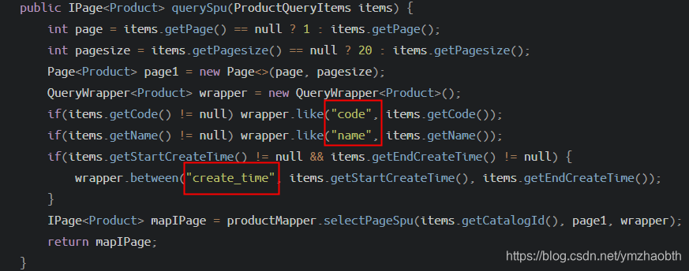
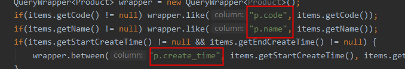

# 实例：MyBatis-Plus 自定义联表分页查询

## 系列文章

[第一篇：实例：MyBatis-Plus 自定义分页查询](./custom-paged-query.md)

第二篇：实例：MyBatis-Plus 自定义联表分页查询

[第三篇：实例：MyBatis-Plus 自定义联表分页查询-动态 sql 实现](./custom-paged-query-join-sql.md)

> 上一篇文章简单示范自定义分页查询，可通过 QueryWrapper 自由添加条件查询。也可以在 xml 中自定义 sql 语句。
>
> 复杂的自定义连表分页查询，就不是那么随意了。
>
> 此篇文章的做法已被本人弃用，更简洁规范的做法可以参考此系列文章第三篇。

## 一、关键代码

- ProductServiceImpl.java

```java
    @Override
    public IPage<Product> querySpu(ProductQueryItems items) {
        Page<Product> page1 = new Page<>(items.getPage(), items.getPagesize());
        QueryWrapper<Product> wrapper = new QueryWrapper<Product>();
        if(items.getCode() != null && items.getCode().trim() != "") wrapper.like("code", items.getCode());
        if(items.getName() != null && items.getName().trim() != "") wrapper.like("name", items.getName());
        if(items.getStartCreateTime() != null && items.getEndCreateTime() != null) {
            wrapper.between("create_time", items.getStartCreateTime(), items.getEndCreateTime());
        }
        IPage<Product> mapIPage = productMapper.selectPageSpu(items.getCatalogId(), page1, wrapper);
        return mapIPage;
    }
```

- ProductMapper.java

```java
public interface ProductMapper extends BaseMapper<Product> {

 IPage<Product> selectPageSpu(@Param("cid") Long catalogId, IPage<Product> page,
  @Param(Constants.WRAPPER) Wrapper<Product> queryWrapper);
}

```

- ProductMapper.xml

```sql
<select id="selectPageSpu" resultType="Product">
    SELECT p.* FROM pd.pd_product p
        inner join pd.pd_product_catalog pc
            on p.id=pc.product_id and pc.delete_time isnull
            inner join pd.pd_catalog c
                on pc.catalog_id=c.id and c.id=#{cid} and c.delete_time isnull
    ${ew.customSqlSegment}
</select>
```

customSqlSegment 中，我们添加了对 name,code 的查询，但此时会报错，表示 name,code 指代模糊。

_org.postgresql.util.PSQLException: ERROR: column reference "name" is ambiguous_

即，sql 中所需的是 `WHERE p.name LIKE ? AND p.code LIKE ?`

再看看，我们的 customSqlSegment 是如何定义的：



而 `${ew.customSqlSegment}` 给我们拼接的实际上是 `WHERE name LIKE ? AND code LIKE ?`

所以，为了匹配别名，手动加上 xml 中定义的别名即可



## 二、总结

上述做法虽然也能达成目标，不过不够规范，代码繁琐。通过学习 mybatis 的动态 sql 后，发现完全可以用它来实现联表的分页查询。

> MyBatis 相关教程：
>
> [MyBatis 教程](https://mybatis.org/mybatis-3/zh/)
>
> [MyBatis-Plus 官方文档](https://mp.baomidou.com/guide/)
