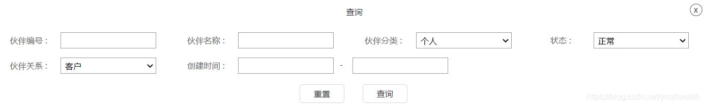

# 实例：MyBatis-Plus自定义分页查询

## 系列文章

第一篇：实例：MyBatis-Plus自定义分页查询

[第二篇：实例：MyBatis-Plus自定义连表分页查询](./custom-paged-query-join.md)

[第三篇：实例：MyBatis-Plus自定义连表分页查询-动态sql实现](./custom-paged-query-join-sql.md)

> MP分页相关博文：
>
> [MyBatis-Plus 分页查询以及自定义sql分页](https://blog.csdn.net/weixin_38111957/article/details/91554108)
>
> [MyBatis-Plus 分页插件使用，自带分页及xml分页的使用](https://blog.csdn.net/qq_31275085/article/details/86716909)
>
> [条件构造器](https://mp.baomidou.com/guide/wrapper.html)：利用MP的条件构造器可以自由添加、组合各种基本查询。

## 一、需求

要求实现一个多条件查询接口：


## 二、条件参数类

定义一个POST类型的请求，查询条件及分页参数都包含在条件参数类中。

```java
package com.xxxxx.xxx.xxxx;

import com.fasterxml.jackson.annotation.JsonFormat;
import lombok.Data;
import lombok.EqualsAndHashCode;
import java.time.LocalDateTime;

@Data
@EqualsAndHashCode(callSuper = false)
@ApiModel(value = "伙伴检索条件", description = "")
public class PartnerQueryItems {

    private Integer page = 1;          // 页数
    private Integer pagesize = 20;     // 页容量
    private String code;               // 编号
    private String name;               // 名称
    private Boolean isOrgan;           // 分类
    private String state;              // 状态
    private String relation;           // 关系
    @JsonFormat(shape = JsonFormat.Shape.STRING, pattern = "yyyy-MM-dd HH:mm", timezone = "GMT+8")
    private LocalDateTime startTime;   // 开始时间
    @JsonFormat(shape = JsonFormat.Shape.STRING, pattern = "yyyy-MM-dd HH:mm", timezone = "GMT+8")
    private LocalDateTime endTime;     // 结束时间
}

```

## 三、关键代码

- PartnerController.java

```java
@RequestMapping(value = "/query", method = RequestMethod.POST)
public IPage<Partner> queryPartner(@RequestBody @Valid PartnerQueryItems items) {
    return iPartnerService.queryPartner(items);
}
```

- PartnerServiceImpl.java

```java
@Override
public IPage<Partner> queryPartner(PartnerQueryItems items) {
    Page<Partner> page1 = new Page<>(items.getPage(), items.getPagesize());
    QueryWrapper<Partner> wrapper = new QueryWrapper<Partner>();
    // MP条件构造器
	if(items.getCode() != null && items.getCode().trim() != "") wrapper.like("code", items.getCode());
    if(items.getName() != null && items.getName().trim() != "") wrapper.like("name", items.getName());
    if(items.getIsOrgan() != null) wrapper.eq("is_organ", items.getIsOrgan());
    if(items.getState() != null && items.getState().trim() != "") wrapper.eq("state", items.getState());
	if(items.getRelation() != null && items.getRelation().trim() != "") wrapper.eq("relation", items.getRelation());
    if(items.getStartTime() != null && items.getEndTime() != null) {
        wrapper.between("create_time", items.getStartTime(), items.getEndTime());
    }
    return partnerMapper.selectPagePartner(page1, wrapper);
}
```

- PartnerMapper.java

```java
public interface PartnerMapper extends BaseMapper<Partner> {
    IPage<Partner> selectPagePartner(IPage<Partner> page, @Param(Constants.WRAPPER) Wrapper<Partner> queryWrapper);
}
```

- PartnerMapper.xml

```sql
<?xml version="1.0" encoding="UTF-8"?>
<!DOCTYPE mapper PUBLIC "-//mybatis.org//DTD Mapper 3.0//EN" "http://mybatis.org/dtd/mybatis-3-mapper.dtd">
<mapper namespace="com.xxxxx.xxx.mapper.PartnerMapper">
    <select id="selectPagePartner" resultType="Partner">
        SELECT * FROM org.org_partner ${ew.customSqlSegment}
    </select>
</mapper>
```

## 四、总结

上述例子仅仅只是单表查询，MP的封装方法selectPage()完全可以胜任，也就不需要去自定义分页查询了。但当sql并非简单的单表查询，或者需要做映射处理时（resultMap），selectPage就不够用了。

或者，像下面这样，映射到bean：

```java
// PartnerMapper.java:
IPage<PartnerParam> selectPagedPartnerParam(IPage<Partner> page, @Param(Constants.WRAPPER) Wrapper<Partner> wrapper);

// PartnerMapper.xml: 
<select id="selectPagedPartnerParam" resultType="com.xxxxxx.api.model.PartnerParam">
    SELECT * FROM org.org_partner ${ew.customSqlSegment}
</select>
```

如有多表查询等复杂需求，可自行在mapper.xml中编写对应sql语句。

> MyBatis相关教程：
>
> [MyBatis教程](https://mybatis.org/mybatis-3/zh/)
>
> [MyBatis-Plus官方文档](https://mp.baomidou.com/guide/)