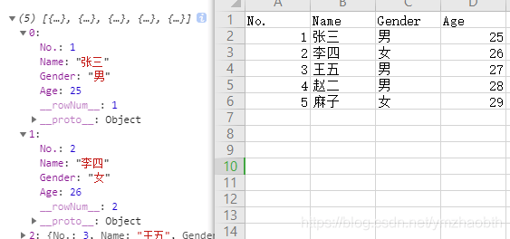
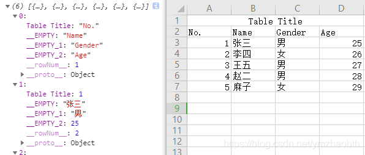
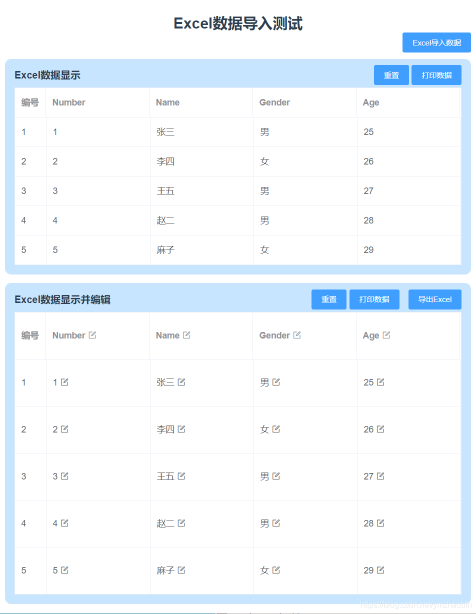
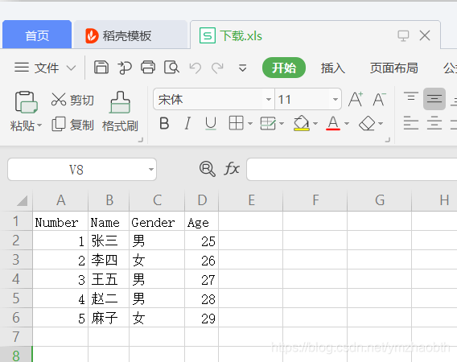

# 导入Excel数据以及导出表格数据成Excel

[Git仓库地址](https://github.com/zymbth/Editable_table)

更规范的excel导出功能参考另一篇文章[xlsx导出excel功能封装，按需引入并可在vue等现代化框架中使用](/front-end/others/xlsx-export-excel)

## 一、导入Excel数据

从本地Excel中导入已有的数据，以免去手动复制粘贴的麻烦

**环境**：`vue2` + `element-ui`

关键代码如下：

先是elementUI的上传控件，设置action, http-request等标签属性。由于不需要直接发请求上传到服务器，还不需要考虑跨域问题。

```javascript
<el-upload
 class="upload-excel"
 action=""
 :multiple="false"
 :show-file-list="false"
 :http-request="httpRequest"
 accept="csv, application/vnd.ms-excel, application/vnd.openxmlformats-officedocument.spreadsheetml.sheet">
 <el-button size="small" type="primary">Excel导入数据</el-button>
</el-upload>
```

“httpRequest”是自定义方法，用来处理文件中的数据
另外，需要安装 file-saver 和 xlsx

```bash
npm install -S file-saver xlsx
```

main.js中引入依赖

```javascript
import XLSX from 'xlsx'
Vue.use(XLSX)
```

```javascript
httpRequest(e) {
 var _this = this;
 var rABS = false; //是否将文件读取为二进制字符串
 let f = e.file // 文件信息
 if(!f) return false;
 else if(!/\.(xls|xlsx)$/.test(f.name.toLowerCase())) {
  this.$message.error('上传格式不正确，请上传xls或者xlsx格式')
  return false
 }

 var reader = new FileReader();
 FileReader.prototype.readAsBinaryString = function(f) {
  var binary = "";
  var rABS = false; //是否将文件读取为二进制字符串
  var wb; //读取完成的数据
  var outdata;
  var reader = new FileReader();
  reader.onload = function(e) {
   var bytes = new Uint8Array(reader.result);
   var length = bytes.byteLength;
   for(var i = 0; i < length; i++) binary += String.fromCharCode(bytes[i]);
   var XLSX = require('xlsx');
   if(rABS) wb = XLSX.read(btoa(fixdata(binary)), {type: 'base64'}); //手动转化
   else wb = XLSX.read(binary, { type: 'binary' });
   outdata = XLSX.utils.sheet_to_json(wb.Sheets[wb.SheetNames[0]], {defval: ''}); //outdata的格式可打印了自行查看
   // 以下是对outdata的格式化，可按个人需要自行转换
   outdata.map((p, idx)=> {
    // ...
   })
  }
  reader.readAsArrayBuffer(f);
 }
 if(rABS) reader.readAsArrayBuffer(f);
 else reader.readAsBinaryString(f);
},
```

- 表数据、outdata数据如下，可以看到，是按行输出的，每行是一个数据对象，其属性名取自第一行

- 如果Excel格式不标准的话，会像这样：

- 转换成自己想要的格式并显示


## 二、导出Excel

导出表格数据成Excel，用的多的话，还是封装下吧，封装方案网上很多



如图所示，实现导出excel功能（表格可编辑的实现见我的另一篇博文：[vue + elementUI动态生成表格，并实现内容可编辑](../../element-plus/editable-table.md)）

```javascript
getExcel(tCols, tDatas){
  // 传入列以及数据数组, 例如：['name','gender','age'], [[‘John’,'male',22],['Jolie','female',24]]
  //列标题
     var str = '<tr>';
     tCols.forEach(p => {
      str += `<td>${p}</td>`
     })
     str += '</tr>';
     //循环遍历，每行加入tr标签，每个单元格加td标签
     for(let i = 0 ; i < tDatas.length ; i++ ){
       str+='<tr>';
       tDatas[i].forEach(p => {
        str+=`<td>${p + '\t'}</td>`; //增加\t为了不让表格显示科学计数法或者其他格式
       })
       str+='</tr>';
     }
     //Worksheet名
     var worksheet = 'Sheet1'
     var uri = 'data:application/vnd.ms-excel;base64,';

     //下载的表格模板数据
     var template = `<html xmlns:o="urn:schemas-microsoft-com:office:office" 
     xmlns:x="urn:schemas-microsoft-com:office:excel" 
     xmlns="http://www.w3.org/TR/REC-html40">
     <head><!--[if gte mso 9]><xml><x:ExcelWorkbook><x:ExcelWorksheets><x:ExcelWorksheet>
       <x:Name>${worksheet}</x:Name>
       <x:WorksheetOptions><x:DisplayGridlines/></x:WorksheetOptions></x:ExcelWorksheet>
       </x:ExcelWorksheets></x:ExcelWorkbook></xml><![endif]-->
       </head><body><table>${str}</table></body></html>`;
     //下载模板
     window.location.href = uri + this.base64(template)
},
//输出base64编码
base64 (s) { return window.btoa(unescape(encodeURIComponent(s))) }
```


