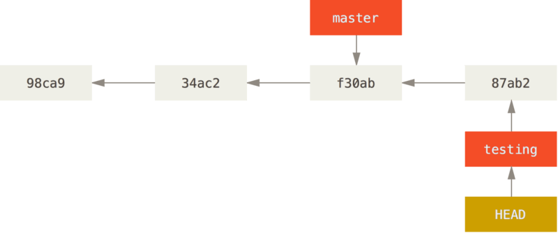
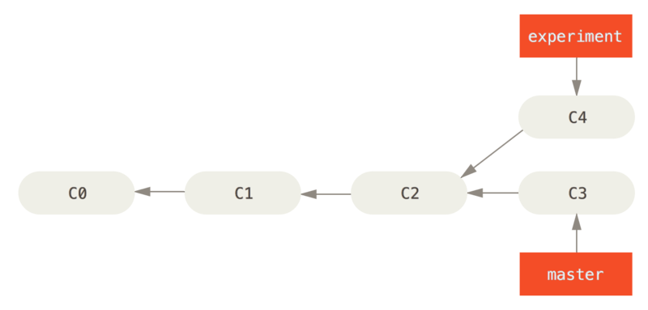
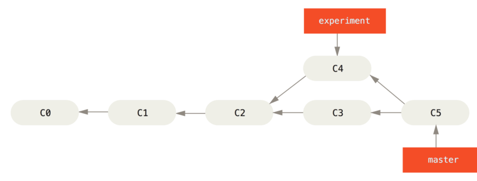
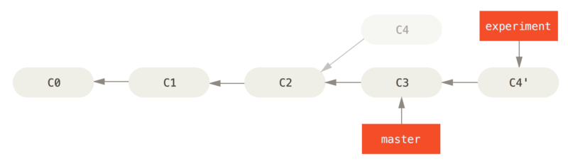
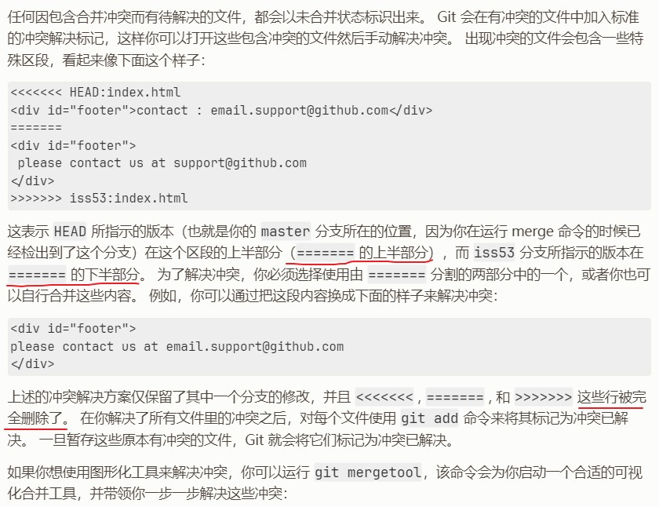

# Git基本使用

> 参考链接:
>
> [Git Book](https://git-scm.com/book/zh/v2)：有时间建议重点学习此书
>
> [Git教程 - 易百教程](https://www.yiibai.com/git)
>
> [Git 教程 - 廖雪峰](https://www.liaoxuefeng.com/wiki/896043488029600/896954848507552)

作为一名程序员，Git最基本的操作与概念必须掌握。

## 基本概念

对git很熟练的可以跳过本节

### 1. 分支

#### 1.1 简单介绍

分支可以说是Git的“必杀技”了，熟练得运用分支可以让你轻松管理版本库、老版本bug修复与现版本开发并行、等等。

**commit**可以视作一个提交对象，其中包含一个指向上次提交对象（父对象）的指针。
Git 的**分支**，其实本质上仅仅是指向提交对象的可变指针， 分支会在每次提交时自动向前移动。
**HEAD** 指向当前所在的分支。

> “Git 的 master 分支并不是一个特殊分支。 它就跟其它分支完全没有区别。 之所以几乎每一个仓库都有 master 分支，是因为 git init 命令默认创建它，并且大多数人都懒得去改动它。”

借用一张Git Book的图，展示提交、分支及其关系：



#### 1.2 基本命令

查看分支

`git branch`

`git branch -a`

创建本地分支：

`git branch my-branch`

- 切换分支：

`git checkout my-branch`

- 创建并切换到本地分支：
`git checkout -b my-branch`

创建远程分支：

两种：

- 创建本地分支、推送到远程：

`git checkout -b my-branch`

`git push origin my-branch:my-branch`

- 远程先开好分支然后拉到本地：

`git checkout -b my-branch origin/my-branch`

合并分支到当前分支

`git merge <name>`

删除分支

`git branch -d <name>`

删除远程分支（不会删除本地分支）

`git branch -r -d origin/<name>`

`git push origin :<name>`

### 2. 标签

#### 2.1 简单介绍

标签用来标记版本库，可通过标签直接找到指定的版本。相对于commit，标签是指向某个commit的指针，通过标签名查找commit要比直接查找commit方便得多。

#### 2.2 基本命令

查看标签：

`git tag`

创建标签：

`git tag v0.1`

创建附注标签：

`git tag -a v0.1 -m "my version 0.1"`

推送标签：

`git push origin v0.1`

删除本地标签：

`git tag -d v0.1`

删除远程标签：

`git push origin :v0.1`

### 3. 变基

#### 3.1 语法

> [git rebase命令 - 易百教程](https://www.yiibai.com/git/git_rebase.html)

语法

```shell
git rebase [-i | --interactive] [options] [--exec <cmd>] [--onto <newbase>]
    [<upstream> [<branch>]]
git rebase [-i | --interactive] [options] [--exec <cmd>] [--onto <newbase>]
    --root [<branch>]
git rebase --continue | --skip | --abort | --quit | --edit-todo
```

`--continue`: 在rebase的过程中，也许会出现冲突(conflict)。在这种情况，Git会停止rebase并会让你去解决冲突。在解决完冲突后，用 `git add` 命令去更新这些内容的索引(index)，然后，无需执行 `git commit`，只要执行 `git rebase --continue` 这样git会继续应用(apply)余下的补丁。

`--edit-todo`: 重新查看和编辑。

`--abort`: 在任何时候，可以用 --abort 参数来终止rebase的操作，分支会回到rebase开始前的状态。

#### 3.2 应用

##### rebase vs merge

>*“在 Git 中整合来自不同分支的修改主要有两种方法：merge 以及 rebase。”* —— [Git - 变基](https://git-scm.com/book/zh/v2/Git-%E5%88%86%E6%94%AF-%E5%8F%98%E5%9F%BA)

示例：将experiment分支整合到master分支



**方法一：使用 `merge`**

`git checkout master`

`git merge experiment`



**方法二：使用 `rebase`**

变基`rebase`是有别于`merge`的一种分支整合方式：提取在分支中引入的补丁和修改，然后在目标分支的基础上应用一次

检出 experiment 分支，然后将它变基到 master 分支上：

`git checkout experiment`

`git rebase master`



**对比**

>*“无论是通过变基，还是通过三方合并，整合的最终结果所指向的快照始终是一样的，只不过提交历史不同罢了。 变基是将一系列提交按照原有次序依次应用到另一分支上，而合并是把最终结果合在一起。<br/>
> 这两种整合方法的最终结果没有任何区别，但是变基使得提交历史更加整洁。 你在查看一个经过变基的分支的历史记录时会发现，尽管实际的开发工作是并行的， 但它们看上去就像是串行的一样，提交历史是一条直线没有分叉。<br/>
> 一般我们这样做的目的是为了确保在向远程分支推送时能保持提交历史的整洁——例如向某个其他人维护的项目贡献代码时。 在这种情况下，你首先在自己的分支里进行开发，当开发完成时你需要先将你的代码变基到 origin/master 上，然后再向主项目提交修改。 这样的话，该项目的维护者就不再需要进行整合工作，只需要快进合并便可。”*

##### 拷贝部分改动

示例：取出 client 分支，找出它从 server 分支分歧之后的补丁， 然后把这些补丁在 master 分支上重放一遍，让 client 看起来像直接基于 master 修改一样

**方法一：使用 `rebase`**

`git rebase --onto master server client`

**方法二：使用 `cherry-pick`**

此需求 `git cherry-pick` 也能实现，它的作用就是将指定的提交（commit）应用于其他分支

> [git cherry-pick 教程 - 阮一峰的网络日志](https://ruanyifeng.com/blog/2020/04/git-cherry-pick.html)

转移一个提交：`git cherry-pick <commitHash>`

转移多个提交：`git cherry-pick <HashA> <HashB>`

转移从 A 到 B 的所有提交：`git cherry-pick A..B`

转移从 A(不包含A) 到 B 的所有提交：`git cherry-pick A^..B`

虽然都能实现，但从理解难易程度以及使用习惯上来讲，个人更常用的是后者

## 仓库连接问题

由于众所周知的原因，国内访问github是需要点技巧的。连接不上仓库，啥都白搭

- 方案一：使用gitee替换github

虽然码云行事有点难以形容，但仅作远程仓库来管理个人项目或小公司小项目的话是没什么问题的，注重私密性的都会公司内网搭建(如gitlab)代码仓库，也不存在连接问题。

- 方案二：使用ssh连接而不是https

ssh连接不会被墙，而后者会。参阅官方文档[通过 SSH 连接到 GitHub](https://docs.github.com/zh/authentication/connecting-to-github-with-ssh)，另外说一句，码云的ssh连接方式与github完全相同😄

具体参阅官网或自行关键字搜索。总的来说就是，本地生成ssh密钥，公钥+私钥。将公钥添加到仓库上对应 setting 中，本地启动 `ssh-agent` 并将私钥添加到 `ssh-agent`。

别人开源的项目fork到自己的仓库中，就可以使用ssh连接了。

- 方案三：本地hosts更新

此方案不总能生效，允许的话，建议选择前两种方案。

参考：[GitHub 访问不了？教你几招轻松解决](https://zhuanlan.zhihu.com/p/358183268)

[GitHub520](https://github.com/521xueweihan/GitHub520): 自动方式更新host，下载 [SwitchHosts](https://github.com/oldj/SwitchHosts/releases/tag/v4.1.2)，例如: SwitchHosts_windows_installer_x64_4.1.2.6086.exe

> 添加配置：
>
> Title: 随意
>
> Type: Remote
>
> URL: `https://raw.hellogithub.com/hosts`
>
> Auto Refresh: 最好选 1 hour

问题：[github可以ping通，但是无法正常访问](https://zhuanlan.zhihu.com/p/356817630)

解决方案：使用命令 `ipconfig /flushdns`，刷新dns即可

## 案例分析

### 1. 初始提交

将本地项目首次上传到已建好的git仓库中

```bash
# 在本地项目中使用 Git 初始化仓库（如果尚未完成）
git init
# 将本地代码提交到本地 Git 仓库中
git add .
git commit -m "first commit"
# 在 GitHub 上创建一个新的空仓库，但不要在仓库中添加任何文件
# 将 GitHub 仓库的 URL 添加为本地 Git 仓库的远程地址（假设您的远程名称是 origin）
git remote add origin <repo-url>
# 将本地 Git 仓库中的代码推送到远程 GitHub 仓库
# 如果您想将本地分支推送到不同的远程分支
# 请使用命令 git push <远程名称> <本地分支名称>:<远程分支名称>
git push -u origin master
```

如果远程仓库**不为空**，需要**合并**处理。

如果只是不小心在创建远程代码仓库时添加了 readme/lisence/.gitignore 等文件，可重新建一个空项目，再按上面的初始提交步骤操作最简单。

```bash {4,13}
git init
git remote add origin <repo-url>
# 将init后，当前的分支名更改下
git branch -m local-master
git add .
git commit -m "first commit"
# 获取远程分支
git fetch origin
# 切换到远程主分支
git checkout -b master origin/master
# 合并本地与远程主分支
# 由于两个分支无共同祖先，需要加上 --allow-unrelated-histories
git merge --allow-unrelated-histories local-master
# 解决冲突，无冲突 :wq 退出交互UI
git push
```

### 2. 冲突处理

参照Git Book - [分支的新建与合并](https://git-scm.com/book/zh/v2/Git-%E5%88%86%E6%94%AF-%E5%88%86%E6%94%AF%E7%9A%84%E6%96%B0%E5%BB%BA%E4%B8%8E%E5%90%88%E5%B9%B6)：



### 3. 临时任务

开发中会出现一种情况，手头上的功能还没完成，就有计划外的任务出现，并且优先级更高。例如：bug修复、更紧急的功能等等

我们希望实现的一般是：暂停当前开发任务 --> 处理临时任务 --> 然后回来继续开发任务。若该任务对当前开发有影响，处理之。

这里只讨论如何暂停、继续当前开发任务

- **git stash**

> [Git 工具 - 贮藏与清理](https://git-scm.com/book/zh/v2/Git-%E5%B7%A5%E5%85%B7-%E8%B4%AE%E8%97%8F%E4%B8%8E%E6%B8%85%E7%90%86)
>
> [git stash 用法总结和注意点](https://www.cnblogs.com/zndxall/archive/2018/09/04/9586088.html)

简单的方法写在前面

使用`git stash`，更规范的方法来存储本地更改。

**注意**：

`git stash` 只能存储本地未提交的更改

恢复存储的代码时，可能会产生冲突，需手动处理冲突

- **分支**

本地存储是个非常便利的办法，但如果两个任务需要并行开发，那就无法使用本地存储了。

简单高效可靠的办法Git早就告诉我们了，运用分支。

***“Git切换分支时，如果本地有未提交的代码，这部分改动会被移动到切换后分支上。”***

基于这个特性，如果起点刚好为上一次提交，可以直接创建并切换到本地分支：`git checkout -b <分支名>`

> 在指定commit创建分支：`git branch <分支名> <COMMIT-ID>`
>
> 在指定tag创建分支：`git branch <分支名> <TAG-NAME>`

**注意**：

临时分支随着任务结束，要及时删除。若推送到了远程代码仓库，自己不删，别人不确认无用后，也不敢删。

长期存在的分支都有各自的用处，不及时清理临时分支的话，会给版本控制带来不必要的麻烦。

### 4. 撤销操作 reset

参考：

> [git代码提交了怎么撤回提交](https://blog.csdn.net/weixin_53138343/article/details/123418190)
>
> [git 删除/回退本地提交](https://www.cnblogs.com/xwgli/p/12194483.html)

- 撤销本地暂存的文件(未git add)

`git checkout -- demo.js`

这样，demo.js的更改会被撤销（**无法再找回**）

- 撤销已暂存未提交的文件

`git reset HEAD demo.js`

这样，demo.js的暂存会回到工作区，文件内容不会被改动

- 已提交

参数 --hard --soft --mixed

`git reset --mixed [提交id]`

`git reset --mixed HEAD~1`

`git reset --mixed commit_id`

### 5. 修改commit

> [GIT 修改commit message](https://blog.csdn.net/weixin_39709292/article/details/124467997)

### 6. 合并多条commit

> [Git 合并多个 commit，保持历史简洁](https://cloud.tencent.com/developer/article/1690638)
>
> [git 合并多个commit](https://www.cnblogs.com/xiaodi-js/p/11065175.html)

`git rebase -i  [commitid]`    会合并此次提交之后所有的提交为一个提交， 注意此次提交不会包含在内

> 说明：
>
> `-i`（--interactive）：弹出交互式的界面进行编辑合并
>
> `[commitid]`：要合并多个版本之前的版本号，注意：[commitid] 本身不参与合并
>
> 指令解释（交互编辑时使用）：
>
> `p`: pick = use commit
>
> `r`: reword = use commit, but edit the commit message
>
> `e`: edit = use commit, but stop for amending
>
> `s`: squash = use commit, but meld into previous commit
>
> `f`: fixup = like "squash", but discard this commit's log message
>
> `x`: exec = run command (the rest of the line) using shell
>
> `d`: drop = remove commit

**注意**：执行合并命令后，并不会直接合并，会弹出交互式的界面，需要手动处理，编辑合并信息：

> vim相关命令：
>
> 按 `i` 进入编辑模式，可以移动光标，编辑
>
> 按 `Esc` 退出编辑模式
>
> 输入 `:wq` 保存并退出（需先退出编辑模式）

例如：

```bash
$ git rebase -i 02a213d
pick 08ad2fb message2
pick a616604 message3
pick a1626f5 message4

# 后面还有注释信息，不用编辑
```

编辑后：

```bash
$ git rebase -i 02a213d
pick 08ad2fb 合并提交
f a616604 message3
f a1626f5 message4

# 后面还有注释信息，不用编辑
```

在 git rebase 过程中，可能会存在冲突，需要解决冲突

解决冲突之后，本地提交: `git add .`

继续rebase: `git rebase --continue`

在任何时候，可以用 --abort 参数来终止rebase的操作，分支会回到rebase开始前的状态（`git rebase --abort`）

注意：如果操作的提交部分已提交远程分支，则需要拉取远程分支做一次合并（可在 rebase 成功后输入 `git status` 查看状态及提示）
