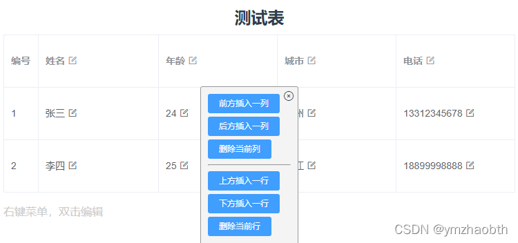
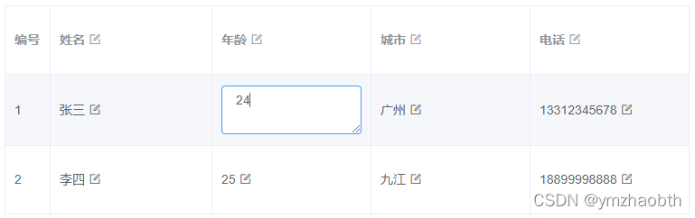
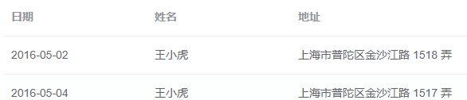
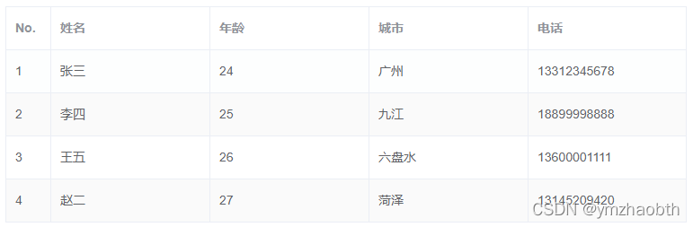
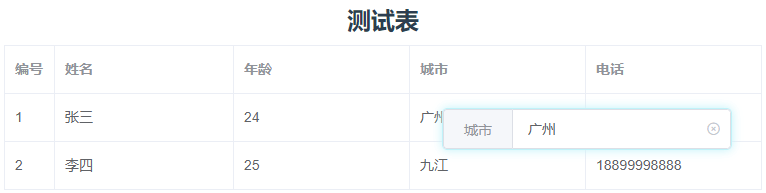
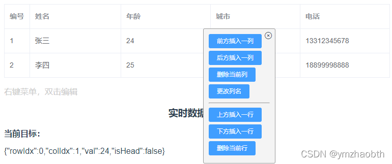

# vue3 + Element Plus动态生成表格，并实现内容可编辑

## 前言

第一个思路得自于网友的讨论，将单元格数据转对象，通过添加控制属性实现编辑状态与显示状态的切换。尽管思路简单，但实现的过程有些看着头大，不够简洁优美。采用这种方法的话，建议浏览了解后自行理清思路实现。

前段时间看到同事在类似问题上找了一个插件，简单得通过一个输入框就实现了对所有数据的编辑。仔细想想，只要能实现数据的“定位”，这种思路在实现过程上显得更加友好。

注意，示例基于 `vue3` & `element-plus@1.1.0-beta.12`，高版本的 `element-plus` 中图标引入方式不同

> 代码仓库：[editable-table](https://github.com/zymbth/editable-table)
>
> [Github Page](https://zymbth.github.io/editable-table/)
>
> [在线演示 - 方案一](https://codepen.io/zymbth/full/BaJpvoO)
>
> [在线演示 - 方案二](https://codepen.io/zymbth/full/gOogZMK)

**注意**：示例项目及文章写于2020年，基于 `vue2` & `element-ui`，后来更新至 `vue3` & `element-plus`，老版本在分支vue2上。由于只是demo，介绍解决方案方便理解与讨论，上生产环境的话肯定存在一些bug，有些必要的会修复，不必要的还请大家自行本地调试😉

## 一、思路一：单元格数据转对象

将单元格数据转换成对象，添加show属性，控制/切换显示与编辑模式

最终效果如下，可自由编辑表头、数据单元格，增删行列，并保持数据绑定




::: details 在线演示

<ClientOnly>
  <iframe height="500" style="width: 100%;" scrolling="no" title="Editable Table V1 (vue3 &amp; Element Plus)" src="https://codepen.io/zymbth/embed/preview/BaJpvoO?default-tab=result&editable=true" frameborder="no" loading="lazy" allowtransparency="true" allowfullscreen="true">
    See the Pen <a href="https://codepen.io/zymbth/pen/BaJpvoO">
    Editable Table V1 (vue3 &amp; Element Plus)</a> by zymbth (<a href="https://codepen.io/zymbth">@zymbth</a>)
    on <a href="https://codepen.io">CodePen</a>.
  </iframe>
</ClientOnly>

:::

### 1.1 首先最基本的，根据数据生成固定表项的表格

从官网摘个Demo过来：

```javascript
tableData: [
  {date: '2016-05-02', name: '王小虎', address: '上海市普陀区金沙江路 1518 弄'},
  {date: '2016-05-04', name: '王小虎', address: '上海市普陀区金沙江路 1517 弄'}
]
```

```html
<el-table :data="tableData" style="width: 100%">
  <el-table-column prop="date" label="日期" width="180"></el-table-column>
  <el-table-column prop="name" label="姓名" width="180"></el-table-column>
  <el-table-column prop="address" label="地址"></el-table-column>
</el-table>
```



### 1.2 动态生成表项

常用的写法：

```javascript
columnList: [
  { prop: "name", label: '姓名' },
  { prop: "age", label: '年龄' },
  { prop: "city", label: '城市' },
  { prop: "tel", label: '电话' }
],
testDatas: [
  {No: 1, name: '张三', age: 24, city: '广州', tel: '13312345678'},
  {No: 2, name: '李四', age: 25, city: '九江', tel: '18899998888'},
  {No: 3, name: '王五', age: 26, city: '六盘水', tel: '13600001111'},
  {No: 4, name: '赵二', age: 27, city: '菏泽', tel: '13145209420'},
]
```

```html
<el-table :data="testDatas" border stripe style="width: 100%">
  <el-table-column type="index" label="No." :width="50"/>
  <el-table-column
    v-for="col in columnList"
    :prop="col.prop"
    :label="col.label"
    :key="col.prop"
  />
</el-table>
```



### 1.3 单元格可编辑

网上早有网友讨论过这个功能，这里采用的是将单元格数据转换成对象，添加属性show来控制其在文字与输入框间切换。听起来就不想下手，又要转换数据格式了。。
  
```javascript
// 表项（头），以键(prop)值(label)存储表头，值可改变，键不变用以绑定数据
columnList: [
  { prop: "name", label: 'name', show: true },
  { prop: "age", label: 'age', show: true },
  { prop: "city", label: 'city', show: true },
  { prop: "tel", label: 'tel', show: true }
],
// 数据
testDatas: [{
  name: { content: '张三', show: true },
  age: { content: 24, show: true },
  city: { content: '广州', show: true },
  tel: { content: '13312345678', show: true }
},{
  name: { content: '李四', show: true },
  age: { content: 25, show: true },
  city: { content: '九江', show: true },
  tel: { content: '18899998888', show: true }
}],
```

```html
<div class="tb-container" ref="tbContainerRef">
  <el-table :data="testDatas" border style="width: 100%">
    <!-- 额外添加的编号项（可删除） -->
    <el-table-column v-if="columnList.length > 0" type="index" :label="'编号'" :width="50"></el-table-column>
    <!-- 自定义表项 -->
    <el-table-column v-for="column in columnList" :key="column.prop">
      <!-- 自定义表头 -->
      <template #header>
        <!-- 段落：show为true -->
        <p v-show="column.show" @dblclick="$event => handleEdit(col, $event.target)">
          {{column.label}} 
          <i class="el-icon-edit-outline" @click="$event => handleEdit(col, $event.target.parentNode)"></i>
        </p>
        <!-- 输入框：show为false -->
        <el-input
          size="mini"
          v-show="!column.show"
          v-model="column.label"
          @blur="column.show = true">
        </el-input>
      </template>

      <!-- 自定义表项/单元格内容 -->
      <template #default="{ row }">
        <!-- 双击文字或点击修改图标以更改"show"属性 -->
        <!-- row为元数据，column.col为该列的'键' -->
        <p v-show="row[column.prop].show" @dblclick="$event => handleEdit(row[col.prop], $event.target)">
          {{row[column.prop].content}} 
          <i class="el-icon-edit-outline" @click="$event => handleEdit(row[col.prop], $event.target.parentNode)"/>
        </p>
        <!-- 失去焦点时更改"show"属性，显示文本 -->
        <el-input
          type="textarea"
          :autosize="{minRows:2,maxRows:4}"
          v-show="!row[column.prop].show"
          v-model="row[column.prop].content"
          @blur="row[column.prop].show=true"
        />
      </template>
    </el-table-column>
  </el-table>
</div>
```

```js
// ...
methods: {
  /**
   * 表头/单元格编辑处理：切换编辑输入框/文本输入框，自动聚焦
   *
   * @param {Object} cell - The cell object to edit.
   * @param {HTMLElement} pEl - The parent element of the cell.
   */
  handleEdit(cell, pEl) {
    const editIputEl = Array.from(pEl.nextSibling.childNodes).find(n => ['INPUT','TEXTAREA'].includes(n.tagName))
    cell.show = false
    editIputEl && this.$nextTick(() => {
      editIputEl.focus()
    })
  },
}
```


### 1.4 插入、删除一行或一列数据

做到第三点，这一步就没什么难度了，无非就是更改数组
想要实现对每一行每一列的操作，要用到Element表格插件提供的一些属性方法

- 行的 className 的回调方法：`row-class-name`给行加下标（非常关键，“定位”单元格的基础）
- 列的`index`属性（非常关键，“定位”单元格的基础）
- 编辑框的控制与数据绑定
  - `@header-contextmenu`：表头右键事件
  - `@row-contextmenu`：数据行右键事件

```html
<div class="tb-container" ref="tbContainerRef">
  <!-- 表格 -->
  <el-table
    :data="testDatas"
    @header-contextmenu="(column, $event) => rightClick(null, column, $event)"
    @row-contextmenu="rightClick"
    :row-class-name="tableRowClassName"
  >
    <el-table-column v-if="columnList.length > 0" type="index" :label="'编号'" :width="50"></el-table-column>
    <el-table-column v-for="(column, idx) in columnList" :key="idx" :index="idx">
      <!-- ... -->
    </el-table-column>
  </el-table>
  
  <!-- 表头右键菜单 -->
  <div v-show="showMenu" id="contextmenu">
    <i class="el-icon-circle-close hideContextMenu" @click="showMenu = false"></i>
    <el-button size="mini" type="primary">功能</el-button>
  </div>
</div>
```

```javascript
// 添加表格行下标
tableRowClassName({row, rowIndex}) {
  row.row_index = rowIndex
},
/**
 * 右键事件处理，仅作参考
 * 菜单定位方案：相对表格容器进行定位
 *
 * @param {Object} row - The row object.
 * @param {Object} column - The column object.
 * @param {Event} $event - The right click event.
 */
rightClick(row, column, $event) {
  // 阻止浏览器自带的右键菜单弹出
  $event.preventDefault()
  if(column.index == null) return
  // 表格容器的位置
  const { x: tbX, y: tbY } = this.$refs.tbContainerRef.getBoundingClientRect()
  // 当前鼠标位置
  const { x: pX, y: pY } = $event
  // 定位菜单
  const ele = document.getElementById('contextmenu')
  ele.style.top = pY - tbY - 6 + 'px'
  ele.style.left = pX - tbX - 6 + 'px'
  this.showMenu = true
},
```


### 1.5 完整代码

[Git链接](https://github.com/zymbth/editable-table/blob/master/src/views/editable-table.vue)

[在线演示](https://codepen.io/zymbth/full/BaJpvoO)

### 1.6 vue2的坑：“列”变化出现的监听问题

**vue3可跳过**

vue2开发中，新增列的时候，要为所有行添加新的对象，通过一般的添加对象属性是无法被vue监听到的。具体参考这篇文章：[关于vue无法侦听数组及对象属性的变化的解决方案](https://www.cnblogs.com/sue7/p/11088696.html)

```javascript
addColumn(idx) { // 新增列
  var obj = {col: 'col_' + this.count_col++, txt: '', show: true} // 新增列对象
  this.testDatas.map(p => {
    _this.$set(p, obj.col, {content: '', show: true})
    // p[obj.col] = {content: '', show: true}
  })
}
```

## 二、思路二：精准定位编辑数据

双击修改数据：


右键编辑行列：


::: details 在线演示

<ClientOnly>
  <iframe height="500" style="width: 100%;" scrolling="no" title="Editable Table V2 (vue3 &amp; Element Plus)" src="https://codepen.io/zymbth/embed/preview/gOogZMK?default-tab=result&editable=true" frameborder="no" loading="lazy" allowtransparency="true" allowfullscreen="true">
    See the Pen <a href="https://codepen.io/zymbth/pen/gOogZMK">
    Editable Table V2 (vue3 &amp; Element Plus)</a> by zymbth (<a href="https://codepen.io/zymbth">@zymbth</a>)
    on <a href="https://codepen.io">CodePen</a>.
  </iframe>
</ClientOnly>

:::

这个思路的实现代码很简洁清晰，就不像上一个那么详细写了

相关要点：

- el-table的单元格双击事件`cell-dblclick`
- 行的 className 的回调方法：`row-class-name`给行加下标（非常关键，“定位”单元格的基础）
- 列的`index`属性（非常关键，“定位”单元格的基础）
- 编辑框的控制与数据绑定
  - `@header-contextmenu`：表头右键事件
  - `@row-contextmenu`：数据行右键事件
  - `@cell-dblclick`：单元格双击事件

```html
<!-- 表格 -->
<el-table
  :data="testDatas"
  @cell-dblclick="cellDblclick"
  @header-contextmenu="(column, $event) => rightClick(null, column, $event)"
  @row-contextmenu="rightClick"
  :row-class-name="tableRowClassName"
>
  <el-table-column v-if="columnList.length > 0" type="index" :label="'编号'" :width="50"></el-table-column>
  <el-table-column v-for="(column, idx) in columnList" :key="idx" :index="idx">
    <!-- ... -->
  </el-table-column>
</el-table>

<!-- 右键菜单框 -->
<div v-show="showMenu" id="contextmenu" @mouseleave="showMenu = false">
  <i class="el-icon-circle-close hideContextMenu" @click="showMenu = false"></i>
  <el-button size="mini" type="primary">功能</el-button>
</div>

<!-- 单元格/表头内容编辑框 -->
<div v-show="showEditInput" id="editInput" @mouseleave="showEditInput = false">
  <el-input v-model="'单元格/表头内容'">
    <template #prepend>表项名称</template>
  </el-input>
</div>
```

- `cellDblclick()`：单元格双击事件 - 更改单元格数值

-> 双击显示输入框（`#editInput`）

-> 找到双击的单元格数据

-> 输入框赋初值

-> 失焦或enter后将输入框的值赋给选中的单元格数据

- `rightClick()`：单元格/表头右击事件 - 打开菜单

-> 右击显示菜单（`#contextmenu`）

-> 根据表头、表格显示对应菜单

-> 点击调用对应的功能方法

- `tableRowClassName()`：添加表格行下标

### 完整代码

[Git链接](https://github.com/zymbth/editable-table/blob/master/src/views/editable-table-v2.vue)

[在线演示](https://codepen.io/zymbth/full/gOogZMK)

## 三、组件复用

如果vue项目中需大量运用到此功能，可以通过生成组件来复用。需要注意父子组件间数据的双向绑定。
