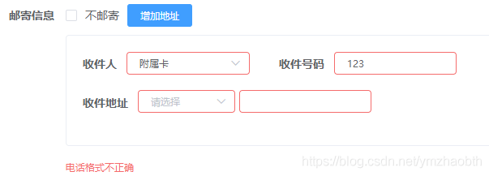

# element-plus 表单验证使用 个人总结

## 前言

表单验证能通过设置验证规则验证用户的输入，并对不规范的输入做出对应提示。尤其是在大表单中，它能让验证变得清晰、美观、可维护。element-plus（包括 element-ui）都提供了表单验证功能。但官网上只有最基本的使用方法，详细使用需要参考 async-validator，element-plus 表单验证就是通过它实现的

> [Element-Plus-Form - 表单验证](https://element-plus.org/#/zh-CN/component/form#biao-dan-yan-zheng)
>
> [async-validator - Git](https://github.com/yiminghe/async-validator)
>
> [async-validator - Gitee](https://gitee.com/mirrors/async-validator)

本文示例基于 `element-plus@1.0.x` ，与最新版本相比，表单验证这块的用法区别不大

**注意：**

亲试发现，`element-plus@2.0.6` 及之后的版本，表单验证不再是同步执行的了 [在线示例](https://codepen.io/zymbth/pen/yLvZxgv?editors=1000)

另外，`element-plus@2.1.4` 及之后的版本，才可按照官方文档示例正常使用（使用的是两者的中间版本的话，最好先自行确认下正确的校验方法）：

```typescript
const submitForm = async (formEl: FormInstance | undefined) => {
  if (!formEl) return
  await formEl.validate((valid, fields) => {
    if (valid) {
      console.log('submit!') // 位置1
    } else {
      console.log('error submit!', fields)
    }
  })
  // 位置2
}
```

上例中：

如果在“**位置 1**”执行表单验证通过后的业务代码，可以去掉 `async...await`

如果在“**位置 2**”执行，则需加上。否则，会直接跳过验证

这样，与异步校验（三、6）的使用办法就一致了，两者可以取其一。**element-plus**[**@2.1.4 **](/2.1.4)\*\* \*\*及之后的推荐统一使用上例中的写法

## 一、表单验证基本使用

### 1、定义验证规则

```javascript
baseRules: {
  name:[{ required: true, message: '请输入医生名称', trigger: 'blur' }],
  title: [{ required: true, message: '请选择职称', trigger: 'change' }],
  gender: [{ required: true, message: '请选择性别', trigger: 'change' }],
  hospital: [{ required: true, message: '请选择医院', trigger: 'change' }]
},
```

### 2、绑定 表单 与 Rules

`<el-form :model="formData" :rules="baseRules" ref="baseForm"></el-form>`

### 3、绑定 Item 与 Rule

上一步已经为表单绑定了规则列表 baseRules，接下来，只需要在 form-item 中使用 prop 绑定验证规则即可

`<el-form-item label="名称" prop="name"></el-form-item>`

对应关系:

- 表单对象 `formData: { name: '' }`
- 表单元素 `prop="name"`
- 规则列表 `baseRules: { name: [{...}] }`

另外，验证嵌套属性可以通过 `.` 连接绑定：

- `formData: { obj: { name: '' } }`
- `prop="obj.name"`
- `baseRules: { 'obj.name': [{...}] }`

### 4、示例

```html
<template>
  <el-form :inline="true" :model="doctorDialogForm" size="small" :rules="baseRules" ref="baseForm">
    <el-form-item label="医生名称" prop="name">
      <el-input v-model="doctorDialogForm.name"></el-input>
    </el-form-item>
    <!-- ... -->
    <template #footer>
      <span class="dialog-footer">
        <el-button @click="cancelOperation()">取 消</el-button>
        <el-button type="primary" @click="confirmOperation()">确 定</el-button>
      </span>
    </template>
  </el-form>
</template>

<script>
  export default {
    name: 'Doctor',
    data() {
      return {
        doctorDialogForm: {
          // 模态框 - 医生信息
          no: '', // 医生编号
          name: '', // 医生名称
          title: '', // 医生职称
          gender: '', // 性别
          hospital: '', // 所在医院
        },
        basicRules: {
          name: [{ required: true, message: '请输入医生名称', trigger: 'blur' }],
          title: [{ required: true, message: '请选择职称', trigger: 'change' }],
          gender: [{ required: true, message: '请选择性别', trigger: 'change' }],
          hospital: [{ required: true, message: '请选择医院', trigger: 'change' }],
        },
      }
    },
    methods: {
      confirmOperation() {
        this.$refs.baseForm.validate(valid => {
          if (!valid) {
            this.$message.warning('请调整数据后再请求')
            return false
          }
          // operation code
        })
      },
    },
  }
</script>
```

## 二、基本 API（可先跳过）

> [async-validator - Git](https://github.com/yiminghe/async-validator)
>
> [async-validator - Gitee](https://gitee.com/mirrors/async-validator)

### 1、async-validator

Rules API:

- type: 指示要使用的验证器类型
  `type`: string, number, boolean, method, regexp, integer, float, array, object, enum, date, url, hex, email, any
- Required
  `required`:必填/非必填
- Messages
  `message`: 错误提示
- Pattern
  `pattern`: 值需校验通过的正则表达式
- Range
  `min`, `max`: type 为 array, string 时，指长度。为 number 时，指大小
- Length
  `len`: type 为 array, string 时，指长度。为 number 时，指值
- Enumerable
  `enum`: 例：`{ type: 'enum', enum: ['admin', 'user', 'guest'] }`
- Whitespace
- Deep Rules 对象的深层规则
  `fields`: 对象的属性名，数组的下标
  `defaultField`: 应用于对象、数组内的所有成员
- Transform
  `transform`: 方法，对值的预处理
- validator
  `validator`: 自定义验证方法
- asyncValidator
  `asyncValidator`: 自定义异步验证方法

### 2、element-plus

`trigger`: 触发验证的方法，值可用字符串'blur', 'change'，也可是数组['blur', 'change']

**注意**，规则数组是按序逐一被执行验证的（trigger='blur'时，更改 input 框的值不会触发验证）

## 三、进阶使用

### 1、单项验证

可在表单的项 ( < el-form-item > ) 中单独设置验证规则

```html
<el-form-item
  label="邮箱："
  prop="email"
  :rules="[{ type: 'email', message: '邮箱格式错误', trigger: 'change' }]"></el-form-item>
```

- 简写

对于字符串的非空校验，element plus 表单验证提供了一种简单的方式

```html
<el-form-item label="姓名：" prop="username" required />
```

能实现校验，但有很大局限性，而且提示语是英文

### 2、自定义表单验证

可使用 validator 设置自定义的表单验证方法

```html
<el-form-item label="支付方式：" prop="payTypes"></el-form-item>
```

```javascript
  data() {
    return {
      basicRules: {
        payTypes: [{ validator: this.validateOrderPayTypes, trigger: 'change' }]
      }
    }
  },
  methods: {
    validateOrderPayTypes(rule, value, callback) { // 验证支付方式
      if(!value || value.length == 0) { // 自定义验证条件，返回错误提示文字
        callback(new Error('请添加支付方式'))
      } else {
        callback()
      }
    },
}
```

为了代码的可维护性与美观，尽量不要将规则写在模板中。但某些情况下必须如此，比如，当需要额外传递参数给 validator 时：

```html
<el-form-item
  label="样本类型："
  prop="sampType"
  :rules="[{ validator: (rule, value, cb) => validateSampType(rule, value, cb, yourParams), trigger: 'change' }]"></el-form-item>
```

### 3、正则校验

element plus 采用的 [async-validator](https://github.com/yiminghe/async-validator) 提供了很多高级用法，可以使用 [pattern](https://github.com/yiminghe/async-validator#pattern) 指定校验的正则

regex.js:

```javascript
// 手机号或座机号
export const reg_tel_phone = /(^((\+86)|(86))?(1[3-9])\d{9}$)|(^(0\d{2,3})-?(\d{7,8})$)/
```

doctor.vue:

```javascript
import { reg_tel_phone } from '@/assets/regex'
```

```javascript
baseRules: {
  name: [{ required: true, message: '请输入医生名称', trigger: 'blur' }],
  title: [{ required: true, message: '请选择职称', trigger: 'change' }],
  tel: [{ pattern: reg_tel_phone, message: '请输入正确的手机号或座机号', trigger: ['blur', 'change'] }]
},
```

注意：直接在 vue 模板中进行单项验证使用正则校验时，需将 RegExp 定义在`data(){return{}}`中

### 4、深层（嵌套）规则

> [在线实例：校验对象数组](https://codepen.io/zymbth/full/mdLzwzd)

可通过嵌套规则校验 object、array，具体参数配置请参考 [async-validator#deep-rules](https://github.com/yiminghe/async-validator#deep-rules)

使用 fields 定位到对象 address 的属性：

```js
{
  address: {
    type: 'object',
    required: true,
    options: { first: true },
    fields: {
      street: { type: 'string', required: true },
      city: { type: 'string', required: true },
      zip: { type: 'string', required: true, len: 8, message: 'invalid zip' },
    },
  },
  name: { type: 'string', required: true },
}
```

使用 defaultField 为数组元素设置校验规则：

```js
{
  urls: {
    type: 'array',
    required: true,
    defaultField: { type: 'url' },
  },
}
```

使用下标为对应数组元素设置校验规则：

```js
{
  roles: {
    type: 'array',
    required: true,
    len: 3,
    fields: {
      0: { type: 'string', required: true },
      1: { type: 'string', required: true },
      2: { type: 'string', required: true },
    },
  },
}
```

实例 1：

```javascript
baseRules: {
  CCEmails: [
    {
      type: 'array',
      defaultField: { type: 'email', message: '请输入正确的邮箱地址' },
    },
  ]
}
```

实例 2：

```javascript
import { reg_tel_phone } from '@/assets/regex'
```

表单数据

```javascript
regTelPhone: reg_tel_phone,
formBaseInfo: {         // 表单对象
	noMail: false,      // 不邮寄
	formMails: [{       // 地址列表
		reciever: '',   // 收件人
        recieveTel: '', // 收件号码
        address: {      // 收件地址
          area: [],     // 地址区划列表
          detail: ''    // 地址详情
        }
	}]
}
```

验证

```html
<el-form :model="formBaseInfo" size="mini" :rules="basicRules" ref="ruleBasicForm">
  <!-- 5、邮寄信息 -->
  <el-form-item
    label="邮寄信息"
    prop="formMails"
    :rules="[{
	    type: 'array',
	    required: !formBaseInfo.noMail,
	    defaultField: {
	      type: 'object',
	      fields: {
	        reciever: { required: true, message: '请输入收件人' },
	        recieveTel: [
	        	{ required: true, message: '请输入收件人电话' },
	        	{ pattern: regTelPhone, message: '电话格式不正确'}
	        ],
	        address: {
	          type: 'object',
	          required: true,
	          message: '请输入地址信息',
	          fields: {
	            area: {
	              type: 'array',
	              required: true,
	              len: 3,
	              message: '请选择地址区划',
	              defaultField: { required: true, message: '缺少区域码' }
	            },
	            detail: { required: true, message: '请输入详细地址' }
	          }
	        }
	      }
	    }
	  }]">
    <!-- ... -->
  </el-form-item>
</el-form>
```

上例仅作为示例。检测结果只是*邮寄信息*的。如果想要更详细的提示，需拆分嵌套规则。

如下图，提示位置始终在*邮寄信息*对应的内容下方，错误也无法定位：


### 5、验证数组内属性值

即，绑定的表单属性为数组内属性值时

如下所示，表单中有多个产品，每个产品中有多个样本，需要验证的有产品编号、样本编号、样本用户等

```javascript
formData: {
	no: null,
	products: [{          // 产品
		no: null,
		remark: '',
		key: null,
		samples: [{       // 样本
			no: null,
			user: null,
			key: null,
		}]
	}]
}
```

prop 需要通过字符串拼接指定绑定的属性

在下面实例中，使用`:prop="'products['+idx+'].no'"`，而不使用`prop="product.no"`

```html
<el-form :model="formData" ref="baseForm" :rules="baseRules">
  <el-card v-for="(product,idx) in formData.products" :key="product.key">
    <!-- 产品 -->
    <el-form-item
      label="选择产品："
      :prop="'products['+idx+'].no'"
      :rules="[{ required: true, trigger: 'change', message: '请选择产品' }]">
      <el-select v-model="product.no" placeholder="请选择产品">...</el-select>
    </el-form-item>
    <el-form-item label="产品备注：">...</el-form-item>

    <!-- 样本 -->
    <el-card v-for="(sample,idx1) in product.samples" :key="sample.key">
      <el-form-item
        label="选择用户："
        :prop="'products['+idx+'].samples['+idx1+'].user'"
        :rules="[{ required: true, trigger: 'change', message: '请选择用户' }]">
        <el-select v-model="sample.user" placeholder="请选择用户">...</el-select>
      </el-form-item>
    </el-card>
    <el-form-item label="添加样本" label-width="0">...</el-form-item>
  </el-card>
</el-form>
```

校验的对象为数组内属性值时，暂未找到直接在 rules 中定义的方法，所以，只能先以单项验证的方式写了

### 6、异步自定义 validator

当自定义 validator 中存在异步校验时，validator 无法正确实现校验，需要使用 asyncValidator。提交前的手动验证写法也有所不同

```javascript
import { reg_tel_phone } from '@/assets/regex'
import { checkTelExistence } from '@/api/common'
```

```javascript
data() {
  return {
	baseRules: {
	  tel: [
		{ required: true, message: '请输入电话' },
		{ pattern: reg_tel_phone, message: '电话格式不正确' },
		{ asyncValidator: this.validateTel, trigger: 'change' }
	  ]
	},
  }
},
methods: {
  // 电话唯一性校验
  async validateTel(rule, value, callback) {
    await checkTelExistence(this.salerDialogForm.tel).then(res => {
      callback()
    }).catch(e => {
      callback(new Error(e.message || e.msg || e))
    })
  },
  // 确认新增
  confirmOperation(formName) {
    this.$refs[formName].validate().then(() => {
	  // validation passed or without error message
    }).catch(e => {
      return false
    })
  }
}
```

**element-plus@2.1.4**及之后的版本，同、异步校验的执行可以统一采用这种写法，无需 then/catch

```javascript
this.$refs[formName].validate(valid => {
  console.log('valid result: ' + valid)
})
```

## 总结

本文仅为个人开发、学习中的总结，欢迎在评论区讨论。如有错误，还望指正！
