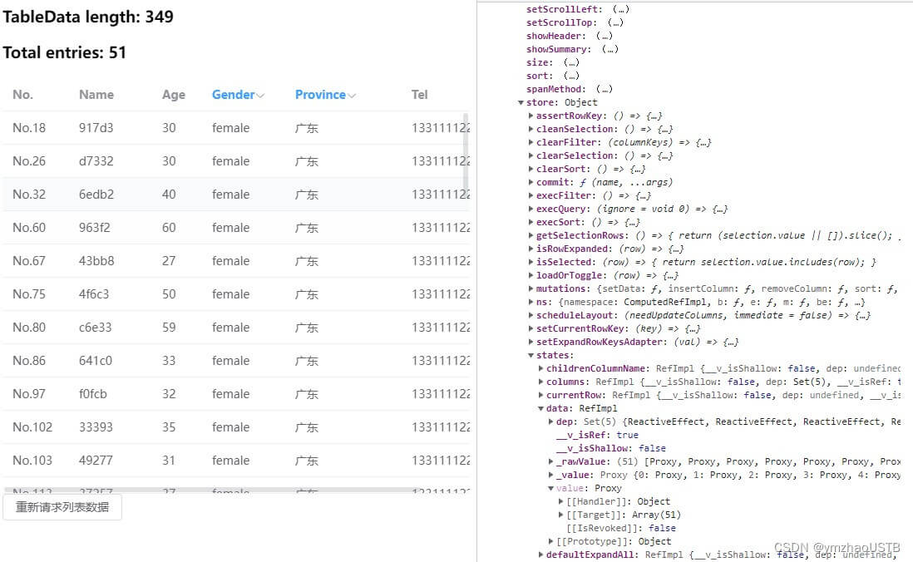

# Element Plus 跟踪表格数据总数，包括查询、筛选等操作

## 前言

Element Plus 的表格组件提供了筛选功能

前端项目中，如果表格使用的是后端分页，使用表格插件及分页器插件就可以了。这种情况下，前端的表格筛选被后端的分页条件查询取代了

另一种情况：不分页，直接查询所有数据，在前端做查询、筛选、排序

第一种情况下，数据统计由后端直接返回。这里，讨论的是第二种情况

::: details 在线演示

[在线演示](https://codepen.io/zymbth/pen/zYLPzjB) （示例基于 element-plus@2.2.9, vue@3.2.37）

<ClientOnly>
  <iframe height="500" style="width: 100%;" scrolling="no" title="[Demo] Watch Element Plus Table Entries" src="https://codepen.io/zymbth/embed/preview/zYLPzjB?default-tab=result&editable=true" frameborder="no" loading="lazy" allowtransparency="true" allowfullscreen="true">
    See the Pen <a href="https://codepen.io/zymbth/pen/zYLPzjB">
    [Demo] Watch Element Plus Table Entries</a> by zymbth (<a href="https://codepen.io/zymbth">@zymbth</a>)
    on <a href="https://codepen.io">CodePen</a>.
  </iframe>
</ClientOnly>

:::

## 一、需求

想要实现的是在上述第二种情况下，在进行前端筛选、重新获取数据等改变表格内数据总数的操作后，获取该总数。

然而，无法从 `ElTable` 组件绑定的数据、公开的属性/方法中直接获知

## 二、解决方案

示例基于 `element-plus@2.2.9`, `vue@3.2.37`，使用 vue 组合式 API 实现

文末有 vue3 两种代码风格的完整代码

### 1. 基本示例

下面是个人员表格，可筛选性别、省份

```html
<script setup>
  import { ref, computed, onMounted } from 'vue'
  import { ElButton, ElTable, ElTableColumn } from 'element-plus'

  const provinces = ['北京', '上海', '广东']
  const tableData = ref([])
  const columns = [
    { label: 'No', prop: 'no', width: 80 },
    { label: 'Name', prop: 'name', width: 100 },
    { label: 'Age', prop: 'age', width: 60 },
    {
      label: 'Gender',
      prop: 'gender',
      width: 100,
      filterable: true,
      filters: [
        { text: 'male', value: 'male' },
        { text: 'female', value: 'female' },
      ],
    },
    {
      label: 'Province',
      prop: 'province',
      width: 140,
      filterable: true,
      filters: [
        { text: '北京', value: '北京' },
        { text: '上海', value: '上海' },
        { text: '广东', value: '广东' },
      ],
    },
    { label: 'Tel', prop: 'tel', width: 140 },
  ]

  const tableEl = ref()

  onMounted(() => {
    queryHandler()
  })

  // 获取列表数据
  function getTableData(amount = 200) {
    return new Promise((resolve, reject) => {
      resolve(
        Array.from({ length: amount }).map((_, idx) => ({
          no: 'No.' + (idx + 1),
          name: Math.floor(Math.random() * 900000 + 100000).toString(16),
          age: Math.ceil(Math.random() * 40 + 20),
          gender: Math.random() > 0.5 ? 'male' : 'female',
          province: provinces[Math.floor(Math.random() * 3)],
          tel: '13311112222',
        }))
      )
    })
  }
  async function queryHandler() {
    tableEl.value?.clearFilter()
    const amount = Math.floor(Math.random() * 900) + 100
    tableData.value = await getTableData(amount)
  }

  function filterHandler(value, row, column) {
    const property = column['property']
    return row[property] === value
  }
</script>

<template>
  <el-table ref="tableEl" :data="tableData" max-height="500">
    <template v-for="col in columns" :key="col.prop">
      <el-table-column
        v-if="col.filterable"
        :prop="col.prop"
        :label="col.label"
        :width="col.width"
        :filters="col.filters"
        :filter-method="filterHandler"></el-table-column>
      <el-table-column
        v-else
        :prop="col.prop"
        :label="col.label"
        :width="col.width"></el-table-column>
    </template>
  </el-table>
  <el-button @click="queryHandler">重新请求列表数据</el-button>
</template>
```

从表格绑定数据 tableData 中无法获知筛选后的表格数据总量，查阅 Element Plus 官方文档，该组件也没有提供相应接口，那就只能想办法通过某种方案间接实现了

### 2. 方案

- 方案一：直接将筛选方法作用于 tableData，手动计算筛选后的表格数据总数

这种方案需要监听表格的 `filter-change` 事件，然后过滤

由于 `filter-change` 事件返回的当前更改的筛选条件，存在多个筛选时，需存储过滤条件

总结一下：

\> 给表项绑定 `column-key` 属性；创建存储筛选条件的对象
\> 监听表格的 `filter-change` 事件，更新筛选条件，计算筛选后的表格数据总数
\> 表格数据变更时，清空筛选条件

上述第二步，手动计算筛选如果过于复杂，也可以考虑在 DOM 层面上，在表格渲染完毕后，直接查询条数(\<tr\>)。

- 方案二：监听表格组件内部数据

虽然官方未提供直接的属性与方法，但表格组件内部肯定知道满足筛选条件的数据有哪些，问题在于它是否被暴露出来

通过打印表格对象，发现 store 中找到了相关数据，`ElTable` 组件内部的状态存储信息：



更完美的是，它是响应式变量，意味着可以直接监听

上例中，我们只需要中添加一个计算变量即可：

```javascript
import { ref, computed, onMounted } from 'vue'

const tableEl = ref()
const total = computed(() => tableEl.value?.store?.states?.data?.value?.length ?? 0)
```

**注意**：若使用的是 vue 选项式 API 实现，需等待表格组件挂载后，再添加计算变量

## 三、总结

第一种方案监听筛选事件，再在监听处理事件中手动筛选数据、计算总数，较为繁琐，不太建议使用

方案二依赖于 `ElTable` 组件内部的状态存储信息，非官网提供的属性/方法，随着版本的更替，指不定什么时候就成潜在的 "Breaking Change" 了。建议核实后锁定项目的 `element-plus` 的版本

若官方后续提供相应属性/方法，再替换。

## 四、完整代码

[Demo - 基于 vue 选项式 API](https://codepen.io/zymbth/pen/zYLPzjB)

Demo - 基于 vue 组合式 API:

```html
<script setup>
  import { ref, computed, onMounted } from 'vue'
  import { ElButton, ElTable, ElTableColumn } from 'element-plus'

  const provinces = ['北京', '上海', '广东']
  const tableData = ref([])
  const columns = [
    { label: 'No', prop: 'no', width: 80 },
    { label: 'Name', prop: 'name', width: 100 },
    { label: 'Age', prop: 'age', width: 60 },
    {
      label: 'Gender',
      prop: 'gender',
      width: 100,
      filterable: true,
      filters: [
        { text: 'male', value: 'male' },
        { text: 'female', value: 'female' },
      ],
    },
    {
      label: 'Province',
      prop: 'province',
      width: 140,
      filterable: true,
      filters: [
        { text: '北京', value: '北京' },
        { text: '上海', value: '上海' },
        { text: '广东', value: '广东' },
      ],
    },
    { label: 'Tel', prop: 'tel', width: 140 },
  ]

  const tableEl = ref()
  const total = computed(() => tableEl.value?.store?.states?.data?.value?.length ?? 0)

  onMounted(() => {
    queryHandler()
  })

  // 获取列表数据
  function getTableData(amount = 200) {
    return new Promise((resolve, reject) => {
      resolve(
        Array.from({ length: amount }).map((_, idx) => ({
          no: 'No.' + (idx + 1),
          name: Math.floor(Math.random() * 900000 + 100000).toString(16),
          age: Math.ceil(Math.random() * 40 + 20),
          gender: Math.random() > 0.5 ? 'male' : 'female',
          province: provinces[Math.floor(Math.random() * 3)],
          tel: '13311112222',
        }))
      )
    })
  }
  async function queryHandler() {
    tableEl.value?.clearFilter()
    const amount = Math.floor(Math.random() * 900) + 100
    tableData.value = await getTableData(amount)
  }

  function filterHandler(value, row, column) {
    const property = column['property']
    return row[property] === value
  }
</script>

<template>
  <h3>TableData length: {{ tableData.length }}</h3>
  <h3>Total entries: {{ total }}</h3>
  <el-table ref="tableEl" :data="tableData" max-height="500">
    <template v-for="col in columns" :key="col.prop">
      <el-table-column
        v-if="col.filterable"
        :prop="col.prop"
        :label="col.label"
        :width="col.width"
        :filters="col.filters"
        :filter-method="filterHandler"></el-table-column>
      <el-table-column
        v-else
        :prop="col.prop"
        :label="col.label"
        :width="col.width"></el-table-column>
    </template>
  </el-table>
  <el-button @click="queryHandler">重新请求列表数据</el-button>
</template>
```
