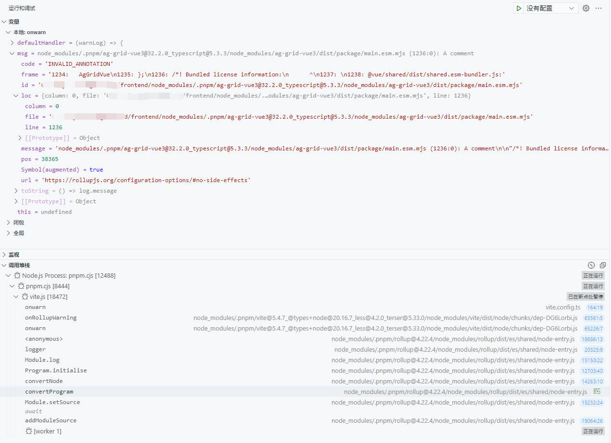

# Rollup Annotation 警告处理

rollup 构建项目时出现 invalid annotation 警告，表明注释不符合 rollup 要求。可更改注释以符合 rollup 要求，也可配置 rollup 过滤此警告。

## Invalid Annotation 警告

vite 项目构建警告:

```sh
> pnpm vite build --mode pro

 WARN  node_modules/.pnpm/ag-grid-vue3@32.2.0_typescript@5.3.3/node_modules/ag-grid-vue3/dist/package/main.esm.mjs (1236:0): A comment                                                              11:11:58

"/*! Bundled license information:

@vue/shared/dist/shared.esm-bundler.js:
  (**
  * @vue/shared v3.4.26
  * (c) 2018-present Yuxi (Evan) You and Vue contributors
  * @license MIT
  **)
  (*! #__NO_SIDE_EFFECTS__ *)

@vue/reactivity/dist/reactivity.esm-bundler.js:
  (**
  * @vue/reactivity v3.4.26
  * (c) 2018-present Yuxi (Evan) You and Vue contributors
  * @license MIT
  **)
*/"

in "node_modules/.pnpm/ag-grid-vue3@32.2.0_typescript@5.3.3/node_modules/ag-grid-vue3/dist/package/main.esm.mjs" contains an annotation that Rollup cannot interpret due to the position of the comment. The comment will be removed to avoid issues.
```

`/node_modules/ag-grid-vue3/dist/package/main.esm.mjs`:

```js
// ...
export { AgGridVue }
/*! Bundled license information:

@vue/shared/dist/shared.esm-bundler.js:
  (**
  * @vue/shared v3.4.26
  * (c) 2018-present Yuxi (Evan) You and Vue contributors
  * @license MIT
  **)
  (*! #__NO_SIDE_EFFECTS__ *)

@vue/reactivity/dist/reactivity.esm-bundler.js:
  (**
  * @vue/reactivity v3.4.26
  * (c) 2018-present Yuxi (Evan) You and Vue contributors
  * @license MIT
  **)
*/
```

## 相关方案

> [[ant-design] fix: rollup warning](https://github.com/ant-design/ant-design/pull/46024)

作为源项目开发者，可以更正注释的位置，使其符合 rollup 要求

作为使用者，可以选择容忍，或使用 rollup 配置过滤警告

## 过滤警告

rollup 提供了 `onwarn` 配置项，可以过滤掉特定的信息

::: tip

详细文档请查看：[rollup configuration options#onwarn](https://rollupjs.org/configuration-options/#onwarn)

:::

以 vite 项目为例，调试/打印查看该警告类型

`vite.config.js`:

```js
export default {
  build: {
    rollupOptions: {
      onwarn(msg, defaultHandler) {
        debugger
      },
    },
  },
}
```

如下：

<script setup>
import { inject } from 'vue'

const viewImg = inject('viewImg')

function handleViewImg() {
  viewImg('.viewer-wrap')
}
</script>
<div class="viewer-wrap">
  
</div>

> 参考
>
> code: [rollup repo:/src/utils/logs.ts#L139](https://github.com/rollup/rollup/blob/master/src/utils/logs.ts#L139)
>
> Type: [RollupLog](https://github.com/rollup/rollup/blob/master/src/rollup/types.d.ts#L36)

根据 msg.code 过滤:

```js [vite.config.js]
export default {
  build: {
    rollupOptions: {
      onwarn(msg, defaultHandler) {
        // 过滤警告信息
        if (msg.code !== 'INVALID_ANNOTATION') defaultHandler(msg)
      },
    },
  },
}
```
