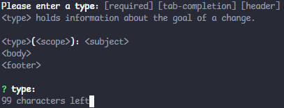
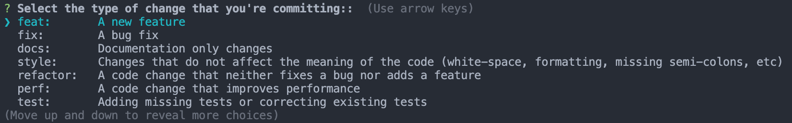

# 使用 husky、lint-staged、commitlint 规范代码提交

> 参考
>
> [husky](https://github.com/typicode/husky)：Git钩子管理工具。允许在Git钩子（如pre-commit, commit-msg等）执行自定义脚本，可以在代码提交的不同阶段自动运行预设的检查或操作
>
> [lint-staged](https://github.com/lint-staged/lint-staged): 只对暂存区（staged）的文件运行代码检查工具，可以在提交前自动运行代码格式化和代码检查
>
> [commitlint](https://github.com/conventional-changelog/commitlint): 检查提交信息是否符合特定规范，可强制使用统一的提交信息格式，并支持自定义提交信息规则
>
> [Conventional Commits](https://www.conventionalcommits.org/): 约定式提交，一种用于给提交信息增加人机可读含义的规范

## 介绍

完整的协作流程示例：

1. 开发者准备提交代码

```sh
git add .
git commit -m "feat: 添加新功能"
```

2. `husky`触发Git钩子：
   - `pre-commit`钩子运行`lint-staged`
   - `commit-msg`钩子运行`commitlint`

3. `lint-staged`执行：
   - 对暂存文件运行ESLint检查
   - 自动修复可以自动修复的代码风格问题
   - 如有无法自动修复的问题，阻止提交

4. `commitlint`执行：
   - 检查提交信息是否符合预设规范
   - 如不符合规范，阻止提交

## 安装依赖

**环境**：node18

```sh
yarn add -D husky lint-staged @commitlint/cli @commitlint/config-conventional
```

## 配置

### 安装 husky

```json
{
  "scripts": {
    "prepare": "husky"
  }
}
```

添加并执行 `prepare` 脚本，安装 husky

### 配置 lint-staged

添加文件 `.husky/lintstagedrc.js`，用于配置 lint-staged，例如：

::: code-group

```js [.husky/lintstagedrc.js]
module.exports = {
  '*.{js,jsx,ts,tsx,vue}': ['eslint --fix']
}
```

```json [package.json]
{
  "scripts": {
    "lint:lint-staged": "lint-staged -c ./.husky/lintstagedrc.js",
    "prepare": "husky"
  }
}
```

:::

> `eslint`, `prettier` 等代码格式化及检查工具需自行安装配置

### 配置 commitlint

添加文件 `commitlint.config.js`:

```js
module.exports = {
  extends: ['@commitlint/config-conventional'],
  rules: {
    'type-enum': [
      2,
      'always',
      [
        'feat', // 新功能(feature)
        'fix', // 修补bug
        'docs', // 文档(documentation)
        'style', // 格式、样式(不影响代码运行的变动)
        'refactor', // 重构(即不是新增功能，也不是修改BUG的代码)
        'perf', // 优化相关，比如提升性能、体验
        'test', // 添加测试
        'ci', // 持续集成修改
        'chore', // 构建过程或辅助工具的变动
        'revert', // 回滚到上一个版本
        'workflow', // 工作流改进
        'mod', // 不确定分类的修改
        'wip', // 开发中
        'types', // 类型修改
        'release' // 版本发布
      ]
    ],
    'subject-full-stop': [0, 'never'],
    'subject-case': [0, 'never']
  }
}
```

具体[规则](https://commitlint.js.org/reference/rules.html)配置按项目需求自定义

::: details commit内容规范

最常见的[提交约定](https://commitlint.js.org/concepts/commit-conventions.html)遵循这种模式：

```text
type(scope?): subject
body?
footer?
```

[Conventional Commits](https://www.conventionalcommits.org/en/v1.0.0/#summary)规范如下：

```text
<type>[optional scope]: <description>

[optional body]

[optional footer(s)]
```

:::

### 配置 husky

- pre-commit hook

添加文件 `.husky/pre-commit`:

```sh
# Format and submit code according to lintstagedrc.js configuration
npm run lint:lint-staged
```

> 这里在提交前运行 lint-staged（上面的 `.husky/lintstagedrc.js` 示例文件中进行了代码格式化）

- commit-msg hook

添加文件 `.husky/commit-msg`

```sh
npx --no -- commitlint --edit $1
```

> 这里在提交时运行 commitlint（上面的 `commitlint.config.js` 示例文件中进行了提交信息检查）
>
> - npx --no --: `--no`选项确保不会在当前项目中安装 `commitlint`，`--`分隔`npx`的选项和传递给`commitlint`的参数。
> - commitlint --edit $1: 打开默认文本编辑器，并编辑正在提交的消息。`$1` 是一个环境变量，代表 Git 提交消息的路径。

## commitlint prompt

完成以上的配置后，就可以对提交信息进行规范检查了。但如果希望在提交时进行提示，可以添加提示工具



::: details

- 使用 commitlint prompt

可安装 `@commitlint/prompt-cli` 以支持在命令行中按提示生成规范的提交信息

添加npm命令：

```json
{
  "scripts": {
    "commit": "commit"
  },
  "devDependencies": {
    "@commitlint/prompt-cli": "^19.6.0"
  },
}
```

- 使用 commitizen

相比于前者，`commitizen` 提供了一种更现代的互动方式



> 参考官网:
>
> [An alternative to @commitlint/prompt-cli: commitizen](https://commitlint.js.org/guides/use-prompt.html#an-alternative-to-commitlint-prompt-cli-commitizen)
>
> [Reference - Prompt](https://commitlint.js.org/reference/prompt.html)

添加npm命令：

```json
{
  "scripts": {
    "commit": "git-cz"
  },
  "devDependencies": {
    "@commitlint/cz-commitlint": "^19.5.0",
    "commitizen": "^4.3.1",
    "inquirer": "9.3.7",
  },
  "config": {
    "commitizen": {
      "path": "@commitlint/cz-commitlint"
    }
  }
}
```

commitizen所需配置可定义在commitlint的配置文件中

- 测试

```sh
git add .
npm run commit
```

**注意：**这里不是通过 `git commit` 提交，`git commit` 不会触发提示

:::

## 其它node版本

以上基于node18+，其它版本兼容性参考各仓库release说明

::: details node16下的区别

`node@16` 指定安装以下版本：

`yarn add -D husky@8.0.3 lint-staged@14.0.1 @commitlint/cli@17.8.1 @commitlint/config-conventional@17.8.1`

husky的安装命令为 `husky install`

husky脚本区别，例如 `pre-commit`:

```sh {1-2}
#!/usr/bin/env sh
. "$(dirname -- "$0")/\_/husky.sh"
npm run lint:lint-staged
```

> `#!/usr/bin/env sh`: 指定运行脚本的解释器(husky@9+无需指定)
>
> `. "$(dirname -- "$0")/\_/husky.sh"`: 加载必要的配置

:::

## Code snippets

::: code-group

```json [package.json]
{
  "type": "module",
  "scripts": {
    "lint:lint-staged": "lint-staged -c ./.husky/lintstagedrc.js",
    "prepare": "husky",
    "commit": "git-cz"
  },
  "devDependencies": {
    "@commitlint/cli": "^19.6.0",
    "@commitlint/config-conventional": "^19.6.0",
    "@commitlint/cz-commitlint": "^19.5.0",
    "commitizen": "^4.3.1",
    "husky": "^9.1.7",
    "inquirer": "9.3.7",
    "lint-staged": "^15.2.10",
  },
  "config": {
    "commitizen": {
      "path": "@commitlint/cz-commitlint"
    }
  }
}
```

```sh [.husky/pre-commit]
# Format and submit code according to lintstagedrc.js configuration
npm run lint:lint-staged
```

```sh [.husky/commit-msg]
npx --no -- commitlint --edit $1
```

```js [.husky/lintstagedrc.js]
export default {
  '*.{js,jsx,ts,tsx,vue}': ['eslint --fix']
}
```

```js [commitlint.config.js]
export default {
  extends: ['@commitlint/config-conventional'],
  rules: {
    'type-enum': [
      2,
      'always',
      [
        'feat', // 新功能(feature)
        'fix', // 修补bug
        'docs', // 文档(documentation)
        'style', // 格式、样式(不影响代码运行的变动)
        'refactor', // 重构(即不是新增功能，也不是修改BUG的代码)
        'perf', // 优化相关，比如提升性能、体验
        'build', // 影响构建系统或外部依赖性的变化（示例范围：Gulp，Groccoli，NPM）
        'test', // 添加测试
        'ci', // 持续集成修改
        'chore', // 构建过程或辅助工具的变动
        'revert', // 回滚到上一个版本
        // 'workflow', // 工作流改进
        // 'mod', // 不确定分类的修改
        // 'wip', // 开发中
        // 'types', // 类型修改
        // 'release' // 版本发布
      ]
    ],
    'subject-full-stop': [0, 'never'],
    'subject-case': [0, 'never']
  },
  prompt: {
    settings: {},
    messages: {
      skip: ':skip',
      max: 'upper %d chars',
      min: '%d chars at least',
      emptyWarning: 'can not be empty',
      upperLimitWarning: 'over limit',
      lowerLimitWarning: 'below limit'
    },
    questions: {
      type: {
        description: 'Select the type of change that you\'re committing:',
        enum: {
          feat: {
            description: 'A new feature',
            title: 'Features',
            emoji: '✨',
          },
          fix: {
            description: 'A bug fix',
            title: 'Bug Fixes',
            emoji: '🐛',
          },
          docs: {
            description: 'Documentation only changes',
            title: 'Documentation',
            emoji: '📚',
          },
          style: {
            description: 'Changes that do not affect the meaning of the code (white-space, formatting, missing semi-colons, etc)',
            title: 'Styles',
            emoji: '💎',
          },
          refactor: {
            description: 'A code change that neither fixes a bug nor adds a feature',
            title: 'Code Refactoring',
            emoji: '📦',
          },
          perf: {
            description: 'A code change that improves performance',
            title: 'Performance Improvements',
            emoji: '🚀',
          },
          test: {
            description: 'Adding missing tests or correcting existing tests',
            title: 'Tests',
            emoji: '🚨',
          },
          build: {
            description: 'Changes that affect the build system or external dependencies (example scopes: gulp, broccoli, npm)',
            title: 'Builds',
            emoji: '🛠',
          },
          ci: {
            description: 'Changes to our CI configuration files and scripts (example scopes: Travis, Circle, BrowserStack, SauceLabs)',
            title: 'Continuous Integrations',
            emoji: '⚙️',
          },
          chore: {
            description: 'Other changes that don\'t modify src or test files',
            title: 'Chores',
            emoji: '♻️',
          },
          revert: {
            description: 'Reverts a previous commit',
            title: 'Reverts',
            emoji: '🗑',
          },
        },
      },
      scope: {
        description:
          'What is the scope of this change (e.g. component or file name)',
      },
      subject: {
        description: 'Write a short, imperative tense description of the change',
      },
      body: {
        description: 'Provide a longer description of the change',
      },
      isBreaking: {
        description: 'Are there any breaking changes?',
      },
      breakingBody: {
        description:
          'A BREAKING CHANGE commit requires a body. Please enter a longer description of the commit itself',
      },
      breaking: {
        description: 'Describe the breaking changes',
      },
      isIssueAffected: {
        description: 'Does this change affect any open issues?',
      },
      issuesBody: {
        description:
          'If issues are closed, the commit requires a body. Please enter a longer description of the commit itself',
      },
      issues: {
        description: 'Add issue references (e.g. "fix #123", "re #123".)',
      },
    },
  }
}
```

:::

注意：

- 以上代码片段基于node@18+
- type: `module`
- `eslint`, `prettier` 等代码格式化及检查工具需自行安装配置
- 提示工具（prompt）可选，可使用 `@commitlint/prompt-cli` 或 `commitizen`，上例使用的后者
- 添加提示工具后，仍可使用 `git commit` 提交
