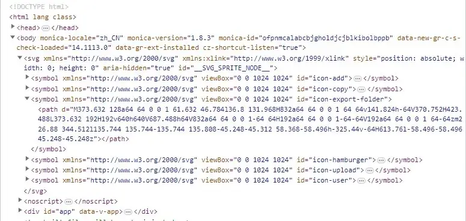

# vue项目中封装使用svg组件

> 参考
>
> [vue3封装svg图标组件](https://juejin.cn/post/7213983712731906106)
>
> [vue-element-admin - Svg Icon 图标](https://panjiachen.github.io/vue-element-admin-site/zh/feature/component/svg-icon.html#%E4%BD%BF%E7%94%A8%E6%96%B9%E5%BC%8F)
>
> [手摸手，带你优雅的使用 icon](https://juejin.cn/post/6844903517564436493)

为什么要封装 svg icon 呢？如果不作封装，svg 在重复使用时需要反复拷贝至代码中，使用 url 作为图片使用时，样式上有所限制。

下面的封装原理上是将 svg 图片处理为[svg 雪碧图](https://www.zhangxinxu.com/wordpress/2014/07/introduce-svg-sprite-technology/)来使用。

## vue-cli

### 1. 新建SvgIcon组件

```vue
<template>
  <div v-if="isExternal" :style="styleExternalIcon" class="svg-external-icon svg-icon" />
  <svg v-else :class="svgClass" aria-hidden="true">
    <use :xlink:href="iconName" />
  </svg>
</template>
<script>
/**
 * svg icon
 * @prop {string} iconClass svg 文件名称
 * @prop {string} className icon 自定义 class
 * @example
 * // 引入 @/icons/svg/xxx.svg
 * <svg-icon iconClass="add" style="color:var(--theme-color);font-size:28px;" />
 * // 使用外链的形式引入 svg:
 * <svg-icon icon-class="https://xxxx.svg />
 */
  export default {
    name: 'SvgIcon',
    props: {
      iconClass: {
        type: String,
        required: true,
      },
      className: {
        type: String,
        default: '',
      },
    },
    computed: {
      isExternal() {
        return isExternal(this.iconClass)
      },
      iconName() {
        return `#icon-${this.iconClass}`
      },
      svgClass() {
        if (this.className) {
          return 'svg-icon ' + this.className
        } else {
          return 'svg-icon'
        }
      },
      styleExternalIcon() {
        return {
          mask: `url(${this.iconClass}) no-repeat 50% 50%`,
          '-webkit-mask': `url(${this.iconClass}) no-repeat 50% 50%`,
        }
      },
      isExternal(path) {
        return /^(https?:|mailto:|tel:)/.test(path)
      }
    },
  }
</script>
<style scoped>
  .svg-icon {
    width: 1em;
    height: 1em;
    vertical-align: -0.15em;
    fill: currentColor;
    overflow: hidden;
  }
  .svg-external-icon {
    background-color: currentColor;
    mask-size: cover !important;
    display: inline-block;
  }
</style>
```

### 2. svg图标存放位置

- svg存放在目录 src/icons/svg/ 下
- 导入所有 svg 图标，文件 src/icons/index.js：

```javascript
const req = require.context('./svg', false, /\.svg$/)
const requireAll = requireContext => requireContext.keys().map(requireContext)
requireAll(req)
```

- 入口文件中引入 svg 组件及图标

main.js:

```javascript
import { createApp } from 'vue'
import App from './App.vue'
import SvgIcon from '@/components/SvgIcon'
import '@/icons'

const app = createApp(App)
app.component('svg-icon', SvgIcon)
app.mount('#app')
```

### 3. 打包

- 安装 `svg-sprite-loader` 处理 svg 图标

`npm install --save-dev svg-sprite-loader`

或：

`yarn add svg-sprite-loader -D`

- 打包配置

vue.config.js:

```javascript
module.exports = {
  chainWebpack: config => {
    config.module.rule('svg').exclude.add(resolve('src/icons')).end()
    config.module
      .rule('icons')
      .test(/\.svg$/)
      .include.add(resolve('src/icons'))
      .end()
      .use('svg-sprite-loader')
      .loader('svg-sprite-loader')
      .options({ symbolId: 'icon-[name]' })
      .end()
  }
}
```

另一种配置会出现打包部署后，无法显示 svg 图标的 bug，不知道什么原因

```javascript
module.exports = {
  chainWebpack: config => {
    config.module.rules.delete('svg') // 重点:删除默认配置中处理svg
    config.module
      .rule('svg-sprite-loader') // rule 匹配规则
      .test(/\.svg$/) // 用正则匹配 文件
      .include // 包含
      .add(resolve('src/icons/svg')) // 处理svg目录
      .end()
      .use('svg-sprite-loader') // 配置loader  use() 使用哪个loader
      .loader('svg-sprite-loader') // 加载loader
      .options({
        // [name] 变量。一般表示匹配到的文件名 xxx.svg
        // 注意： symbolId  在  <use xlink:href="#icon-svg文件名" />
        symbolId: 'icon-[name]', // 将所有的.svg 集成到 symbol中，当使用 类名 icon-文件名
        // outputPath: '/icons',
        // publicPath: '/',
      })
  }
}
```

### 4. 使用

将 add.svg 拷贝只 src/icons/svg/ 文件夹下

页面中引用全局注册的 svg-icon 组件，iconClass 对于图标文件名

`<svg-icon iconClass="add" />`

## vite

vite 项目中可使用 `vite-plugin-svg-icons` 实现。

vite.config.js配置如下:

```js
import { createSvgIconsPlugin } from 'vite-plugin-svg-icons'
import path from 'path'

export default () => {
  return {
    plugins: [
      createSvgIconsPlugin({
        // 指定需要缓存的图标文件夹
        iconDirs: [path.resolve(process.cwd(), 'src/icons/svg')],
        // 指定symbolId格式
        symbolId: 'icon-[dir]-[name]',
        svgoOptions: true
      }),
    ]
  }
}
```

具体参考[文档](https://github.com/vbenjs/vite-plugin-svg-icons)

## 总结

vue项目中封装svg组件的思路大多都是这样的，细节可以自行调整。

封装的意义，一方面在于通过组件调用 svg 图标，使之可重用，封装后，调用只需一行代码。另一方面，`svg-sprite-loader` 可以**压缩** svg。

由于它的实现实际上是将压缩后的 svg 图标内联到html上：



当项目中使用了过多的 svg 时，可能会影响性能
