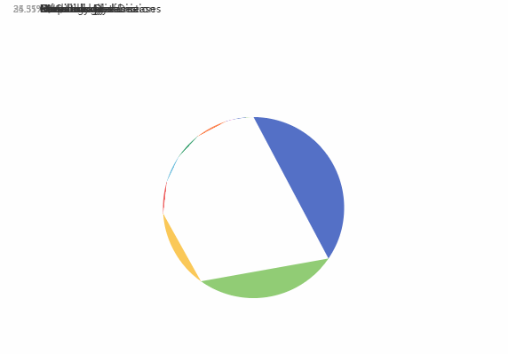

# uglifyjs压缩代码导致echarts图表UI异常 <Badge type="danger" text="BUG" />

`vue-cli` 项目中使用 `uglifyjs-webpack-plugin` 压缩代码，导致构建后， `echarts` 图表UI异常，图例文字堆叠在一起。如下图所示：



## 项目背景

`vue-cli` & vue@3.2.37

基于 webpack4，运行于 node16，使用 yarn 作为包管理器

自上一次生产环境部署后，将 node16 更换至18，项目依赖做了一些相应的调整，包管理器更换为 pnpm。期间，多次开发维护，本地(win10)运行无误，测试服务器(Ubuntu 22)构建部署无误。

完成小版本迭代后，本地构建，预览后发现了该bug

## 问题分析

首先怀疑是某些依赖未锁定版本号，小版本更新导致的问题。先后排除了 `vue`, `vue-cli`,  `sass`, `sass-loader` 的版本问题。

其次，测试环境构建无误，本地有误，可能是构建环境问题。将本地构建环境切换为 node16，分别使用 npm/yarn 构建，构建后依旧存在此bug。

重建一个空项目，仅保留 vue-cli, vue, echarts 以及构建配置，运行环境node16。渲染一个纯静态的 echarts 表格，运行无误，构建后依旧存在此bug。

最后，开始排查构建配置影响，最后到这点是因为没有更改过构建配置，且相关插件版本早已锁定。将项目中使用 `uglifyjs-webpack-plugin` 最小化代码的webpack plugin注释掉后，bug消失了。破案了！就是[uglifyjs-webpack-plugin](https://github.com/webpack-contrib/uglifyjs-webpack-plugin)的锅，虽然它早就不再维护了。

## 解决方案

`uglifyjs-webpack-plugin` 仓库首页开头就写着：

> DEPRECATED
>
> Please use https://github.com/webpack-contrib/terser-webpack-plugin

vue-cli 基于 webpack4，所以访问 [terser-webpack-plugin/tree/v4.2.3](https://github.com/webpack-contrib/terser-webpack-plugin/tree/v4.2.3)

安装：`npm install terser-webpack-plugin@4.2.3 -D` or `yarn add terser-webpack-plugin@4.2.3 -D`

配置基本都能对应上

::: code-group

```js [[old]vue.config.js]
const UglifyJsPlugin = require('uglifyjs-webpack-plugin')

module.exports = {
  configureWebpack: {
    plugins: [
      new UglifyJsPlugin({
        uglifyOptions: {
          compress: {
            drop_debugger: true,
            drop_console: true,
            pure_funcs: ['console.log'],
          },
        },
        sourceMap: false,
        parallel: true,
      }),
    ]
  }
}
```

```js [[new]vue.config.js]
const TerserPlugin = require('terser-webpack-plugin')

module.exports = {
  configureWebpack: {
    optimization: {
      minimize: true,
      minimizer: [
        new TerserPlugin({
          sourceMap: false,
          parallel: true,
          terserOptions: {
            compress: {
              drop_debugger: true,
              drop_console: true,
              pure_funcs: ['console.log'],
            },
          },
        }),
      ],
    }
  }
}
```

:::

## 总结

仍然不知道什么原因导致的，推测是js或其他相关标准更新导致的
