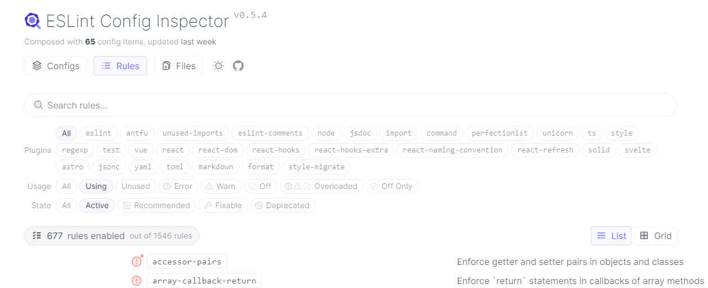

# 实践：使用 @antfu/eslint-config 整合 ESLint 配置

## 简介

详情请参见[源仓库文档](https://github.com/antfu/eslint-config)，总的来说就是整合 ESLint 及其插件配置，开箱即用。

需要**注意**的是，相对于自行配置，作者按个人代码风格设置了一些默认的规则。这意味着，对于不喜欢的默认配置，你需要手动关闭或调整。

## 从零开始使用

在未应用格式化的项目中使用是很方便的。具体参照源仓库文档，这里仅做简要介绍

1. 准备：环境 node@18+, IDE vscode
2. 安装：`pnpm i -D eslint @antfu/eslint-config`
3. 配置：创建配置文件 `eslint.config.mjs`
4. 自定义配置：配置参数类型；插件重命名；规则添加、覆盖；扁平配置等
5. 添加 npm 命令
6. IDE Support：vscode 配置，例如，推荐插件、禁用其它格式化工具、编辑器保存时格式化等

## 从 ESLint 迁移

示例：假设项目中配置了 typescript、unocss、eslint、prettier，现在将 eslint-config 迁移到 `@antfu/eslint-config` 下

- 首先，还是安装依赖，创建配置文件 `eslint.config.mjs`（注意不是 `.eslintrc.js`）

- 其次，将源格式化配置迁移到新配置文件中，移除无用插件依赖

配置可能来源于`.eslintrc.js`、package.json 中的 `eslintConfig`。`@antfu/eslint-config` 汇集了 30 个插件的近 700 条规则，并提供了一个在线查看、搜索规则的工具 [ESLint Config Inspector](https://eslint-config.antfu.me/)。在迁移中，对于不熟知的规则，可以在此对比并查看其对应原文档，感谢大佬！



移除`.eslintignore`，使用 `@antfu/eslint-config` 配置第一个参数的 `ignores` 替代，例如：`ignores: ['dist','node_modules','public','**/*.d.ts','.eslint-config-inspector','.vscode']`

移除`@antfu/eslint-config`整合在内的插件（例如，`eslint-plugin-*`）

移除`eslint-define-config`

`@antfu/eslint-config`可自动检测 ts 或手动激活 ts 检测。eslint 解析 ts 的相关插件也可以移除，`@typescript-eslint/eslint-plugin`, `@typescript-eslint/parser`

对于 prettier 配置，可以弃用了，使用 ESLint 就可以很好的完成代码格式化任务了。可移除 `prettier`, `eslint-config-prettier`

- npm 命令

```json
{
  "scripts": {
    "lint": "eslint .",
    "lint:fix": "eslint . --fix"
  }
}
```

指定目录的语法同 eslint，例如：`eslint \"./src/**/*.{js,ts,jsx,tsx,vue,html}\"`

- 最后，检测并修复

## 总结

请充分了解手动配置 `ESLint` 与`@antfu/eslint-config`的异同

- 插件引入

前者自行引入 ESLint，按实际需求引入插件以支持对 TS，JSX/TSX，markdown等文件的支持。后者则整合封装好了，可在配置中直接激活启用。

- 默认规则

后者即便是以最小化的引入使用，提供的默认规则是作者按个人风格调整后的。这意味着你可能需要手动关掉/调整它们
