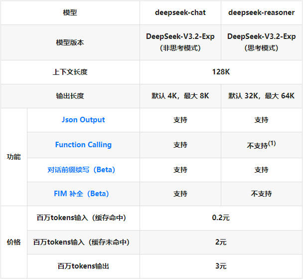
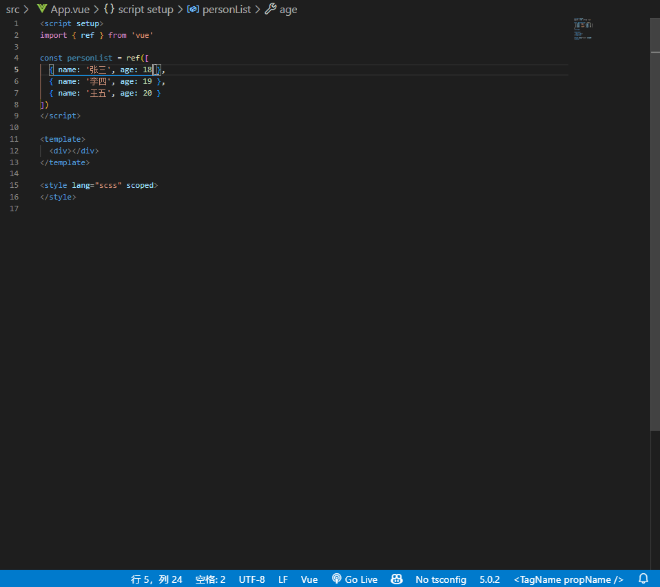

# 分享：前端开发使用的各类AI工具辅助开发

## 最新

### DeepSeek & Qwen

国产大模型已经跟上来了，deepseek-r1的深度思考的内容逻辑性和质量都令人吃惊，不用去费时费力地用国外大模型了。

之前官方的服务已经爆满了，直接关闭了充值入口，转而使用其它服务商提供的api。DeepSeek的VSCode插件首页上放了两个合作的服务商，>>[硅基流动](https://cloud.siliconflow.cn/i/scFXHmf2)<<，可以用它送的额度先体验下，比官网API稳定。可选择最新的deepseek-v3.1、Qwen3、kimi-k2等模型。生产环境使用的话，可接入百炼等大模型服务平台。

对前端开发人员来说，API key可作为通行证使用各种AI工具，AI IDE、IDE插件以及各类基于大模型的产品，除了自己的订阅计划外，很多都允许使用用户自己的API key。

通过浏览器或移动端使用的话，选择就多了，DeepSeek官网响应太慢，r1有隐形限制。可以先试试[腾讯元宝](https://yuanbao.tencent.com/chat/)、百度的[AI搜索](https://chat.baidu.com/search)这些号称接入了DeepSeek R1满血版，目前都是免费使用，响应超快。

### Cursor/GitHub Copilot/Claude Code/Codex

舍得花钱就能享受最好的AI助手！

## 常见使用场景

### AI IDE

功能：包含IDE集成所有功能并进行​无缝工具整合，原生AI驱动，提供从代码生成、优化到调试和部署全流程覆盖​​。全项目上下文感知、​​多文件编辑。

- [Cursor](https://www.cursor.com/)：Pro版每月20刀。作为AI IDE的先行者，AI IDE 的 **No.1**，由于Claude模型的不支持，现在地位不保。
- [Trae](https://www.trae.com.cn/)：字节出品，免费，但使用体验有待提高，目前有些“**笨重**”，还提供海外版。
- [Windsurf](https://codeium.com/)：Pro版每月15刀。“Cascade”的AI助手维持开发者的“**心流**”状态，首页查看演示。
- [Qoder](https://qoder.com/)：阿里巴巴出品，含免费订阅计划，Pro版每月20刀，目前半价中。“**Quest Mode**”允许AI像一个初级开发者一样自主执行长周期任务，并能自动生成项目知识库（Repo Wiki）
- [Augment Code](https://www.augmentcode.com/)：订阅价20刀起步，强大的上下文引擎和AI“代理”，专为处理大型复杂代码库而设计，能完成跨多文件的复杂任务。
- [Kiro](https://kiro.dev/)：含免费订阅计划，Pro版本每月20刀。由AWS推出，“规范驱动开发”（**spec-driven** development），通过结构化的工作流将需求规格转化为代码实现，首页查看演示。
- [Zed](https://zed.dev/)：免费，AI功能采用token制收费。极简，基于Rust构建带来的**极致轻便**和启动速度。~~暂未正式发布Windows版本，需手动构建，不过可以使用github上别人构建好的包，[源码](https://github.com/deevus/zed-windows-builds)，[参考](https://hafuhafu.com/archives/how-to-install-zed-editor-windows/)。~~Windows版本已发布！使用体验出乎意料的不错，可添加包括硅基流动在内的大模型供应商。最直观的感受就是**轻便快捷**。

> Trae CN刚出来没多久用的，体验欠佳，过段时间再试试，应该有很大进步。接下来计划体验下Qoder。
>
> 对于后端或全栈开发来说，相比于AI IDE或IDE插件集成，CLI工具的适用范围更广，自由度更高（Claude Code/Codex）。

### IDE集成

功能：代码生成、代码补全、解释代码、优化建议、生成单元测试、调式和错误检测、生成文档和注释
工具：**通义灵码**, **Github Copilot**, Codeium, Supermaven

> 很早就用过通义灵码的VS Code插件了，在代码补全上表现一直不错，也是我一直推荐的。Qwen3惊艳的表现让我重拾通义灵码，“智能问答”、“文档编辑”、“智能体”三种模式，qwen3-coder免费用！在代码能力上比起Claude模型还有些差距，但已经很不错了。

### 在线使用

可通过网页、客户端、浏览器插件等方式使用。

- [通义千问](https://www.tongyi.com/qianwen/)、[最新千问大模型](https://chat.qwen.ai/)：代码相关推荐千问，尤其是后者，质量很高
- [Kimi Chat](https://kimi.moonshot.cn/)、腾讯元宝：日常可用
- [Poe](https://poe.com/)：每日3000积分，可体验Gemini/Claude/GPT/Grok最新高级模型
- Gemini, Google AI Studio：质量绝佳，科学上网可体验
- Monica, Sider, Chat-GPT, Claude：部分收费

> Gemini-2.5-Pro真的厉害，当下各方面最均衡、最强大的模型体验。用户输入越详细就越能感受到它的细致与全面，举个例子，在日常问诊上，必要的描述+图片，它的推论让人感觉是一个专业医生当面给出来的。

### 浏览器辅助

- kimi.ai - Chrome插件：提供基于网页上下文的即使问答
- 秘塔AI搜索：无广，包含引用源，自动生成大纲、思维导图

### 智能体(Agent)

功能：定制智能体
工具：扣子/Coze, Dify, 豆包, Poe, kimi.ai

## 部分工具介绍

### GitHub Copilot

[GitHub Copilot - 维基百科](https://zh.wikipedia.org/zh-cn/GitHub_Copilot)
[GitHub Copilot](https://docs.github.com/zh/copilot)
[GitHub Copilot VSCode插件 - Your AI pair programmer](https://marketplace.visualstudio.com/items?itemName=GitHub.copilot)

相对于什么都可以问的AI对话，GitHub Copilot 的定位就是“结对编程助手”，具体介绍、使用方法参照官方介绍。它可以在 JetBrains IDEs (Beta)，Neovim，Visual Studio，Visual Studio Code中安装拓展使用。

使用方式非常**丝滑**~

示例：

### 更多工具

> 参考链接
> [State of AI - 2025](https://2025.stateofai.dev/zh-Hans/): 2025年度AI调查报告
> [IDEs with GenAI features that Software Engineers love](https://newsletter.pragmaticengineer.com/p/ide-that-software-engineers-love)
> [万字盘点 2025 上半年，值得推荐的 AI 模型与产品清单](https://sspai.com/post/101081)

- Dify: 开源的 LLM 应用开发平台。可构建聊天助手、Agent等应用，可创建工作流并发布成应用。提供**社区版**，可本地运行、自托管。
- [v0](https://v0.dev/): Vercel推出的AI代码生成工具，通过自然语言描述快速生成React/TailwindCSS组件代码，支持逐元素修改和原型迭代
- [bolt.diy](https://github.com/stackblitz-labs/bolt.diy)：Stackblitz 推出的AI驱动的在线**全栈开发**，通过单一提示创建全栈 Web 应用。可在线调试运行、修改。是`bolt.new`的**社区版**，可本地运行、自托管，但实践发现搭配`deepseek-v3`的使用体验远不如`bolt.new`
- [same.new](https://same.new/): AI驱动的**网站UI复刻**工具，输入目标网址即可像素级克隆其布局、交互逻辑并生成可维护的前端代码
