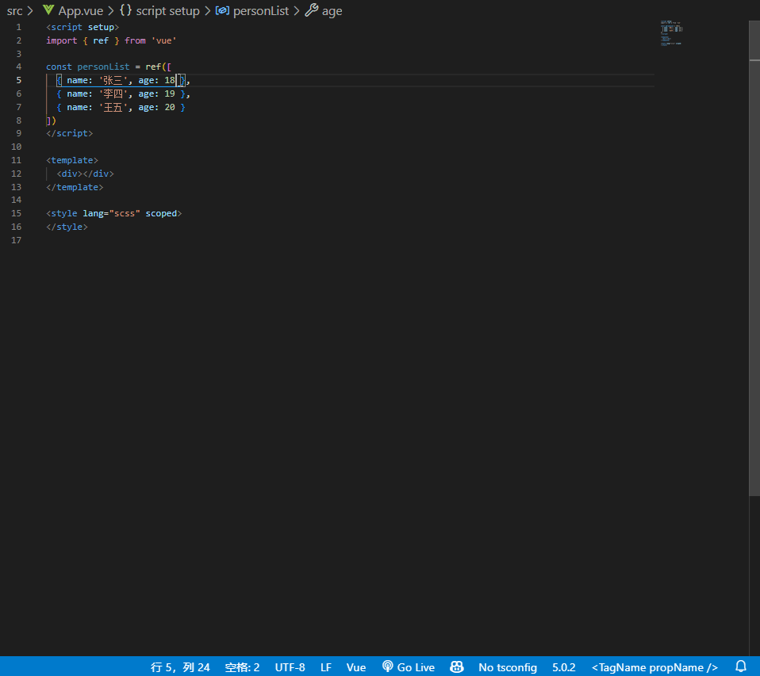

# 分享：前端开发使用的各类AI工具辅助开发

## 相关文章

[《前端开发在AI时代的生存与进阶》](/front-end/others/ai-frontend-survival)

## 最新(2026年5月)

到2026年5月，AI的发展已经到了让码农心慌的程度了。你还局限在同AI对话上吗？

### AI Agents

::: details Agentic coding

常见的 AI Agents: Claude Code, Codex, Cursor, Gemini CLI, Cline, GitHub Copilot 等等

传统AI助手基本是**提建议**，建议代码，需手动复制、粘贴、运行、调试

AI Agent 是真正**干活**的，能记忆上下文、感知项目环境；自主调用工具、规划并执行复杂的多步骤任务、自动修复 Bug、运行测试并迭代修正；甚至能理解非文本输入、生成图片、联动外部服务

以 Claude Code 为例：

`CLAUDE.ms` / `AGENTS.md`: 提供持久上下文。可添加项目说明、编码规范、约定等信息，每次会话自动加载，确保AI遵循团队规范

`Skills`: 工作流技能，封装高频任务指令，智能体会自动扫描并触发使用。可安装大神们撰写好的skills，也可自行编撰

`MCP`: 联通外部工具与数据源

此外，`Commands`, `Hooks`, `Agents`, `Subagents`, `Rules`, `Memory` 等扩展组件进一步释放潜能，让 AI Agents 更加高效智能

:::

对程序员日常开发来讲，现在最优的就两个 AI Agents：**Claude Code**、**Codex**，都支持第三方大模型供应商。

顶尖的 AI 智能体 + 国产大模型，这是性价比最高的选择。花点小钱就能享受最好的 AI Agent！

个人使用的话，也可以购买中转站提供的 Claude 等大模型，即便这样，国产大模型也可以作备选或托底

AI Agent 的使用场景大多都不局限于一两种，可运行在终端、IDE 插件、IDE本身等

### 国产大模型

**GLM / DeepSeek / Qwen / Kimi**：国产大模型质量已经很不错了，不用去费时费力地用国外大模型了，费钱不说，最关键的是不稳定，有被封的风险。

当下的 glm-5.1, deepseek-v4, qwen3.6-plus, qwen3.6-max-preview, kimi-k2.6 都是不错的选择。qwen/deepseek相对便宜一些

上面四个都有官方平台，按量付费，qwen/deepseek最近都有折扣

### 大模型供应商

除了直接使用大模型apikey外，有些大模型供应商自行部署了很多模型，提供apikey进行统一调用，切换模型很方便。

之前deepseek官方的服务就曾爆满，直接关闭了充值入口，响应也慢、经常排队。

👉[硅基流动](https://cloud.siliconflow.cn/i/scFXHmf2)：送16元代金券，响应快，服务稳定

👉[阿里云百炼](https://bailian.console.aliyun.com/cn-beijing)：送百万token，响应快，服务稳定

> API key可作为通行证使用各种AI工具，AI IDE、IDE插件以及各类基于大模型的产品，除了自己的订阅计划外，很多都允许使用用户自己的API key。

### Github Copilot

Github Copilot 的代码补全功能一如既往的丝滑好用，Agent模式也早就开放了。提供包括 claude, gpt, gemini, grok, codex 模型，还支持自定义模型。

Github Copilot 早就不是单纯的编程助手了，它是 vscode 官方支持的 AI Agent，这几年一直在频繁迭代更新中，最新推出了 [Agents window](https://code.visualstudio.com/docs/copilot/agents/agents-window)，在独立窗口中专注 AI Agent 任务管理。

它完全可以同 Claude Code 一同使用，很多配置可通用。非常适合一般企业采购

## 常见使用场景

AI Agent 不再赘述

### AI IDE

功能：包含IDE集成所有功能并进行​无缝工具整合，原生AI驱动，提供从代码生成、优化到调试和部署全流程覆盖​​。全项目上下文感知、​​多文件编辑。

- 🌟[Cursor](https://www.cursor.com/)：Pro版每月20刀。作为AI IDE的先行者，AI IDE 的 **No.1**，由于Claude模型的不支持，现在地位不保。
- 🌟[Antigravity](https://antigravity.google/): 谷歌出品，免费（有频率/速率限制），提供Gemini, Claude模型，但需要魔法以及谷歌账号（有关联国家要求）。“Agent-First”，优势在于它的多智能体编排与全链路自主性。
- [Trae](https://www.trae.com.cn/)：字节出品，免费，但使用体验有待提高，目前有些“**笨重**”，还提供海外版。
- [Windsurf](https://codeium.com/)：Pro版每月15刀。“Cascade”的AI助手维持开发者的“**心流**”状态，首页查看演示。
- [Qoder](https://qoder.com/)：阿里巴巴出品，含免费订阅计划，Pro版每月20刀，目前半价中。“**Quest Mode**”允许AI像一个初级开发者一样自主执行长周期任务，并能自动生成项目知识库（Repo Wiki）
- [Augment Code](https://www.augmentcode.com/)：订阅价20刀起步，强大的上下文引擎和AI“代理”，专为处理大型复杂代码库而设计，能完成跨多文件的复杂任务。
- [Kiro](https://kiro.dev/)：含免费订阅计划，Pro版本每月20刀。由AWS推出，“规范驱动开发”（**spec-driven** development），通过结构化的工作流将需求规格转化为代码实现，首页查看演示。
- 🌟[Zed](https://zed.dev/)：免费，AI功能采用token制收费。极简，基于Rust构建带来的**极致轻便**和启动速度。~~暂未正式发布Windows版本，需手动构建，不过可以使用github上别人构建好的包，[源码](https://github.com/deevus/zed-windows-builds)，[参考](https://hafuhafu.com/archives/how-to-install-zed-editor-windows/)。~~Windows版本已发布！使用体验出乎意料的不错，可添加包括硅基流动在内的大模型供应商。最直观的感受就是**轻便快捷**。作为AI-IDE可能平平无奇🤷‍♀️，但作为代码编辑器👍

### IDE集成

功能：代码生成、代码补全、解释代码、优化建议、生成单元测试、调式和错误检测、生成文档和注释
工具：**通义灵码**, **Github Copilot**, Codeium, Supermaven

> 很早就用过通义灵码的VS Code插件了，在代码补全上表现一直不错，也是我一直推荐的。Qwen3惊艳的表现让我重拾通义灵码，“智能问答”、“文档编辑”、“智能体”三种模式，qwen3-coder免费用！“文档编辑”模式目前还差了点意思，其他代码能力上比起Claude模型还有些差距，但已经很不错了。

### 在线使用

可通过网页、客户端、浏览器插件等方式使用。

- [ChatGPT](https://chatgpt.com/), [Grok](https://grok.com/): 需🪜可用，有每日限额
- [Qwen Studio](https://chat.qwen.ai/)，[Kimi Chat](https://kimi.moonshot.cn/)，[Deepseek](https://chat.deepseek.com)，[GLM-智谱](https://bigmodel.cn/)：各国产大模型官方网页版，免费使用
- ~~[Poe](https://poe.com/)：每日3000积分，可体验Gemini/Claude/GPT/Grok最新高级模型~~ 不再推荐，每日300积分，够干啥？
- ~~Gemini, Google AI Studio：质量绝佳，科学上网可体验~~ 不再推荐，额度严重下降，浪费时间
- Monica, Sider：提供网页版、浏览器插件、APP等使用方式，有每日限额

### 浏览器辅助

- kimi.ai - Chrome插件：提供基于网页上下文的即使问答
- 秘塔AI搜索：无广，包含引用源，自动生成大纲、思维导图

### 智能体(Agent)

功能：定制智能体
工具：扣子/Coze, Dify, 豆包, Poe, kimi.ai

## 部分工具介绍

### GitHub Copilot

[GitHub Copilot - 维基百科](https://zh.wikipedia.org/zh-cn/GitHub_Copilot)

[GitHub Copilot](https://docs.github.com/zh/copilot)

[GitHub Copilot VSCode插件 - Your AI pair programmer](https://marketplace.visualstudio.com/items?itemName=GitHub.copilot)

相对于什么都可以问的AI对话，GitHub Copilot 的定位就是“结对编程助手”，具体介绍、使用方法参照官方介绍。它可以在 JetBrains IDEs (Beta)，Neovim，Visual Studio，Visual Studio Code中安装拓展使用。

使用方式非常**丝滑**~

示例：

### 更多工具

> 参考链接
>
> [State of AI - 2025](https://2025.stateofai.dev/zh-Hans/): 2025年度AI调查报告
>
> [IDEs with GenAI features that Software Engineers love](https://newsletter.pragmaticengineer.com/p/ide-that-software-engineers-love)

- Dify: 开源的 LLM 应用开发平台。可构建聊天助手、Agent等应用，可创建工作流并发布成应用。提供**社区版**，可本地运行、自托管。
- [v0](https://v0.dev/): Vercel推出的AI代码生成工具，通过自然语言描述快速生成React/TailwindCSS组件代码，支持逐元素修改和原型迭代
- [bolt.diy](https://github.com/stackblitz-labs/bolt.diy)：Stackblitz 推出的AI驱动的在线**全栈开发**，通过单一提示创建全栈 Web 应用。可在线调试运行、修改。是`bolt.new`的**社区版**，可本地运行、自托管，但实践发现搭配`deepseek-v3`的使用体验远不如`bolt.new`
- [same.new](https://same.new/): AI驱动的**网站UI复刻**工具，输入目标网址即可像素级克隆其布局、交互逻辑并生成可维护的前端代码
