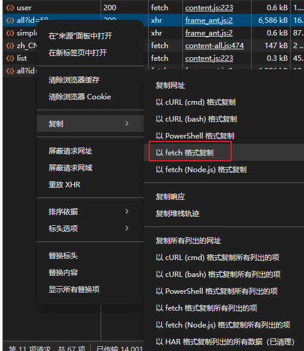
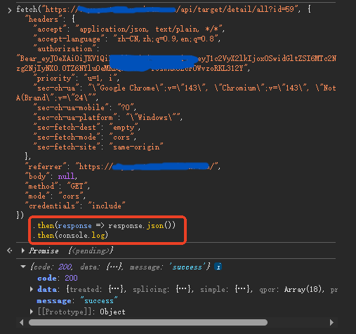

# Chrome的大数据预览限制

## 问题

某个版本后，Chrome DevTools的预览功能限制了数据大小，也没有提供直接的“开关”或 chrome://flags 配置项来关闭这个限制

## 示例

一个大小9M的响应，Chrome DevTools中，其预览与响应界面如下显示两行文字：

*“无法加载响应数据”*

*“Request content was evicted from inspector cache”* (请求内容已从检查器缓存中移除)

## 解决方法

- 代码中手动添加打印语句

麻烦，且需要本地开发模式

- 在Chrome DevTools中打印

网络面板复制请求，在打印面板中手动fetch一次数据：

1) 在 Network 面板找到该请求
2) 右键点击 -> Copy(复制) -> Copy as fetch(以 fetch 格式复制)
3) 切换到 Console 面板
4) 粘贴代码，但在最后加上 `.then(r => r.json()).then(console.log)`
5) 回车执行

