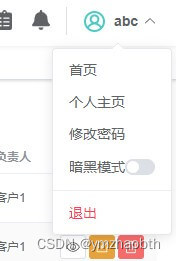

# 基于 vue3 & element-plus 的暗黑模式

## 前言

`element-plus@2.2.0` 已经开始支持[暗黑模式](https://element-plus.gitee.io/zh-CN/guide/dark-mode.html)了

通过在html标签上添加一个名为 `dark` 的类来启用

基于 vue3 & element-plus 的项目现在可以方便的添加暗黑模式

## 一、基本使用

因为是通过在html标签上添加 `dark` 类，可以自行实现切换

但为了方便切换以及进一步的定制化，官方推荐使用 [useDark | VueUse](https://vueuse.org/core/usedark/)

示例：以下，基于 element-plus switch组件 创建了一个暗黑模式开关组件，将它放入菜单栏，就可以方便地切换模式了

```html
<script setup>
import { useDark, useToggle } from '@vueuse/core'

const isDark = useDark()
const toggleDark = useToggle(isDark)

</script>

<template>
  <span @click.stop="toggleDark()">暗黑模式</span>
  <el-switch size="small" v-model="isDark"/>
</template>
```



进一步定制化可查阅官方文档

## 二、自定义深色样式

暗黑模式中，一旦混入非深色样式，就会非常难看刺眼，一些自定义样式的暗黑模式适配是少不了的

### 1、深色样式

element-plus定义了一些暗黑模式下的变量，满足其自身样式的暗黑模式适配

项目中设定了颜色的样式是无法自动适配的，需要我们手动写一套深色样式来覆盖

```css
html.dark {
  .my-dialog {
    background-color: #304156;
    color: #bfcbd9;
  }
}
```

### 2、变量覆盖

一些反复使用的样式可以定义成变量重用，这样，就可以通过简单的变量覆盖来适配暗黑模式

```css
:root {
  --theme-color: #409EFF;
}
html.dark {
  --theme-color: #135fad;
}
.demo-class {background-color:var(--theme-color)}
.demo-class-one button {color:var(--theme-color)}
```

### 3、element-plus变量覆盖

如果想更改element-plus默认的深色样式，可再次定义并覆盖之。为了正确覆盖，下述样式需在引入element-plus样式后引入

src/styles/demo.scss：

```css
html.dark {
  /* 覆盖element-plus默认深色背景色 */
  --el-bg-color: #626aef;
  .el-button--primary {
    --el-button-text-color: #ededed;
  }
}
```

main.js：

```javascript
import 'element-plus/dist/index.css'
import './styles/demo.scss'
```

### 4、scss变量

scss定义变量，并在其它样式中引入使用。结合css变量，也可以轻松实现暗黑模式的适配

src/styles/variables.scss：

```css
$menuBg:var(--menuBg);
$menuActiveText:var(--themeColor);
$btnColor: var(--themeColor);
```

src/styles/index.scss：

```css
@import './variables.scss';

:root {
  --themeColor: #409EFF;
  --menuBg: #304156;
}
html.dark {
  --themeColor: #46ACFF;
  --menuBg: #263445;
}
```

main.js：

```javascript
import './styles/index.scss'
```

话说回来，如果只是当作css变量一样使用scss变量，那为何不直接使用css变量呢？况且，css变量还可以使用js更改之

## 三、暗黑模式下的图片

> [暗黑模式下图片处理](https://blog.csdn.net/ymzhaobth/article/details/122804686)

在暗黑模式下显示图片，部分会比较亮，刺眼。可以使用CSS滤镜，设置图片的亮度、饱和度
除图片外，可将以图片为背景图的容器加上类 dark-img-bg 或其它css选择器

```css
html.dark {
  img,
  .dark-img-bg {filter:brightness(0.8) saturate(1.25)}
}
```
