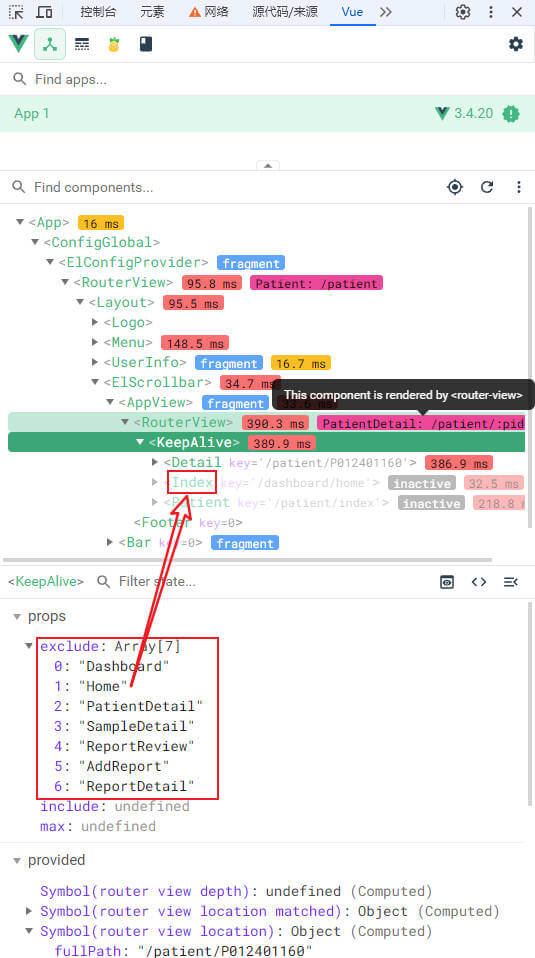

# vue3 KeepAlive 组件缓存失效 bug 分析 <Badge type="danger" text="BUG" />

vue3 组合式 API 风格中，使用 setup 语法糖创建的组件出现缓存失效的 bug

## 分析

路由设置了 name 属性，KeepAlive 组件中设置了排除项（exclude），核验无误，但排除失效了

经网络方案搜寻，根源在于 KeepAlive 组件的 include/exclude 指的并不是路由名称，而是组件名称

> 官网说明
>
> [keep-alive](https://cn.vuejs.org/guide/built-ins/keep-alive.html#include-exclude)
>
> [组件 name 选项](https://cn.vuejs.org/api/options-misc.html#name)

::: tip

在 3.2.34 或以上的版本中，使用 `<script setup>` 的单文件组件会自动根据文件名生成对应的 `name` 选项，无需再手动声明。

:::

使用 vue devtools 调试可以很清楚的看到哪些组件被缓存了：



以排除的“Home”组件为例，路由及对应文件如下：

```js{4} [route]
{
  path: 'home',
  component: () => import('@/views/Dashboard/Home/index.vue'),
  name: 'Home'
}
```

`KeepAlive` 组件中缓存的组件 name 是 `Index`

## 解决方案

> 参考
>
> [vue keep-alive](https://cn.vuejs.org/guide/built-ins/keep-alive.html)
>
> [vue3 中使用 keepAlive 缓存路由组件不生效的情况记录](https://blog.csdn.net/weixin_40451732/article/details/139744930) > [vue3 中使用 keepAlive 缓存路由组件不生效的问题解决](https://www.cnblogs.com/suducn/p/18331108)

### 1. 唯一命名单文件组件

单文件组件命名时就考虑其唯一性

```text
src/xxx/index.vue -> src/xxx/xxxIndex.vue
src/xxx/list.vue -> src/xxx/xxxList.vue
src/yyy/index.vue -> src/xxx/yyyIndex.vue
src/yyy/list.vue -> src/xxx/yyyList.vue
```

有人愿意为此更改代码规范吗？🤣

### 2. 设置组件 name 选项

#### • vue2 & vue3 非 setup 语法糖

显示声明 `name` 选项即可

```js
export default {
  name: 'Home',
  // ...
}
```

#### • vue3 setup 语法糖

既然 vue 3.2.34 及以上的版本中 setup 语法糖创建的单文件组件会自动生成的 name 选项

如果单文件组件命名无法保证其唯一性

要么，手动附加一个 script 声明 name 选项

或者，使用宏[defineOptions](https://cn.vuejs.org/api/sfc-script-setup.html#defineoptions)在组件内声明 name 选项

::: code-group

```vue [附加script声明]
<script>
export default { name: 'Home' }
</script>
<script setup>
// ...
</script>
<template>
  <!-- ... -->
</template>
```

```vue [组件内声明]
<script setup>
import { defineOptions } from 'vue'

defineOptions({ name: 'Home' })
</script>
<template>
  <!-- ... -->
</template>
```

:::

script 的 lang 属性如有需保持一致

#### • jsx/tsx

可使用 [defineComponent](https://cn.vuejs.org/api/general.html#definecomponent)，例如：

::: code-group

```jsx [函数语法]
import { ref } from 'vue'

export default defineComponent(
  props => {
    const count = ref(0)
    const handleAdd = () => count.value++

    return () => (
      <div>
        <p>count: {count.value}</p>
        <button onClick={handleAdd}>Add</button>
      </div>
    )
  },
  { name: 'TestJsxComp' }
)
```

```jsx [选项式语法]
import { ref } from 'vue'

export default defineComponent({
  name: 'TestJsxComp',
  setup() {
    const count = ref(0)
    const handleAdd = () => count.value++

    return () => (
      <div>
        <p>count: {count.value}</p>
        <button onClick={handleAdd}>Add</button>
      </div>
    )
  },
})
```

:::

### 3. 外包一层组件声明 name 选项

在 Component 组件中渲染包裹后的组件

```vue
<script setup lang="ts">
// const excludeKeepAlive = ...

function formatComponentInstance(comp, route) {
  const wrapComp = {
    render() {
      return h(comp)
    },
  }
  if (route.name) wrapComp.name = route.name
  return wrapComp
}
</script>

<template>
  <router-view>
    <template #default="{ Component, route }">
      <keep-alive :exclude="excludeKeepAlive">
        <component :is="formatComponentInstance(Component, route)" :key="route.fullPath" />
      </keep-alive>
    </template>
  </router-view>
</template>
```

### 总结

第一种方案更标准，需要一一声明好组件 name 选项，与路由 name 属性区分开来。

第二种方法统一外包一层，根据路由名称声明包裹组件 name 选项。
