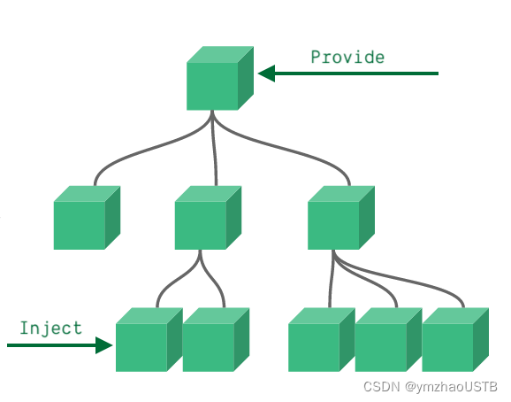

# vue3 setup 组合式API：Options API 迁移至 Composition API 的一些要点

## 前言

vue3出来也很久了，可以抛弃vue2了。况且vue3是兼容vue2的选项式API写法的

vue2至vue3的具体迁移工作请参考[官方文档](https://v3.cn.vuejs.org/guide/migration/introduction.html)

本文以 `<script setup>` 为示例，总结个人学习使用 Composition API 的一些要点

## 一、基础

### 1、准备

Vue 官网学习

[组合式API](https://v3.cn.vuejs.org/guide/composition-api-introduction.html)：了解组合式API的意义，学习基础

[响应性 API](https://v3.cn.vuejs.org/api/reactivity-api.html)：理解 `reactive`，`ref`，`toRef`，`toRefs`；`computed`，`watchEffect`，`watch` 等常用API

[深入响应性原理](https://v3.cn.vuejs.org/guide/reactivity.html)：深入了解响应性原理

边学边练：[Vue SFC Playground](https://sfc.vuejs.org/)

### 2、基本API

以下列出必须掌握的API，可以先学会基本用法，快速上手。再在使用中逐步加深理解直至熟练掌握

这里仅展示基本释义、用法及注意事项，说明及示例均来自于 vue 官网

#### 1）**[ref](https://v3.cn.vuejs.org/api/refs-api.html#ref)**

> ***“接受一个内部值并返回一个==响应式==且可变的 ref 对象。ref 对象仅有一个 `.value` property，指向该内部值。”***

组合式API最大的一个不同在于响应式变量需自行定义了

选项式API中创建一个响应式变量，只需要定义在 `data() { return {} }` 中即可

```html
<script setup>
const count = ref(0)
console.log(count.value) // 0
count.value++
console.log(count.value) // 1
</script>
<template>
  <!-- 自动浅解包 -->
  <p>{{count}}</p>
</template>
```

> ***“从 setup 返回的 refs 在==模板==中访问时是被自动浅解包的，因此不应在模板中使用 .value。”***

#### 2）**[reactive](https://v3.cn.vuejs.org/api/basic-reactivity.html#reactive)**

> ***“返回对象的响应式副本”***

```javascript
const obj = reactive({ count: 0 })

// reactive 将解包所有深层的 refs，同时维持 ref 的响应性
const count = ref(1)
const obj1 = reactive({ count }) // reactive({ count: count })
console.log(obj1.count === count.value) // true，ref 会被解包

count.value++ // 它会更新 `obj.count`
console.log(count.value, obj1.count) // 2 2

obj1.count++ // 它也会更新 `count` ref
console.log(count.value, obj1.count) // 3 3
// 如果 obj1 = reactive({ count: count.value })，则不会解包ref，也不存在响应性
```

`ref` 与 `reactive` 的对比：

`ref` 可以很好的创建一个非引用类型变量。当然，它也可以用于创建响应式对象，使用ref创建的对象相当于创建一个ref对象，将ref对象的value属性指向目标对象。获取目标对象需通过ref对象的value属性

而 `reactive` 创建的响应式对象，可直接访问其成员属性，但在使用中需注意其响应性的维持

```js
const obj = ref({ name: 'Tom' })
obj.value.name = 'Anne'
console.log(obj.value) // { name: 'Anne' }
obj.value = { k: 'v' } // 维持响应性

const obj1 = reactive({ name: 'Tom' })
obj1 = reactive({ k: 'v' }) // 失去响应性
```

#### 3）**[toRef](https://v3.cn.vuejs.org/api/refs-api.html#toref)**

> ***“可以用来为源响应式对象上的某个 property 新创建一个 `ref`。然后，ref ==可以被传递，它会保持对其源 property 的响应式连接==。”***

`toRef` ，顾名思义，返回一个ref对象

```javascript
const state = reactive({ foo: 1, bar: 2 })
const fooRef = toRef(state, 'foo')
```

即使源 property 不存在，toRef 也会返回一个可用的 ref。

#### 4）**[toRefs](https://v3.cn.vuejs.org/api/refs-api.html#torefs)**

> ***“将响应式对象转换为普通对象，其中结果对象的每个 property 都是指向原始对象相应 property 的 `ref`。”***

```javascript
const state = reactive({ foo: 1, bar: 2 })
const stateAsRefs = toRefs(state)
const { foo, bar } = toRefs(state) // foo, bar会保持对其源属性的响应式连接
```

可在不丢失响应性的情况下对返回的对象进行解构/展开

**NOTE1:** 不同于 `toRef`，`toRefs` 只会为源对象中包含的 property 生成 ref。
**==NOTE2: （尤其注意）==** `toRef`，`toRefs` 解构出的属性是对象时，也必须通过 `.value` 获取该对象的属性

```javascript
const obj = reactive({
  foo: 1,
  bar: { k: 'v' }
})
const { foo, bar } = toRefs(obj)

console.log(bar.k) // undefined
console.log(bar.value.k) // 'v'
console.log(obj.bar.k) // 'v'
```

#### 5）**[computed](https://v3.cn.vuejs.org/api/computed-watch-api.html#computed)**

> ***“接受一个 getter 函数，并根据 getter 的返回值返回一个==不可变==的==响应式 ref 对象==。”***

```javascript
const count = ref(1)
const plusOne = computed(() => count.value + 1)
console.log(plusOne.value) // 2
plusOne.value++ // Warning console: Write operation failed: computed value is readonly
console.log(plusOne.value) // 2
```

**注意：** 与 `reactive` 对象不同，返回的是 `ref` 对象，需要通过 `.value` 访问
该不可变与 `readonly` 不同，变量是引用类型时，前者可以更改其成员属性

```js
const obj = reactive({ name: 'Tom' })
let obj1 = computed(() => {
  return obj
})
obj1.value.name = 'Anne'
console.log(obj1.value) // { name: 'Anne' }
obj1.value = {} // Warning console: Write operation failed: computed value is readonly
console.log(obj1.value) // { name: 'Anne' }
```

> ***“或者，接受一个具有 get 和 set 函数的对象，用来创建可写的 ref 对象。”***

```javascript
const count = ref(1)
const plusOne = computed({
  get: () => count.value + 1,
  set: val => {
    count.value = val - 1
  }
})
console.log(count.value, plusOne.value) // 1 2
plusOne.value = 10
console.log(count.value, plusOne.value) // 9 10
```

#### 6）**[watchEffect](https://v3.cn.vuejs.org/api/computed-watch-api.html#watcheffect)**

> ***“立即执行传入的一个函数，同时响应式追踪其依赖，并在其依赖变更时重新运行该函数。”***

```javascript
const count = ref(0)
setTimeout(() => count.value++, 100)
watchEffect(() => console.log(count.value))
```

#### 7）**[watch](https://v3.cn.vuejs.org/api/computed-watch-api.html#watch)**

> ***“`watch` API 完全等同于选项式 API `this.$watch`。`watch` 需要侦听特定的数据源，并在回调函数中执行副作用。默认情况下，它也是惰性的，即只有当被侦听的源发生变化时才执行回调。”***

```javascript
// 直接侦听一个 ref
const count = ref(0)
watch(count, (count, prevCount) => {
  /* ... */
})

// 侦听一个 getter
const state = reactive({ count: 0 })
watch(
  () => state.count,
  (count, prevCount) => {
    /* ... */
  }
)

// 侦听多个源（多个同步更改只会触发一次侦听器）
const fooRef = ref(''), barRef = ref('')
watch([fooRef, barRef], ([foo, bar], [prevFoo, prevBar]) => {
  /* ... */
})

// 侦听深度嵌套对象或数组
watch(
  () => obj,
  (obj, prevObj) => {
    console.log('deep', obj, prevObj)
  },
  { deep: true, immediate: false }
)
```

### 3、其它好用的api

#### 1）**[Provide / Inject](https://v3.cn.vuejs.org/guide/component-provide-inject.html)**

>[组合式API - Provide / Inject](https://v3.cn.vuejs.org/guide/composition-api-provide-inject.html)

> ***“通常，当我们需要从父组件向子组件传递数据时，我们使用 props。想象一下这样的结构：有一些深度嵌套的组件，而深层的子组件只需要父组件的部分内容。在这种情况下，如果仍然将 prop 沿着组件链逐级传递下去，可能会很麻烦。
对于这种情况，我们可以使用一对 provide 和 inject。无论组件层次结构有多深，父组件都可以作为其所有子组件的依赖提供者。这个特性有两个部分：父组件有一个 provide 选项来提供数据，子组件有一个 inject 选项来开始使用这些数据。”***



```javascript
<script setup>
import { ref, reactive, readonly, provide } from 'vue'
import Comp from './Comp.vue'

const refVal = ref(1)
const obj = reactive({
  arr: []
})
setTimeout(() => { refVal.value = 11 }, 0)
setTimeout(() => { obj.arr = [1,2,3] }, 0)
function updArr() {
  obj.arr.push('a')
}

provide('test', 'test value')
// 为了增加 provide 值和 inject 值之间的响应性，我们可以在 provide 值时使用 ref 或 reactive。
provide('refVal ', refVal)
// readonly 确保通过 provide 传递的数据不会被 inject 的组件更改
provide('arr', readonly(computed(() => obj.arr)))
// 尽可能将对响应式 property 的所有修改限制在定义 provide 的组件内部。
provide('updArr', updArr)
</script>
<template>
  <Comp />
</template>
```

Comp.vue:

```javascript
<script setup>
import { inject } from 'vue'

const val = inject('test')
const arr = inject('arr')
const updArr = inject('updArr')
</script>
<template>
  <p>{{val}}</p>
  <button @click="updArr">Upd Arr</button>
</template>
```

## 二、从选项式API迁移的部分细节

vue3 setup 个人使用中总结的一些细节，随着进一步使用，后续陆续补充

### 1、对象响应式更改

更改属性

```html
<script setup>
import { reactive } from 'vue'

let obj = reactive({ name: 'John', age: 25, gender: 'male' })

function testFunc() {
  obj.name = 'Tom' // 维持响应性
  // obj = { name: 'Anney', age: 20, gender: 'female' } // 失去响应性
  // obj = reactive({ name: 'Anney', age: 20, gender: 'female' }) // 失去响应性
  // Object.assign(obj, { name: 'Anney', age: 20, gender: 'female' }) // 维持响应性
}
</script>

<template>
  <p>{{obj.name}}-{{obj.age}}-{{obj.gender}}</p>
  <button @click="testFunc()">TEST</button>
</template>
```

`Object.assign` 是个很好用的响应式更改对象属性的方法，不过，使用中，需要明白其本身的特性，避免不必要的副作用

响应式对象 `delete` 属性，不会失去响应性

```html
<script setup>
import { reactive } from 'vue'

const obj = reactive({ a: 'aaa', b: 'bbb' })
setTimeout(() => {
  delete obj.b
}, 1500)
</script>

<template>
  <h1>{{ obj }}</h1>
</template>
```

### 2、nextTick

`import { nextTick } from 'vue'`

### 3、`this.refs` 获取DOM元素

Options API:

`this.$refs['refName']`

Composition API:

```html
<script setup>
import { ref, onMounted } from 'vue'
const eleRef = ref()
console.log(!!eleRef.value) // false
onMounted(() => {
  console.log(!!eleRef.value) // true （onMounted后可用）
})
</script>
<template>
  <div ref="eleRef"/>
</template>
```

会根据变量名称查找，同样无法在 `onMounted` 前访问

### 4、vue-router: route，router

> [Vue Router](https://router.vuejs.org/zh/guide/)：vue-router 在vue setup中的使用细节查阅官网
>
> [Vue Router 和 组合式 API](https://router.vuejs.org/zh/guide/advanced/composition-api.html)

***“不能再直接访问 `this.$router` 或 `this.$route` 。作为替代，我们使用 `useRouter`，`useRoute` 函数”***

```javascript
import { useRouter, useRoute } from 'vue-router'
const route = useRoute()
```

导航守卫

```js
import { onBeforeRouteLeave, onBeforeRouteUpdate } from 'vue-router'

onBeforeRouteLeave((to, from) => {})
onBeforeRouteUpdate((to, from) => {})
```

### 5、vuex: store

> [Vuex](https://vuex.vuejs.org/zh/guide/): 在vue setup中的使用细节查阅官网
>
> [Vuex - 组合式API](https://vuex.vuejs.org/zh/guide/composition-api.html)

```javascript
import { computed } from 'vue'
import { useStore } from "vuex"

const store = useStore()
// 在 computed 函数中访问 state
const count = computed(() => store.state.count)
// 在 computed 函数中访问 getter
const double = computed(() => store.getters.double)
```

### 6、全局变量

定义：`app.config.globalProperties`

```javascript
import { createApp } from 'vue'
import * as echarts from 'echarts'
import App from './App.vue'
const app = createApp(App)
app.mount('#app')
app.config.globalProperties.$echarts = echarts
```

setup中获取：

```html
<script setup>
import { getCurrentInstance } from 'vue'
console.log(getCurrentInstance().appContext.config.globalProperties.$echarts)
</script>
```

模板中可直接获取

main.js:

```js
// ...
app.config.globalProperties.$testVal = 'abc'
```

```html
<template>
  <div>{{$testVal}}</div>
</template>
```

### 7、props & emit

> ***“`defineProps` is a compiler macro and no longer needs to be imported.”***

[defineProps 和 defineEmits](https://v3.cn.vuejs.org/api/sfc-script-setup.html#defineprops-%E5%92%8C-defineemits) : `defineProps` , `defineEmits` 无需导入，可直接使用

```html
<script setup>
const props = defineProps({ foo: String })
const emit = defineEmits(['change', 'delete'])
</script>
```

defineProps中的属性可直接在模板中使用

```html
<script setup>
defineProps({ foo: String })
</script>
<template>
  <p>{{foo}}</p>
</template>
```

[Props](https://v3.cn.vuejs.org/guide/composition-api-setup.html#props)

> ***“props 是响应式的，你不能使用 ES6 解构，它会消除 prop 的响应性。
如果需要解构 prop，可以在 setup 函数中使用 `toRefs` 函数来完成此操作”***

```javascript
import { toRefs } from 'vue'
setup(props) {
  const { title } = toRefs(props)
  console.log(title.value)
}
```

如果 title 是可选的 prop，则传入的 props 中可能没有 title 。在这种情况下，`toRefs` 将不会为 title 创建一个 ref 。你需要使用 `toRef` 替代它：

```javascript
import { toRef } from 'vue'
setup(props) {
  const title = toRef(props, 'title')
  console.log(title.value)
}
```

在 `<script setup>` 中，可先使用 `defineProps` 方法获取组件属性，再使用 `toRefs` 解构

```javascript
import { toRef } from 'vue'

const props = defineProps({
  title: String,
  foo: { type: String, default: 'foo' }
})
const { title, foo } = toRefs(props)
// const title = toRef(props, 'title')
console.log(title.value)
```

### 8、[defineExpose](https://v3.cn.vuejs.org/api/sfc-script-setup.html#defineexpose)

在选项式API中，我们可以通过ref获取子组件实例，然后直接访问其属性、方法

组合式API中有所不同：

> ***“使用 \<script setup> 的组件是默认关闭的，也即通过模板 ref 或者 $parent 链获取到的组件的公开实例，不会暴露任何在 \<script setup> 中声明的绑定。
为了在 \<script setup> 组件中明确要暴露出去的属性，使用 defineExpose 编译器宏”***

```javascript
<script setup>
import { ref,onMounted } from 'vue'
import Comp from './Comp.vue'

const comp = ref()
onMounted(() => {
  console.log(comp.value.b)
  comp.value.func()
}) 
</script>
<template>
  <Comp ref="comp" />
</template>
```

Comp.vue

```javascript
<script setup>
import { ref } from 'vue'

const a = 1
const b = ref(2)
function func() {
  console.log('execute func')
}
defineExpose({ a, b, func })
</script>
```

### 9、[useSlots() 和 useAttrs()](https://cn.vuejs.org/api/sfc-script-setup.html#useslots-useattrs)

> ***在 \<script setup\> 使用 slots 和 attrs 的情况应该是相对来说较为罕见的，因为可以在模板中直接通过 `$slots` 和 `$attrs` 来访问它们。在你的确需要使用它们的罕见场景中，可以分别用 useSlots 和 useAttrs 两个辅助函数：***

```js
<script setup>
import { useSlots, useAttrs } from 'vue'

const slots = useSlots()
const attrs = useAttrs()
</script>
```

### 10、组件递归调用自身

vue2及vue3的非 `<script setup>` 中，只需命名组件，然后通过名称即可调用自身

```html
<script>
export default { name: 'CompName' }
</script>
<template>
  <!-- <CompName /> -->
</template>
```

由于普通 `<script>` 可以与 `<script setup>` 并存，所以，可以将上述script拷贝一份，模板中通过名称调用

```html
<script>
export default { name: 'CompName' }
</script>
<script setup>
  // ...
</script>
<template>
  <!-- <CompName /> -->
</template>
```

上例做法有些丑，其实官方已经提供了 [递归组件](https://v3.cn.vuejs.org/api/sfc-script-setup.html#%E4%BD%BF%E7%94%A8%E7%BB%84%E4%BB%B6) 引用方法（可能是后续版本才更新出来的功能）

> ***“一个单文件组件可以通过它的文件名被其自己所引用。例如：名为 FooBar.vue 的组件可以在其模板中用 \<FooBar/> 引用它自己。”***

```html
<script setup>
  // ...
</script>
<template>
  <!-- <FooBar/> -->
</template>
```

## 三、逻辑复用

vue3同时支持两种API风格，熟悉两种风格后，可以自由切换写法。上面写的是如何使用组合式API。那么，为什么要学习使用它呢？这个问题应当是需要首先思考的，但在学习新知识前，看太多理论分析，可能会消磨学习的积极性。在实操的过程中，相信会思考的人会自己找到答案。

[Vue.js - API 风格](https://cn.vuejs.org/guide/introduction.html#api-styles)

[Vue.js - 组合式 API 常见问答](https://cn.vuejs.org/guide/extras/composition-api-faq.html)

官网涵盖面非常广，基本使用只是基础，必须反复查看学习

### 1、逻辑复用

对比纯js的逻辑复用，vue3提供的组合式 API 能非常方便地抽离可复用逻辑，可计算、可监听，还可返回响应式变量。

对比mixins，组合式 API 解决了[mixins 的所有缺陷](https://cn.vuejs.org/guide/reusability/composables.html#vs-mixins)。

[Vue.js - 逻辑复用 - 组合式函数](https://cn.vuejs.org/guide/reusability/composables.html)

### 2、组织代码

[通过抽取组合式函数改善代码结构](https://cn.vuejs.org/guide/reusability/composables.html#extracting-composables-for-code-organization)

在选项式 API 中，一个功能多的组件可能长达几千行代码。在迁移至组合式 API 的过程中，对这种组件会非常头疼，只能先跳过。但写新页面，且功能逐渐增多时，依然会面临这种问题。

尽管遵循其风格，将同一功能的代码(变量声明定义、监听、计算、方法)集中在一个区域，但很有可能会写出一个又臭又长有难以阅读的组件，可读性远不如选项式API。

需要知道的是，不是只有可复用的逻辑才需要抽离。组件内，某一功能相关的逻辑可以抽离出来，在组件内调用。

### 3、小结

官网示例展示了逻辑复用的基本实践，更多场景下的使用，需要自行查询大佬们分享的优质文章

以下文章可作参考：

> [做了一夜动画，就为让大家更好的理解Vue3的Composition Api](https://juejin.cn/post/6890545920883032071)
> [Vue3.2的setup语法糖和Hook函数 (强烈推荐)](https://juejin.cn/post/7041038709906472974)
> [vue3 + setup sugar + TS 经验分享](https://juejin.cn/post/6990682369992704007)
> [我相信这是 Vue3 复用代码的正确姿势！](https://mp.weixin.qq.com/s/Fyo6876mgdgbvIHcqKf3oA)

## 四、最后

本人的vue3使用经验尚且不足，个人总结，如果错误，欢迎评论指正！
