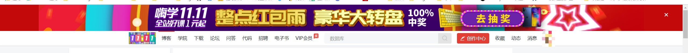
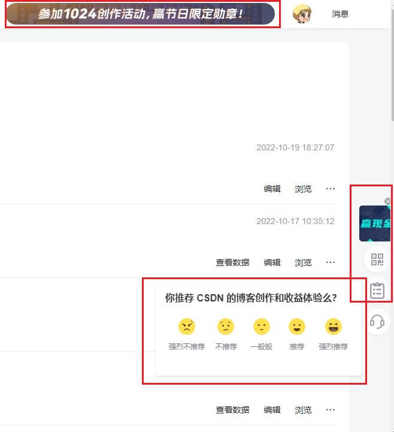
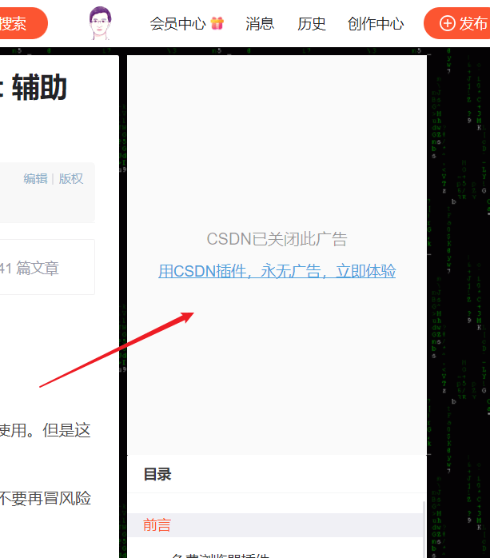
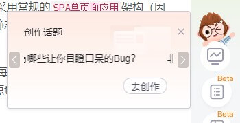
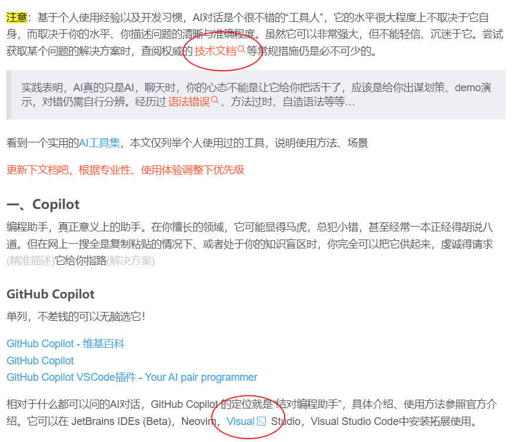

# CSDN 去污器

## 前言

CSDN 用的比较久了（仅限博客），最开始的目的就是发博文、笔记、经验总结、bug记录等，当云文档使用。

现在个人的日常搜索已经把CSDN域名排除在外了，但还没有放弃CSDN博客，一方面感觉自己的输出更适合新手，搬到掘金这些可能会被骂误人子弟、又水一篇等；另一方面CSDN博客页如果去掉广告、与博文无关的板块，阅读体验也不至于很差。

## 工具

使用油猴脚本给 CSDN 做个面部清洁

个人开发的一个油猴脚本，[csdn广告隐藏(顶部及侧边)](https://greasyfork.org/zh-CN/scripts/415912-csdn%E5%B9%BF%E5%91%8A%E9%9A%90%E8%97%8F-%E9%A1%B6%E9%83%A8%E5%8F%8A%E4%BE%A7%E8%BE%B9)：

- 仅包含css样式
- 主要针对CSDN博客页，通过简单的css隐藏其广告及无用乐色内容
- 为避免影响正常使用，不隐藏可能有用的内容
- 取消博文中被csdn不要face插入的牛皮藓链接

<ClientOnly>
  

    
广告及无用乐色：

    
    
    
    
    
牛皮藓链接：

    
  

</ClientOnly>

## 总结

有什么新的乐色、牛皮藓没过滤的，欢迎留言。
