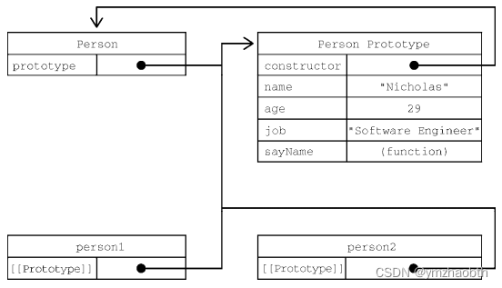
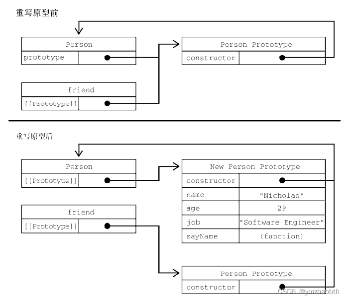
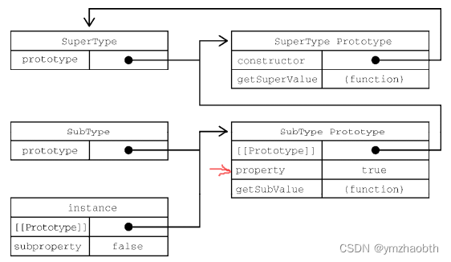

# 第8章 对象、类与面向对象编程

>*“ECMA-262 将对象定义为一组属性的**无序集合**。严格来说，这意味着对象就是一组没有特定顺序的值。对象的每个属性或方法都由一个名称来标识，这个名称映射到一个值。正因为如此（以及其他还未讨论的原因），可以把 ECMAScript 的对象想象成一张散列表，其中的内容就是一组名/值对，值可以是数据或者函数。”*

## 8.1 理解对象

创建自定义对象：

- 创建Object的一个新实例，再给它添加属性、方法
- 对象字面量

```js
let obj = new Object()
obj.name = 'Nicholas'
obj.func = () => {}

let obj = {
  name: 'Nicholas',
  func: () => {}
}
```

两者等价

### 8.1.1 属性的类型

>*“ECMA-262 使用一些内部特性来描述属性的特征。这些特性是由为 JavaScript 实现引擎的规范定义的。因此，开发者不能在 JavaScript 中直接访问这些特性。为了将某个特性标识为内部特性，规范会用两个中括号把特性的名称括起来，比如[[Enumerable]]。<br/>
属性分两种：数据属性和访问器属性。”*

#### 1. 数据属性

- `[[Configurable]]`：表示属性是否可以通过 delete 删除并重新定义，是否可以修改它的特性，以及是否可以把它改为访问器属性。默认情况下，所有**直接定义在对象上**的属性的这个特性都是 true
- `[[Enumerable]]`：表示属性是否可以通过 for-in 循环返回。默认情况下，所有**直接定义在对象上**的属性的这个特性都是 true
- `[[Writable]]`：表示属性的值是否可以被修改。默认情况下，所有**直接定义在对象上**的属性的这个特性都是 true
- `[[Value]]`：包含属性实际的值。这就是前面提到的那个读取和写入属性值的位置。默认为 undefined

将属性显式添加到对象之后，`[[Configurable]]`、`[[Enumerable]]` 和 `[[Writable]]` 都会被设置为 true，而 `[[Value]]` 特性会被设置为指定的值

要修改属性的默认特性，就必须使用 `Object.defineProperty()` 方法，这个方法接收 3 个参数：

- 要给其添加属性的对象
- 属性的名称
- 一个描述符对象：可以包含：configurable、enumerable、writable 和 value，跟相关特性的名称一一对应

```js
let person = {}
Object.defineProperty(person, "name", {
 configurable: false,
 value: "Nicholas"
})
```

> *“一个属性被定义为不可配置之后，就不能再变回可配置的了”*
>
> *“在调用 Object.defineProperty()时，configurable、enumerable 和 writable 的值如果不指定，则都**默认为 false**。”*

注意直接定义在对象上的属性，和使用`Object.defineProperty()`定义的属性，他们的数据属性的默认值是不同的

#### 2. 访问器属性

访问器属性不包含数据值

- `[[Configurable]]`：表示属性是否可以通过 delete 删除并重新定义，是否可以修改它的特性，以及是否可以把它改为数据属性。默认情况下，所有直接定义在对象上的属性的这个特性都是 true
- `[[Enumerable]]`：表示属性是否可以通过 for-in 循环返回。默认情况下，所有直接定义在对象上的属性的这个特性都是 true
- `[[Get]]`：获取函数，在读取属性时调用。默认值为 undefined
- `[[Set]]`：设置函数，在写入属性时调用。默认值为 undefined

访问器属性是不能直接定义的，必须使用 `Object.defineProperty()`

获取函数和设置函数不一定都要定义。只定义获取函数意味着属性是只读的，只定义设置函数的属性是不能读取的

### 8.1.2 定义多个属性

ECMAScript 提供了 `Object.defineProperties()` 方法。这个方法可以通过多个描述符一次性定义多个属性。它接收两个参数：要为之添加或修改属性的对象和另一个描述符对象

```js
let book = {}
Object.defineProperties(book, {
  year_: {
    value: 2017
  },
  edition: {
    value: 1
  },
  year: {
    get() {
      return this.year_
    },
    set(newValue) {
      if (newValue > 2017) {
        this.year_ = newValue
        this.edition += newValue - 2017
      }
    }
  }
})
```

### 8.1.3 读取属性的特性

使用 `Object.getOwnPropertyDescriptor()` 方法可以取得指定属性的属性描述符

`Object.getOwnPropertyDescriptor(book, "year_")`

ECMAScript 2017 新增了 `Object.getOwnPropertyDescriptors()` 静态方法。这个方法实际上会在每个自有属性上调用 `Object.getOwnPropertyDescriptor()` 并在一个新对象中返回它们

### 8.1.4 合并对象

>*“ECMAScript 6 专门为合并对象提供了 `Object.assign()` 方法。这个方法接收一个目标对象和一个或多个源对象作为参数，然后将每个源对象中可枚举（`Object.propertyIsEnumerable()`返回 true）和自有（`Object.hasOwnProperty()`返回 true）属性复制到目标对象。以字符串和符号为键的属性会被复制。对每个符合条件的属性，这个方法会使用源对象上的[[Get]]取得属性的值，然后使用目标对象上的[[Set]]设置属性的值。<br/>
Object.assign()实际上对每个源对象执行的是**浅复制**。如果多个源对象都有相同的属性，则使用最后一个复制的值。”*

### 8.1.5 对象标识及相等判定

在 ECMAScript 6 之前，有些特殊情况即使是`===`操作符也无能为力。为改善这类情况，ECMAScript 6 规范新增了 `Object.is()`。这个方法必须接收两个参数

```js
// 正确的 0、-0、+0 相等/不等判定
console.log(Object.is(+0, -0)) // false 
console.log(Object.is(+0, 0)) // true 
console.log(Object.is(-0, 0)) // false 
// 正确的 NaN 相等判定
console.log(Object.is(NaN, NaN)) // true
```

### 8.1.6 增强的对象语法

ECMAScript 6 为定义和操作对象新增了很多极其有用的语法糖特性

#### 1. 属性值简写

在给对象添加变量的时候，若属性名和变量名是一样的，可简写属性名

> 简写属性名只要使用变量名（不用再写冒号）就会自动被解释为同名的属性键。如果没有找到同名变量，则会抛出 ReferenceError

```js
let name = 'Matt'
let person = { name } // { name: 'Matt' }
```

#### 2. 可计算属性

可计算属性允许你在对象字面量中完成动态属性赋值。中括号包围的对象属性键告诉运行时将其作为 JavaScript 表达式而不是字符串来求值

```js
const nameKey = 'name'
let person = {
  [nameKey]: 'Matt',
}
console.log(person) // { name: 'Matt' }
```

#### 3. 简写方法名

>*“在给对象定义方法时，通常都要写一个方法名、冒号，然后再引用一个匿名函数表达式<br/>
新的简写方法的语法遵循同样的模式，但开发者要放弃给函数表达式命名（不过给作为方法的函数命名通常没什么用）。相应地，这样也可以明显缩短方法声明”*

```js
let person = {
  sayName: function(name) {
    console.log(`My name is ${name}`)
  }
}
let person = {
  sayName(name) {
    console.log(`My name is ${name}`)
  }
}
```

简写方法名与可计算属性键相互兼容：

```js
const methodKey = 'sayName'
let person = {
  [methodKey](name) {
    console.log(`My name is ${name}`)
  }
}
```

### 8.1.7 对象解构

```js
let person = {
  name: 'Matt',
  age: 27
}
const { name: personName, age: personAge } = person
console.log(personName, personAge) // Matt, 27

const { name, age } = person
console.log(name, age) // Matt, 27
```

解构赋值不一定与对象的属性匹配。赋值的时候可以忽略某些属性，而如果引用的属性不存在，则该变量的值就是 `undefined`

接上例：

```js
const { name, job } = person
console.log(name, job) // Matt, undefined
```

也可以在解构赋值的同时定义默认值：

```js
const { name, job = 'Software engineer' } = person
console.log(name, job) // Matt, Software engineer
```

>*“解构在内部使用函数 `ToObject()`（不能在运行时环境中直接访问）把源数据结构转换为对象。这意味着在对象解构的上下文中，**原始值会被当成对象**。这也意味着（根据 ToObject()的定义），**null和 undefined 不能被解构**，否则会抛出错误。”*

```js
let { length } = 'foobar'
console.log(length) // 6
let { constructor: c } = 4
console.log(c === Number) // true
let { _ } = null // TypeError
let { _ } = undefined // TypeError
```

>*“解构并不要求变量必须在解构表达式中声明。不过，如果是给事先声明的变量赋值，则赋值表达式必须包含在一对括号中”*

```js
let personName, personAge
let person = {
  name: 'Matt',
  age: 27
}; // 这里的分号不可以去除
({name: personName, age: personAge} = person)
console.log(personName, personAge) // Matt, 27
```

#### 1. 嵌套解构

解构对于引用嵌套的属性或赋值目标没有限制。为此，可以通过解构来复制对象属性

```js
let person = {
  name: 'Matt',
  age: 27,
}
let personCopy = {};
({
  name: personCopy.name,
  age: personCopy.age
} = person)
console.log(personCopy) // { name: 'Matt', age: 27 }
```

解构赋值可以使用嵌套结构，以匹配嵌套的属性

```js
let person = {
  name: 'Matt',
  age: 27,
  job: {
    title: 'Software engineer'
  }
}
// 声明 title 变量并将 person.job.title 的值赋给它
let { job: { title } } = person
console.log(title) // Software engineer
// 或者，将 person.job.title 解构给已声明对象
let jobTitle;
({ job: { title: jobTitle } } = person)
console.log(jobTitle) // Software engineer
```

在外层属性没有定义的情况下不能使用嵌套解构。无论源对象还是目标对象都一样

```js
let person = {
  job: {
    title: 'Software engineer'
  }
}
let personCopy = {};
// foo 在源对象上是 undefined 
({
  foo: { 
    bar: personCopy.bar 
  } 
} = person)
// TypeError: Cannot destructure property 'bar' of 'undefined' or 'null'.
```

#### 2. 部分解构

需要注意的是，涉及多个属性的解构赋值是一个输出无关的顺序化操作。如果一个解构表达式涉及
多个赋值，开始的赋值成功而后面的赋值出错，则整个解构赋值只会完成一部分

```js
let person = {
  name: 'Matt',
  age: 27
}
let personName, personBar, personAge
try {
  // person.foo 是 undefined，因此会抛出错误
  ({name: personName, foo: { bar: personBar }, age: personAge} = person);
} catch(e) {}
console.log(personName, personBar, personAge)
// Matt, undefined, undefined
// personAge的解构未进行
```

#### 3. 参数上下文匹配

在函数参数列表中也可以进行解构赋值。对参数的解构赋值不会影响 arguments 对象，但可以在函数签名中声明在函数体内使用局部变量

```js
let person = {
  name: 'Matt',
  age: 27
}
function printPerson2(foo, { name: personName, age: personAge }, bar) {
  console.log(arguments)
  console.log(personName, personAge)
}
printPerson2('1st', person, '2nd')
// ['1st', { name: 'Matt', age: 27 }, '2nd'] 
// 'Matt', 27
```

#### 学习小结 - 对象解构

解构对象，顾名思义，是根据对象的结构逆向进行的

被解构的对象放右边，左边按对象的结构进行解构：

`let { name, age } = { name: 'Matt', age: 27 }`

这里使用了上一节的**属性值简写**，等价于

`let { name: name, age: age } = { name: 'Matt', age: 27 }`

所以，解构的结果是定义了 `name` 以及 `age` 两个变量

而，`let { name: personName, age: personAge } = { name: 'Matt', age: 27 }` 则是弃用**属性值简写**语法糖，目的是定义两个自定义变量

默认值同样可以用在此解构方式上：

```js
let { name: personName, age: personAge, job: personJob = 'developer' } = { name: 'Matt', age: 27 }
console.log(personName, personAge, personJob) // Matt 27 developer
```

关于**嵌套解构**，文中提到两种：

一种是赋值的引用嵌套，也就是将解构的值赋值给对象的属性（可嵌套）；

一种是嵌套解构赋值，它更能体现“解构”的过程。（两种嵌套可并存）

```js
let person = {
  name: 'Matt',
  age: 27,
  job: {
    title: 'Software engineer'
  }
}
```

```js
// 声明变量personName，并将 person.name 的值赋给它
// 声明变量jobTitle，并将 person.job.title 的值赋给它
let { name: personName, job: { title: jobTitle } } = person
console.log(personName, jobTitle) // Matt, Software engineer
```

上例可见，左边表达式的结构与对象person的一致

使用**属性值简写**语法糖的语句：`let { name, job: { title } } = person`，声明的是name, title两个变量

两种嵌套的并存，接上例：

```js
let obj = {
  person: {}
};
({ name: obj.person.name, job: { title: obj.person.jobTitle } } = person)
// obj: {"person":{"name":"Matt","jobTitle":"Software engineer"}}
```

## 8.2 创建对象

### 8.2.2 工厂模式

```js
function createPerson (name, age, job) {
  let o = new Object()
  o.name = name
  o.age = age
  o.job = job
  o.sayName = function () {
    console.log(this.name)
  }
  return o
}
let person1 = createPerson("Nicholas", 29, "Software Engineer")
let person2 = createPerson("Greg", 27, "Doctor")
```

这种工厂模式虽然可以解决创建多个类似对象的问题，但没有解决对象标识问题（即新创建的对象是什么类型）

### 8.2.3 构造函数模式

ECMAScript 中的构造函数是用于创建特定类型对象的。像 Object 和 Array 这样的原生构造函数，运行时可以直接在执行环境中使用。当然也可以自定义构造函数，以函数的形式为自己的对象类型定义属性和方法。

```js
function Person (name, age, job) {
  this.name = name
  this.age = age
  this.job = job
  this.sayName = function () {
    console.log(this.name)
  }
}
let person1 = new Person("Nicholas", 29, "Software Engineer")
let person2 = new Person("Greg", 27, "Doctor")
```

按照惯例，构造函数名称的首字母都是要大写的，非构造函数则以小写字母开头。ECMAScript 的构造函数就是能创建对象的函数。

要创建 Person 的实例，应使用 new 操作符。以这种方式调用构造函数会执行如下操作：

(1) 在内存中创建一个新对象
(2) 这个新对象内部的[[Prototype]]特性被赋值为构造函数的 prototype 属性
(3) 构造函数内部的 this 被赋值为这个新对象（即 this 指向新对象）
(4) 执行构造函数内部的代码（给新对象添加属性）
(5) 如果构造函数返回非空对象，则返回该对象；否则，返回刚创建的新对象

上例中，person1 和 person2 分别保存着 Person 的不同实例。这两个对象都有一个constructor 属性指向 Person。constructor 本来是用于标识对象类型的。不过，一般认为 instanceof 操作符是确定对象类型更可靠的方式。

```js
console.log(person1 instanceof Object); // true 
console.log(person1 instanceof Person); // true
```

定义自定义构造函数可以确保实例被标识为特定类型，相比于工厂模式，这是一个很大的好处。

#### 1. 构造函数也是函数

构造函数与普通函数唯一的区别就是调用方式不同。任何函数只要使用 new 操作符调用就是构造函数，而不使用 new 操作符调用的函数就是普通函数。比如，前面的例子中定义的 Person()可以像下面这样调用：

```js
// 作为构造函数
let person = new Person('Nicholas', 29, 'Software Engineer')

// 作为函数调用
Person('Greg', 27, 'Doctor') // 添加到window对象
window.sayName() // 'Greg'

// 在另一个对象的作用域中调用
let o = new Object()
Person.call(o, "Kristen", 25, "Nurse")
o.sayName() // "Kristen"
```

作为函数调用，仅执行。作为构造函数，执行过程则分为五步

#### 2. 构造函数的问题

构造函数虽然有用，但也不是没有问题。构造函数的主要问题在于，其定义的方法会在每个实例上都创建一遍。

### 8.2.4 原型模式

每个函数都会创建一个 prototype 属性，这个属性是一个对象，包含应该由特定引用类型的实例共享的属性和方法。实际上，这个对象就是通过调用构造函数创建的对象的原型。使用原型对象的好处是，在它上面定义的属性和方法可以被对象实例共享。原来在构造函数中直接赋给对象实例的值，可以直接赋值给它们的原型，如下所示：

```js
function Person() {}
// 使用函数表达式也可以：let Person = function() {}
Person.prototype.name = "Nicholas"
Person.prototype.age = 29
Person.prototype.job = "Software Engineer"
Person.prototype.sayName = function() {
 console.log(this.name)
}
let person1 = new Person()
person1.sayName() // "Nicholas"
let person2 = new Person()
person2.sayName() // "Nicholas"
console.log(person1.sayName == person2.sayName) // true
```

#### 1. 理解原型

无论何时，只要创建一个函数，就会按照特定的规则为这个函数创建一个 `prototype` 属性（指向原型对象）。默认情况下，所有原型对象自动获得一个名为 `constructor` 的属性，指回与之关联的构造函数。

在自定义构造函数时（8.2.3），原型对象默认只会获得 `constructor` 属性，其他的所有方法都继承自`Object`。每次调用构造函数创建一个新实例，这个实例的内部`[[Prototype]]`指针就会被赋值为构造函数的原型对象。脚本中没有访问这个`[[Prototype]]`特性的标准方式，但 Firefox、Safari 和 Chrome会在每个对象上暴露`__proto__`属性，通过这个属性可以访问对象的原型。在其他实现中，这个特性完全被隐藏了。关键在于理解这一点：实例与构造函数原型之间有直接的联系，但实例与构造函数之间没有。

```js
function Person () {}

/** 
 * 声明之后，构造函数就有了一个
 * 与之关联的原型对象：
 */ 
console.log(typeof Person.prototype); 
console.log(Person.prototype); 
// { 
// constructor: f Person(), 
// __proto__: Object
// }
/** 
 * 如前所述，构造函数有一个 prototype 属性
 * 引用其原型对象，而这个原型对象也有一个
 * constructor 属性，引用这个构造函数
 * 换句话说，两者循环引用：
 */
console.log(Person.prototype.constructor === Person); // true
/** 
 * 正常的原型链都会终止于 Object 的原型对象
 * Object 原型的原型是 null 
 */ 
console.log(Person.prototype.__proto__ === Object.prototype); // true 
console.log(Person.prototype.__proto__.constructor === Object); // true 
console.log(Person.prototype.__proto__.__proto__ === null); // true
```



Person 的两个实例 person1 和 person2 都只有一个内部属性指回 Person.prototype，而且两者都与构造函数没有直接联系。另外要注意，虽然这两个实例都没有属性和方法，但 person1.sayName()可以正常调用。这是由于**对象属性查找机制**。

虽然不是所有实现都对外暴露了[[Prototype]]，但可以使用 isPrototypeOf()方法确定两个对象之间的这种关系

```js
console.log(Person.prototype.isPrototypeOf(person1)); // true
```

ECMAScript 的 Object 类型有一个方法叫 Object.getPrototypeOf()，返回参数的内部特性[[Prototype]]的值。例如：

```js
console.log(Object.getPrototypeOf(person1) == Person.prototype); // true 
console.log(Object.getPrototypeOf(person1).name); // "Nicholas"
```

Object 类型还有一个 setPrototypeOf()方法，可以向实例的私有特性[[Prototype]]写入一个新值。这样就可以重写一个对象的原型继承关系：

```js
let biped = { numLegs: 2 } 
let person = { name: 'Matt' }
Object.setPrototypeOf(person, biped) // 将实例person的原型对象设置为biped
console.log(person.name) // Matt 
console.log(person.numLegs) // 2 
console.log(Object.getPrototypeOf(person) === biped) // true
```

>**警告**：Object.setPrototypeOf()可能会严重影响代码性能。Mozilla 文档说得很清楚：“在所有浏览器和 JavaScript 引擎中，修改继承关系的影响都是微妙且深远的。这种影响并不仅是执行 Object.setPrototypeOf()语句那么简单，而是会涉及所有访问了那些修改过[[Prototype]]的对象的代码。

为避免使用 Object.setPrototypeOf()可能造成的性能下降，可以通过 Object.create()来创建一个新对象，同时为其指定原型：

```js
let biped = { numLegs: 2 }
let person = Object.create(biped)
person.name = 'Matt'
```

#### 2. 原型层级

在通过对象访问属性时，会按照这个属性的名称开始搜索。搜索**开始于对象实例本身**。如果在这个实例上发现了给定的名称，则返回该名称对应的值。如果没有找到这个属性，则搜索会沿着指针**进入原型对象**，然后在原型对象上找到属性后，再返回对应的值。

虽然可以通过实例读取原型对象上的值，但不可能通过实例重写这些值。如果在实例上添加了一个与原型对象中同名的属性，那就会在实例上创建这个属性，这个属性会遮蔽（shadow）原型对象上的属性。即使在实例上把这个属性设置为 null，也不会恢复它和原型的联系。不过，使用 delete 操作符可以完全删除实例上的这个属性，从而让标识符解析过程能够继续搜索原型对象。

`hasOwnProperty()`方法用于确定某个属性是在实例上还是在原型对象上。这个方法是继承自 Object的，会在属性存在于调用它的对象实例上时返回 true

```js
function Person() {}
Person.prototype.name = "Nicholas"
let person1 = new Person()

console.log(person1.name) // "Nicholas"，来自原型
console.log(person1.hasOwnProperty("name")) // false

person1.name = "Greg"
console.log(person1.name) // "Greg"，来自实例
console.log(person1.hasOwnProperty("name")) // true

delete person1.name
console.log(person1.name) // "Nicholas"，来自原型
console.log(person1.hasOwnProperty("name")) // false
```

>**注意**：ECMAScript 的 Object.getOwnPropertyDescriptor()方法只对实例属性有效。要取得原型属性的描述符，就必须直接在原型对象上调用 Object.getOwnPropertyDescriptor()。

#### 3. 原型和in操作符

有两种方式使用 `in` 操作符：单独使用和在 `for-in` 循环中使用。在单独使用时，`in` 操作符会在可以通过对象访问指定属性时返回 true，**无论该属性是在实例上还是在原型上**。

```js
// 接上例
console.log("name" in person1) // true
```

在 `for-in` 循环中使用 `in` 操作符时，**可以通过对象访问且可以被枚举的属性**都会返回，包括实例属性和原型属性。遮蔽原型中不可枚举（`[[Enumerable]]`特性被设置为 false）属性的实例属性也会在 for-in 循环中返回，因为默认情况下开发者定义的属性都是可枚举的。

要获得对象上所有可枚举的**实例属性**，可以使用 `Object.keys()`方法。这个方法接收一个对象作为参数，返回包含该对象**所有可枚举属性名称**的字符串数组。

```js
function Person() {} 
Person.prototype.name = "Nicholas"; 
Person.prototype.age = 29; 
Person.prototype.job = "Software Engineer"; 
Person.prototype.sayName = function() { 
 console.log(this.name); 
}; 
let keys = Object.keys(Person.prototype); 
console.log(keys); // "name,age,job,sayName" 
let p1 = new Person(); 
p1.name = "Rob"; 
p1.age = 31; 
let p1keys = Object.keys(p1); 
console.log(p1keys); // "[name,age]"
```

这里，keys 变量保存的数组中包含"name"、"age"、"job"和"sayName"。这是正常情况下通过for-in 返回的顺序。而在 Person 的实例上调用时，Object.keys()返回的数组中只包含"name"和"age"两个属性。

如果想列出所有实例属性，无论是否可以枚举，都可以使用 `Object.getOwnPropertyNames()`：

```js
let keys = Object.getOwnPropertyNames(Person.prototype)
console.log(keys) // "[constructor,name,age,job,sayName]"
```

以符号为键的属性没有名称的概念，`Object.getOwnPropertySymbols()`：

```js
let k1 = Symbol('k1')
  k2 = Symbol('k2')
let o = {
  [k1]: 'k1',
  [k2]: 'k2'
}
console.log(Object.getOwnPropertySymbols(o)) // [Symbol(k1), Symbol(k2)]
```

#### 4. 属性枚举顺序

for-in 循环、Object.keys()、Object.getOwnPropertyNames()、Object.getOwnPropertySymbols()以及 Object.assign()在属性枚举顺序方面有很大区别。**for-in 循环和 Object.keys()的枚举顺序是不确定的，取决于 JavaScript 引擎，可能因浏览器而异。**

Object.getOwnPropertyNames()、Object.getOwnPropertySymbols()和 Object.assign()的枚举顺序是确定性的。先**以升序枚举数值键**，然后**以插入顺序枚举字符串和符号键**。在对象字面量中定义的键以它们逗号分隔的顺序插入。

### 8.2.5 对象迭代

ECMAScript 2017 新增了两个静态方法，用于将对象内容转换为序列化的——更重要的是可迭代的——格式。这两个静态方法`Object.values()`和 `Object.entries()`接收一个对象，返回它们内容的数组。`Object.values()`返回对象值的数组，`Object.entries()`返回键/值对的数组。

```js
const o = {
  foo: 'bar',
  baz: 1,
  qux: {}
}
console.log(Object.values(o)) // ["bar", 1, {}]
console.log(Object.entries((o))) // [["foo", "bar"], ["baz", 1], ["qux", {}]]
```

注意，非字符串属性会被转换为字符串输出。符号属性会被忽略。另外，这两个方法执行对象的浅复制

#### 1. 其他原型语法

在前面的例子中，每次定义一个属性或方法都会把 Person.prototype 重写一遍。为了减少代码冗余，也为了从视觉上更好地封装原型功能，直接通过一个包含所有属性和方法的对象字面量来重写原型成为了一种常见的做法。

```js
function Person() {}
Person.prototype = {
  name: "Nicholas",
  age: 29,
  job: "Software Engineer",
  sayName() {
    console.log(this.name)
  }
}
```

这样重写之后，Person.prototype 的 constructor 属性就不指向 Person了。在创建函数时，也会创建它的 prototype 对象，同时会自动给这个原型的 constructor 属性赋值。而上面的写法完全重写了默认的 prototype 对象（指向新创建的对象），因此其 constructor 属性也指向了完全不同的新对象（Object 构造函数，新对象由对象字面量创建），不再指向原来的构造函数。虽然 instanceof 操作符还能可靠地返回值，但我们不能再依靠 constructor 属性来识别类型了。

```js
let friend = new Person();
console.log(friend instanceof Object); // true
console.log(friend instanceof Person); // true
console.log(friend.constructor == Person); // false
console.log(friend.constructor == Object); // true
```

如果 constructor 的值很重要，则可以像下面这样在重写原型对象时专门设置一下它的值：

```js
function Person() {}
Person.prototype = {
  constructor: Person,
  name: "Nicholas",
  age: 29,
  job: "Software Engineer",
  sayName() {
    console.log(this.name);
  }
}
```

这次的代码中特意包含了 constructor 属性，并将它设置为 Person，保证了这个属性仍然包含恰当的值。

但要注意，以这种方式恢复 constructor 属性会创建一个`[[Enumerable]]`为 true 的属性。而**原生 constructor 属性默认是不可枚举的**。因此，如果你使用的是兼容 ECMAScript 的 JavaScript 引擎，那可能会改为使用 `Object.defineProperty()` 方法来定义 constructor 属性。

```js
function Person() {}
Person.prototype = {
  name: "Nicholas",
  age: 29,
  job: "Software Engineer",
  sayName() {
    console.log(this.name)
  }
}
// 恢复 constructor 属性
Object.defineProperty(Person.prototype, "constructor", {
  enumerable: false,
  value: Person
})
```

#### 2. 原型的动态性

因为从原型上搜索值的过程是动态的，所以即使实例在修改原型之前已经存在，任何时候对原型对
象所做的修改也会在实例上反映出来。

```js
let friend = new Person();
Person.prototype.sayHi = function() {
  console.log("hi");
}
friend.sayHi(); // "hi"，没问题！
```

```js
function Person() {}
let friend = new Person();
Person.prototype = {
  constructor: Person,
  name: "Nicholas",
  age: 29,
  job: "Software Engineer",
  sayName() {
    console.log(this.name);
  }
};
friend.sayName(); // 错误
```

重写构造函数上的原型之后再创建的实例才会引用新的原型。而在此之前创建的实例仍然会引用最初的原型。


#### 3. 原生对象原型

原型模式之所以重要，不仅体现在自定义类型上，而且还因为它也**是实现所有原生引用类型的模式**。所有原生引用类型的构造函数（包括 `Object`、`Array`、`String` 等）都在原型上定义了实例方法。比如，数组实例的 `sort()`方法就是 `Array.prototype` 上定义的，而字符串包装对象的 `substring()`方法也是在 `String.prototype` 上定义的。

通过原生对象的原型可以取得所有默认方法的引用，也可以给原生类型的实例定义新的方法。可以像修改自定义对象原型一样修改原生对象原型，因此随时可以添加方法。

```js
String.prototype.startsWith = function (text) {
 return this.indexOf(text) === 0;
};
let msg = "Hello world!";
console.log(msg.startsWith("Hello")); // true
```

>**注意**：尽管可以这么做，但并不推荐在产品环境中修改原生对象原型。这样做很可能造成误会，而且可能引发命名冲突（比如一个名称在某个浏览器实现中不存在，在另一个实现中却存在）。另外还有可能意外重写原生的方法。推荐的做法是创建一个自定义的类，继承原生类型。

#### 4. 原型的问题

> 原型模式也不是没有问题。首先，它**弱化了向构造函数传递初始化参数的能力**，会导致所有实例默认都取得相同的属性值。虽然这会带来不便，但还不是原型的最大问题。原型的最主要问题源自它的**共享特性**。<br/>
我们知道，原型上的所有属性是在实例间共享的，这对函数来说比较合适。另外包含原始值的属性也还好，如前面例子中所示，可以通过在实例上添加同名属性来简单地遮蔽原型上的属性。真正的问题来自**包含引用值的属性**。<br/>
如果是有意在多个实例间共享，那没什么问题。但一般来说，不同的实例应该有属于自己的属性副本。这就是实际开发中通常不单独使用原型模式的原因。

## 8.3 继承

> 继承是面向对象编程中讨论最多的话题。很多面向对象语言都支持两种继承：接口继承和实现继承。前者只继承方法签名，后者继承实际的方法。接口继承在 ECMAScript 中是不可能的，因为函数没有签名。**实现继承是 ECMAScript 唯一支持的继承方式**，而这主要是通过原型链实现的。

### 8.3.1 原型链

> ECMA-262 把原型链定义为 ECMAScript 的主要继承方式。其基本思想就是通过**原型**继承多个引用类型的属性和方法。

```js
function SuperType () {
  this.property = true
}
SuperType.prototype.getSuperValue = function () {
  return this.property
}
function SubType () {
  this.subProperty = false
}
// 继承SuperType
SubType.prototype = new SuperType()
SubType.prototype.getSubValue = function () {
  return this.subProperty
}

let instance = new SubType()
console.log(instance.getSuperValue())
```

> 这个例子中实现继承的关键，是 SubType 没有使用默认原型，而是将其替换成了一个新的对象。这个新的对象恰好是 SuperType 的实例。这样一来，SubType 的实例不仅能从 SuperType 的实例中继承属性和方法，而且还与 SuperType 的原型挂上了钩。

`SubType.prototype = new SuperType()`：根据前面构造函数的概念，`new` 关键字以父类(SuperType)为原型创建一个新对象并将之重置为子类(SubType)的新原型(SubType Prototype)。也就是说，该对象（子类新原型）的 `[[Prototype]]` 指向父类原型对象(SuperType Prototype)。由此，构造了一条原型链。
此例中，父类构造函数内的语句（`this.property = true`），为子类的原型对象增加了一条属性（property）。


上图展现了上例的原型链，可见父类、父类原型、子类、子类原型、子类实例之间的关系及联系。

> 要注意，由于 `SubType.prototype` 的 `constructor` 属性被重写为指向`SuperType`，所以 `instance.constructor` 也指向 `SuperType`。

这句话有些不够直观，我的理解是：上面也说了，父类使用`new`关键字创建实例，被重写为子类的原型。（不理解的可以再翻翻章节8.2.3，8.2.4）从上图也可以看出来，子类的新原型上是没有 `constructor` 属性的。

`instance.constructor` 打印出来的是从原型链上层（父类原型）中找到的。

```js
instance.hasOwnProperty('constructor') // false
instance.__proto__.hasOwnProperty('constructor') // false
instance.__proto__.__proto__.hasOwnProperty('constructor') // true
```
