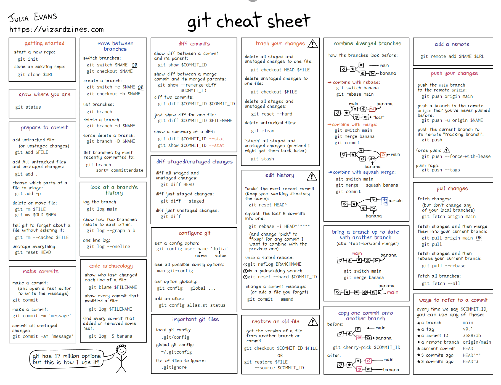

# git 命令速查表

非常优秀生动的速查表[👉wizard zines](https://wizardzines.com/){[📄PDF](https://wizardzines.com/git-cheat-sheet.pdf)}

<ClientOnly>
  <div class="viewer-wrap" v-viewer>
    
  </div>
</ClientOnly>

常用的git命令速查表，[👉源](https://gist.github.com/laixintao/81079c85a5e4988f21a918a3af643e47)

```sh
------------------------------commit------------------------------
$ git status                                    # 检查文件当前的状态
$ git add [文件名]                               # 追踪新的文件
$ git diff --cached                             # 若要看已经暂存起来的文件和上次提交时的快照之间的差异
$ git commit -m "Story 182: Fix benchmark"      # 用一行命令提交更新
$ git commit -a -m 'added new benchmarks'       # 跳过add命令直接提交
$ git rm --cached log.log                       # 从git仓库中删除不小心追踪的文件（用于gitignore之前追踪的文件）                   
$ git mv file_from file_to                      # 移动文件/重命名文件

------------------------------branch------------------------------
$ git branch                                    # 查看分支
$ git branch -v                                 # 查看各分支最后一个提交对象
$ git branch --merged                           # 查看已经merge过的分支
$ git branch --no-merged                        # 尚未merge的分支
$ git branch -d testing                         # 删除掉分支(如果还没有merge,会出现错误,-D可以强制删除)

$ git branch -a                                 # 查看所有分支（包括远程服务器）
$ git push [远程仓库名] [本地分支名]:[远程分支名]  # 推送本地分支到远程分支
                                                # 如果本地分支名为空，则会直接删除远程分支名
$ git checkout -b iss53                         # 新建分支并切换到新分支 =$ git branch iss53; git checkout iss53
$ git cherry-pick [id]                          # 合并某一个单独的commit

------------------------------log---------------------------------
$ git log --pretty=format:"%h - %an, %ar : %s"  # 用特性的format查看log
$ git log --graph                               # 用图表的形式显示git的合并历史

------------------------------config---------------------------------
$ git config --global user.name "John Doe"      # 配置用户名 ！仅第一次必须
$ git config --global user.email je@example.com # 配置电邮 ！仅第一次必须
$ git config --list                             # 查看配置信息
$ git config --global alias.stash-unapply '!git stash show -p | git apply -R'
                                                # 设置别名
                                                
------------------------------stash------------------------------
$ git stash                                     # 储藏当前工作内容
$ git stash list                                # 查看所有已经储藏的内容
$ git stash apply  [stash@{0}]                  # 在当前工作区应用储藏的内容，默认最新
$ git stash apply --index                       # 在当前工作区应用储藏的内容，并保持之前暂存区的状态
$ git stash drop                                # 删除一个储藏
$ git stash pop                                 # 弹出一个储藏
```

[👉git命令速查表中文版-在线](https://cheatsheet.wang/)
