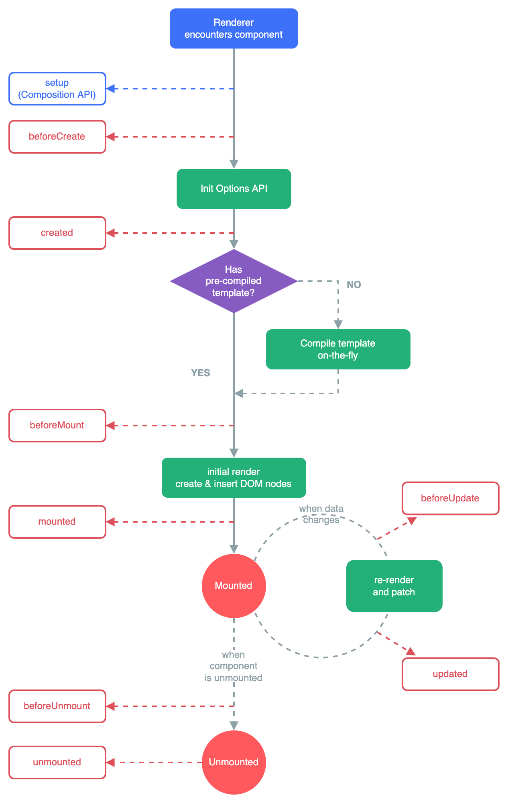

# vue3查缺补漏-基础

> 首先说明，本文不适合从0到1的学习 vue！初学者请参阅[vue3官网](https://cn.vuejs.org/)
>
> vue 的上手难度低，很多细节及原理不需要了解就能开发一般前端项目了。很多人即便是几年 vue 工作经验的也很难说对 vue 有多了解。本系列文章旨在通过一次全面复习，一方面温习 vue 核心概念，另一方面查缺补漏，将以下几处陈列出来，供反复复习：
>
> - 新增或错漏知识点
> - 了解但未用过
> - 对原理其实一知半解
> - 可优化性能或提高编码质量
>
> 复习顺序与官网目录顺序一致，如有错误，欢迎指正😊

## 创建 vue 应用实例

**多个应用实例**：应用实例并不只限于一个。createApp API 允许你在同一个页面中创建多个共存的 Vue 应用，而且每个应用都拥有自己的用于配置和全局资源的作用域。

```js
const app1 = createApp({
  /* ... */
})
app1.mount('#container-1')

const app2 = createApp({
  /* ... */
})
app2.mount('#container-2')
```

## 模板语法

Vue 使用一种基于 HTML 的模板语法，使我们能够声明式地将其组件实例的数据绑定到呈现的 DOM 上。

- 文本插值
- 原始 HTML
- Attribute 绑定
- 使用 JavaScript 表达式

仅支持单一表达式，一个简单的判断方法是是否可以合法地写在 return 后面。

可以在绑定的表达式中使用一个组件暴露的方法（调用函数）

::: details 注意
> 绑定在表达式中的方法在组件每次更新时都会被重新调用，因此**不**应该产生任何副作用，比如改变数据或触发异步操作。
>
> 模板中的表达式将被**沙盒化**，仅能够访问到[有限的全局对象列表](https://github.com/vuejs/core/blob/main/packages/shared/src/globalsAllowList.ts#L3)。该列表中会暴露常用的内置全局对象，比如 Math 和 Date。没有显式包含在列表中的全局对象将不能在模板内表达式中访问，例如用户附加在 window 上的属性。然而，你也可以自行在 `app.config.globalProperties` 上显式地添加它们，供所有的 Vue 表达式使用。

::: details 全局对象列表
Infinity, undefined, NaN, isFinite, isNaN, parseFloat, parseInt, decodeURI, decodeURIComponent, encodeURI, encodeURIComponent, Math, Number, Date, Array, Object, Boolean, String, RegExp, Map, Set, JSON, Intl, BigInt, console
:::

- 指令 Directives

指令参数上可以使用一个 JavaScript 表达式，实现**动态参数**

`<a :[attributeName]="url"> ... </a>`

动态参数可使用变量、响应式变量、js 表达式(包括调用函数)、计算属性(替换复杂的表达式)等

## 响应式基础

- **shallowRef()**

::: details 参考
> [深层响应性](https://cn.vuejs.org/guide/essentials/reactivity-fundamentals.html#deep-reactivity)
>
> [shallowRef()](https://cn.vuejs.org/api/reactivity-advanced.html#shallowref)
>
> [减少大型不可变数据的响应性开销](https://cn.vuejs.org/guide/best-practices/performance.html#reduce-reactivity-overhead-for-large-immutable-structures)
>
> [与外部状态系统集成](https://cn.vuejs.org/guide/extras/reactivity-in-depth.html#integration-with-external-state-systems)
:::

ref() 的浅层作用形式，放弃深层响应性。对于浅层 ref，只有 .value 的访问会被追踪。

浅层 ref 可以用于避免对大型数据的响应性开销来优化性能、或者有外部库管理其内部状态的情况。

- **reactive()**

`reactive()` 返回的是一个原始对象的 Proxy，它和原始对象不相等：

```js
const raw = {}
const proxy = reactive(raw)

console.log(raw === proxy) // false
```

为保证访问代理的一致性，对同一个原始对象调用 reactive() 会总是返回同样的代理对象，而对一个已存在的代理对象调用 reactive() 会返回其本身

```js
// 接上例
console.log(reactive(raw) === proxy) // true
console.log(reactive(proxy) === proxy) // true
```

此规则对嵌套对象也适用。依靠深层响应性，响应式对象内的嵌套对象依然是代理：

```js
const proxy = reactive({})
const raw = {}
proxy.nested = raw
console.log(proxy.nested === raw) // false
```

- **解包**

作为 reactive 对象的属性，如果将一个新的 ref 赋值给一个关联了已有 ref 的属性，那么它会替换掉旧的 ref

```js
const count = ref(1)
const state = reactive({ count })

const otherCount = ref(2)

state.count = otherCount
console.log(state.count) // 2
// 原始 ref 现在已经和 state.count 失去联系
console.log(count.value) // 1
```

当 ref 作为响应式数组或原生集合类型(如 Map) 中的元素被访问时，它不会被解包：

```js
const books = reactive([ref('Vue 3 Guide')])
// 这里需要 .value
console.log(books[0].value)

const map = reactive(new Map([['count', ref(0)]]))
// 这里需要 .value
console.log(map.get('count').value)
```

- **SFC**

> 参考：[单文件组件](https://cn.vuejs.org/guide/scaling-up/sfc.html)

Vue 的单文件组件是网页开发中 HTML、CSS 和 JavaScript 三种语言经典组合的自然延伸。`<template>`、`<script>` 和 `<style>` 三个块在同一个文件中封装、组合了组件的视图、逻辑和样式。

- **为什么要使用 SFC**

使用 SFC 必须使用构建工具，但作为回报带来了以下优点：

::: details

- 使用熟悉的 HTML、CSS 和 JavaScript 语法编写模块化的组件
- 让本来就强相关的关注点自然内聚
- 预编译模板，避免运行时的编译开销
- 组件作用域的 CSS
- 在使用组合式 API 时语法更简单
- 通过交叉分析模板和逻辑代码能进行更多编译时优化
- 更好的 IDE 支持，提供自动补全和对模板中表达式的类型检查
- 开箱即用的模块热更新 (HMR) 支持

:::

SFC 是 Vue 框架提供的一个功能，并且在下列场景中都是官方推荐的项目组织方式：

  1) 单页面应用 (SPA)
  2) 静态站点生成 (SSG)
  3) 任何值得引入构建步骤以获得更好的开发体验 (DX) 的项目

- **SFC 是如何工作的**

Vue SFC 是一个框架指定的文件格式，因此必须交由 `@vue/compiler-sfc` 编译为标准的 JavaScript 和 CSS，一个编译后的 SFC 是一个标准的 JavaScript(ES) 模块。

SFC 中的 `<style>` 标签一般会在开发时注入成原生的 `<style>` 标签以支持热更新，而生产环境下它们会被抽取、合并成单独的 CSS 文件。

在实际项目中，我们一般会使用集成了 SFC 编译器的构建工具，比如 Vite 或者 Vue CLI (基于 webpack)，Vue 官方也提供了脚手架工具来帮助你尽可能快速地上手开发 SFC。

## 计算属性

computed() 方法期望接收一个 getter 函数，返回值为一个计算属性 ref

```js
<script setup>
import { reactive, computed } from 'vue'

const author = reactive({
  name: 'John Doe',
  books: [
    'Vue 2 - Advanced Guide',
    'Vue 3 - Basic Guide',
    'Vue 4 - The Mystery'
  ]
})

const publishedBooksMessage = computed(() => {
  return author.books.length > 0 ? 'Yes' : 'No'
})
</script>

<template>
  <span>{{ publishedBooksMessage }}</span>
</template>
```

Vue 的计算属性会自动追踪响应式依赖。它会检测到 publishedBooksMessage 依赖于 author.books，所以当 author.books 改变时，任何依赖于 publishedBooksMessage 的绑定都会同时更新。

- **计算属性缓存 vs 方法**

在表达式中像这样调用一个函数也会获得和计算属性相同的结果：

```js
<p>{{ calculateBooksMessage() }}</p>
```

```js
// 组件中
function calculateBooksMessage() {
  return author.books.length > 0 ? 'Yes' : 'No'
}
```

不同之处在于**计算属性值会基于其响应式依赖被缓存**。一个计算属性仅会在其响应式依赖更新时才重新计算。这意味着只要 author.books 不改变，无论多少次访问 publishedBooksMessage 都会立即返回先前的计算结果，而不用重复执行 getter 函数。

相比之下，方法调用**总是**会在重渲染发生时再次执行函数。

- **可写计算属性**

计算属性默认是只读的。当你尝试修改一个计算属性时，你会收到一个运行时警告。只在某些特殊场景中你可能才需要用到“可写”的属性，你可以通过同时提供 getter 和 setter 来创建。

创建一个可写的计算属性 ref：

```js
const count = ref(1)
const plusOne = computed({
  get: () => count.value + 1,
  set: (val) => {
    count.value = val - 1
  }
})

plusOne.value = 1
console.log(count.value) // 0
```

调试：

```js
const plusOne = computed(() => count.value + 1, {
  onTrack(e) {
    debugger
  },
  onTrigger(e) {
    debugger
  }
})
```

- **Getter 不应有副作用**

计算属性的 getter 应只做计算而没有任何其他的副作用，举例来说，不要在 getter 中做异步请求或者更改 DOM！getter 的职责应该仅为计算和返回该值。可使用侦听器根据其他响应式状态的变更来创建副作用。

- **避免直接修改计算属性值**

从计算属性返回的值是派生状态。可以把它看作是一个“临时快照”，每当源状态发生变化时，就会创建一个新的快照。更改快照是没有意义的，因此计算属性的返回值应该被视为只读的，并且永远不应该被更改——应该**更新它所依赖的源状态以触发新的计算**。

例如：

::: code-group

```vue [parent.vue]
<script setup>
  import { ref } from 'vue'
  import ChildComp from './child.vue'

  const loading = ref(false)
  // ...
</script>
<template>
  <div>
    <!-- ... -->
    <ChildComp v-model="loading" />
  </div>
</template>
```

```vue [child.vue]
<script setup>
  import { ref, computed } from 'vue'

  const props = defineProps({ modelValue: Boolean })
  const emit = defineEmits(['update:modelValue'])

  const loading = computed({
    get: () => props.modelValue,
    set: val => emit('update:modelValue', val)
  })
</script>
```

:::

## 类绑定

- 绑定内联对象

`<div :class="{ active: isActive }"></div>`

- 绑定对象

`<div :class="classObject"></div>`

还可绑定计算变量

- 绑定数组

```js
const activeClass = ref('active')
const errorClass = ref('text-danger')
```

```html
<!-- 绑定数组 -->
<div :class="[activeClass, errorClass]"></div>
<!-- 有条件得渲染 -->
<div :class="[isActive ? activeClass : '', errorClass]"></div>
<!-- 嵌套对象 -->
<div :class="[{ active: isActive }, errorClass]"></div>
```

- **在组件上使用**

对于只有一个根元素的组件，当你使用了 class attribute 时，这些 class 会被添加到根元素上并与该元素上已有的 class 合并。

如果你的组件有**多个根元素**，你将需要指定哪个根元素来接收这个 class。你可以通过组件的 `$attrs` 属性来实现指定：

`<MyComponent class="baz" />`

```html
<!-- MyComponent 模板使用 $attrs 时 -->
<p :class="$attrs.class">Hi!</p>
<span>This is a child component</span>
```

这将被渲染为：

```html
<p class="baz">Hi!</p>
<span>This is a child component</span>
```

## 样式绑定

- **绑定内联样式**

- 绑定内联对象

`<div :style="{ color: activeColor, fontSize: fontSize + 'px' }"></div>`

样式名同时支持 `camelCase` 与 `kebab-cased` 两种形式

- 绑定对象

`<div :style="styleObject"></div>`

- 绑定数组

给 :style 绑定一个包含多个样式对象的数组

`<div :style="[baseStyles, overridingStyles]"></div>`

- **自动前缀**

当你在 `:style` 中使用了需要[浏览器特殊前缀](https://developer.mozilla.org/en-US/docs/Glossary/Vendor_Prefix)的 CSS 属性时，Vue 会**自动**为他们加上相应的前缀。Vue 是在运行时检查该属性是否支持在当前浏览器中使用。如果浏览器不支持某个属性，那么将尝试加上各个浏览器特殊前缀，以找到哪一个是被支持的。

- **样式多值**

你可以对一个样式属性提供多个值，数组仅会渲染浏览器支持的最后一个值

`<div :style="{ display: ['-webkit-box', '-ms-flexbox', 'flex'] }"></div>`

## 条件渲染

使用包装器元素 `<template>` 包装多个元素，在包装器元素上使用 `v-if` 完成统一切换。

- **v-if 与 v-show 对比**

- `v-show`不支持在 `<template>` 元素上使用。
- `v-if` 是“真实的”按条件渲染，因为它确保了在切换时，条件区块内的事件监听器和子组件都会被销毁与重建。
- `v-if` 也是惰性的：如果在初次渲染时条件值为 false，则不会做任何事。（惰性渲染有利于提升性能及用户体验）
- `v-show` 初始始终会被渲染，切换时，会在 DOM 渲染中保留元素；`v-show` 仅切换了该元素上名为 display 的 CSS 属性。

## 列表渲染

- **用法**

`v-for`内定义变量别名时可像 forEach 一样使用解构

`<li v-for="{ message } in items">{{ message }}<li>`

可以使用 of 作为分隔符来替代 in，这更接近 JavaScript 的迭代器语法

`<div v-for="item of items"></div>`

`v-for`支持在 `<template>` 元素上使用。

- **遍历对象**

可以使用 v-for 来遍历一个**对象**的所有属性。遍历的顺序会基于对该对象调用 Object.keys() 的返回值来决定。

::: code-group

```vue [vue sfc]
<script setup>
import { reactive } from 'vue'

const myObject = reactive({
  title: 'How to do lists in Vue',
  author: 'Jane Doe',
  publishedAt: '2016-04-10'
})
</script>
<template>
  <p v-for="(value,key,index) in myObject">
    {{ index }}. {{ key }}: {{ value }}
  </p>
</template>
```

```html [output]
<p>0. title: How to do lists in Vue</p>
<p>1. author: Jane Doe</p>
<p>2. publishedAt: 2016-04-10</p>
```

:::

- **使用范围值**

v-for 可以直接接受一个整数值。在这种用例中，会将该模板基于 1...n 的取值范围重复多次。

`<span v-for="n in 10">{{ n }}</span>`

**注意**此处 n 的初值是从 1 开始而非 0

- **v-for 与 v-if**

不推荐同时使用 `v-if` 与 `v-for`，同时存在于同一元素上时，前者优先级更高，先执行。这意味着 `v-if` 的条件将无法访问到 `v-for`作用域内定义的变量别名

在外新包装一层 `<template>` 再在其上使用 v-for

```html
<template v-for="todo in todos">
  <li v-if="!todo.isComplete">{{ todo.name }}</li>
</template>
```

- **通过 key 管理状态**

Vue 默认按照“就地更新”的策略来更新通过 v-for 渲染的元素列表。当数据项的顺序改变时，Vue 不会随之移动 DOM 元素的顺序，而是就地更新每个元素，确保它们在原本指定的索引位置上渲染。

[demo - playground](https://play.vuejs.org/#eNp9Uk1rwkAQ/SvDXqKgsSC9SJR+4KGFflC9dXtYNxONJrvLflgh5L93NkHbQ/EwMLz3Zue9SRp2b0x6DMhmLHPSlsaDQx/MgquyNtp6aMBiAS0UVteQkDThiiuplfMgrIV55AefiUhGyYZKUuVUSFVQbZOvIVdFUNKXWkFsBkNouII4nh5FFZAeufSp1yvai/lgIEabIcwX8CL8LrVC5bqm0THcpLf0ZMtVNuk9k9vMY20q4TH2m+A97bqTVSkPc87iUs4W6+VqnU16kmQAmYHjuNCWJL2PUkUjJG0a6JG2zSbxGtnksoCNmHd0gKLcpnunFd2ui8OZ1LUpK7RvJmZ1nM36oJETVaW/nzvM24CjMy53KA//4Ht3ihhn7xYd2iNyduG8sFv0Pb1cveKJ+gtZ6zxUpL5CfqDTVYgee9lDUDnZ/qPr3D51f0Cptmu3PHlU7hwqGo3KttPT8QI+Xon+a3eaTrs5+nqs/QGyZNB4)

默认模式是高效的，但只适用于列表渲染输出的结果不依赖子组件状态或者临时 DOM 状态 (例如表单输入值) 的情况。

为了给 Vue 一个提示，以便它可以跟踪每个节点的标识，从而重用和重新排序现有的元素，你需要为每个元素对应的块提供一个唯一的 key attribute

当你使用 `<template v-for>` 时，key 应该被放置在这个 `<template>` 容器上

key 的更多用途细节，请参阅 [API 文档](https://cn.vuejs.org/api/built-in-special-attributes.html#key)。

## 事件处理

事件处理器（handler）的值可以是：

- 内联事件处理器：事件被触发时执行的内联 JavaScript 语句 (与 onclick 类似)。

`<button @click="count++">Add 1</button>`

- 方法事件处理器：一个指向组件上定义的方法的属性名或是路径。

`function greet(event) {} // event 是 DOM 原生事件`

`<button @click="greet">Greet</button>`

方法事件处理器会自动接收原生 DOM 事件并触发执行

- **在内联处理器中调用方法**

`const say = val => console.log(val)`

`<button @click="say('bye')">Say bye</button>`

这允许我们向方法传入自定义参数以代替原生事件

- **在内联事件处理器中访问事件参数**

向处理器方法传入一个特殊的 $event 变量，或者使用内联箭头函数：

`<button @click="warn('Form cannot be submitted yet.', $event)">Submit</button>`

`<button @click="(event) => warn('Form cannot be submitted yet.', event)">Submit</button>`

```js
function warn(message, event) {
  // 这里可以访问原生事件
  if (event) {
    event.preventDefault()
  }
  alert(message)
}
```

> 需注意两种事件处理器的区别，简单来说，一种是内联的执行语句，一种是函数。vue 模板编译器会通过检查 v-on 的值是否是合法的 JavaScript 标识符或属性访问路径来断定是何种形式的事件处理器
>
> `@click="say('hi')"` 是执行语句
>
> `@click="(event) => warn('msg', event)"` 是函数，这个函数在执行时调用 warn 函数

- **事件修饰符**

| 修饰符 | 介绍 | 简单示例 |
| --- | --- | --- |
| .stop | 阻止事件冒泡 | `<button @click.stop="handleClick">点击</button>` |
| .prevent | 阻止默认行为 | `<form @submit.prevent="handleSubmit">提交</form>` |
| .capture | 使用事件捕获模式 | `<div @click.capture="handleClick">点击</div>` |
| .self | 只当事件是从自身触发时触发 | `<div @click.self="handleClick">点击</div>` |
| .once | 事件只触发一次 | `<button @click.once="handleClick">点击</button>` |
| .passive | 禁用事件的默认行为 | `div @touchstart.passive="handleTouchStart">触摸</div>` |

- **按键修饰符**

可以直接使用 KeyboardEvent.key 暴露的按键名称作为修饰符，但需要转为 kebab-case 形式

`<input @keyup.enter="submit" />`：仅在 key 为 Enter 时调用 submit

`<input @keyup.page-down="onPageDown" />`：仅在 key 为 PageDown 时调用 onPageDown

- 一些常用按键的别名：

.enter, .tab, .delete, .esc, .space, .up, .down, .left, .right

- 系统按键修饰符：

.ctrl, .alt, .shift, .meta

`<input @keyup.alt.enter="clear" />`: Alt + Enter

`<div @click.ctrl="doSomething">Do something</div>`: Ctrl + 点击

- .exact 用于限定组合的系统按键修饰符

`<button @click.ctrl="onClick">A</button>`：当按下 Ctrl 时，即使同时按下 Alt 或 Shift 也会触发

`<button @click.ctrl.exact="onCtrlClick">A</button>`：仅当按下 Ctrl 且未按任何其他系统按键时触发

- 鼠标按键修饰符

.left, .right, .middle：限定鼠标按键，注意与键盘左右按键的区别

## 表单输入绑定

`<input v-model="text">`

=>

```html
<input :value="text" @input="event => text = event.target.value" />
```

绑定包括值绑定和更改事件监听。

上例中，更改事件中将输入值赋值给输入框绑定的值，输入框以更新视图。

`v-model` 还可以用于各种不同类型的输入，`<textarea>`、`<select>` 元素。它会根据所使用的元素自动使用对应的 DOM 属性和事件组合：

文本类型的 `<input>` 和 `<textarea>` 元素会绑定 `value` property 并侦听 `input` 事件；

`<input type="checkbox">` 和 `<input type="radio">` 会绑定 `checked` property 并侦听 `change` 事件；

`<select>` 会绑定 `value` property 并侦听 `change` 事件。

注意，绑定了输入时，DOM 元素原生属性值会被忽略

- **复选框组**

将多个复选框绑定到同一个数组或集合的值

`const checkedNames = ref([])`

```html
<div>Checked names: {{ checkedNames }}</div>

<input type="checkbox" id="jack" value="Jack" v-model="checkedNames">
<label for="jack">Jack</label>

<input type="checkbox" id="john" value="John" v-model="checkedNames">
<label for="john">John</label>

<input type="checkbox" id="mike" value="Mike" v-model="checkedNames">
<label for="mike">Mike</label>
```

> vue 通过绑定同一数组或集合实现**复选框组**。而在原生 js 中，则需通过设置同一 `name` 属性，获取复选框组的值需自行遍历实现

- **单选按钮**

```html
<div>Picked: {{ picked }}</div>

<input type="radio" id="one" value="One" v-model="picked" />
<label for="one">One</label>

<input type="radio" id="two" value="Two" v-model="picked" />
<label for="two">Two</label>
```

> vue 通过绑定响应式变量实现单选按钮，通过绑定同一响应式变量实现**单选按钮组**。
>
> 而在原生 js 中，则需通过设置同一 `name` 属性实现，获取单选按钮的值需自行查询。（同一 `name` 的 `radio` 输入框被视为一个单独的组，只有一个选项可以被选择，选择一个选项会自动取消其他选项的选择状态。这是HTML中 `radio` 输入框的默认行为。）

复选框的另一种用法：

```html
<input
  type="checkbox"
  v-model="toggle"
  true-value="yes"
  false-value="no" />
```

`true-value` 和 `false-value` 是 Vue 特有的 attributes，仅支持和 `v-model` 配套使用。这里 `toggle` 属性的值会在选中时被设为 'yes'，取消选择时设为 'no'。可以通过 `v-bind` 将其绑定为其他动态值。

> 注意：请单独作为单选按钮来使用`true-value` 和 `false-value`吧。
>
> 如下例所示，`true-value` 和 `false-value`会被忽视。
>
> 但如果 toggle 的封装变量不是数组或集合(改为`ref('')`，`ref()`，等)，`value`会被忽视。
>
> [混用示例](https://play.vuejs.org/#eNqtksFPwyAUxv8VwkVNdI16W+oSNZroQY16Ew91e+2YFAg86pam/7sPajsPcydPwPf7HnwPaPmltZMmAJ/y3M+dtMg8YLAzoWVtjUPWMgcl61jpTM0OyHogtNBzoz0yNFWlgF1Ey+Hb+5HQedbvQvW0QKitKhDiCvOFbGZ9xZS17VDcdXkWSbJIbQPGmUC5uBAclw5A8F7BjQXS5kuYf36Y9SA3J7VZgIrutONodwFOmkKFWLQBfzqAslB+S7QZwSD9nMqyPpQqPkCx0rgtmr3GMc8SSq4d4UsT3D9lP/sr+wgGqT90V/SezG5p2AbPs/GN+DFHT+9aymqy8kbTl2iFZoxSm9pKBe7RoqR3F5zeL5LICqXM133SYujjQU+d7tBXnpqf0uTJgQfXUMsjw8JVgD2+eXmANc1HSBcV4gXtgc/gjQoxY2+7CnpBsX/5Utq79LGlrl79zRpB+6GpGDQ6u+QXnD779Z7Wt3HPJ+epTuiOd98IAygb)

```vue
<script setup>
  import { ref } from 'vue'

  const toggle = ref([])
</script>

<template>
  <div>toggle: {{ toggle }}</div>
  <input
    id="three"
    type="checkbox"
    v-model="toggle"
    true-value="yes1"
    false-value="no1"
    value="three" />
  <label for="three">Three</label>
  <input
    id="four"
    type="checkbox"
    v-model="toggle"
    true-value="yes2"
    false-value="no2"
    value="four" />
  <label for="four">Four</label>
</template>
```

- **修饰符**

- `.lazy`：在每次 change 事件后更新数据（默认为 input 事件）
- `.number`：让用户输入自动转换为数字

如果该值无法被 `parseFloat()` 处理，那么将返回原始值。`number` 修饰符会在输入框有 `type="number"` 时自动启用。

```vue
<script setup>
import { ref } from 'vue'

const age = ref(123)
function func () {
  const val = document.getElementById('one').value
  console.log(val, typeof val)
  console.log(age.value, typeof age.value)
}
</script>
<template>
  <input v-model.number="age" id="one" />
  <button @click="func">TEST</button>
</template>
```

> 注意：input 元素 value 不变，仍然是字符串，但 age 会自动转换为数字

- `trim`：自动去除用户输入内容中两端的空格

## 生命周期



> [组合式 API：生命周期钩子](https://cn.vuejs.org/api/composition-api-lifecycle.html)

周期钩子应当在组件初始化时被同步注册，可以在一个外部函数中调用，只要调用栈是同步的，且最终起源自 setup() 就可以。

## 侦听器

- **侦听数据源类型**

watch 的第一个参数可以是不同形式的“数据源”：它可以是一个 ref (包括计算属性)、一个响应式对象、一个 getter 函数、或多个数据源组成的数组

- **深层侦听器**

直接给 watch() 传入一个响应式对象，会隐式地创建一个深层侦听器

```js
const obj = reactive({ count: 0 })

watch(obj, (newValue, oldValue) => {
  // 在嵌套的属性变更时触发
  // 注意：`newValue` 此处和 `oldValue` 是相等的
  // 因为它们是同一个对象！
})

obj.count++
```

> watch 响应式数组则不会。手动设置深层侦听时，newValue, oldValue 也是相等的

- **watchEffect()**

自动跟踪回调的响应式依赖，并立即执行回调

```js
const todoId = ref(1)
const data = ref(null)
// watch
watch(todoId, async () => {
  const response = await fetch(
    `https://jsonplaceholder.typicode.com/todos/${todoId.value}`
  )
  data.value = await response.json()
}, { immediate: true })
// watchEffect()
watchEffect(async () => {
  const response = await fetch(
    `https://jsonplaceholder.typicode.com/todos/${todoId.value}`
  )
  data.value = await response.json()
})
```

对于这种只有一个依赖项的例子来说，`watchEffect()` 的好处相对较小。但是对于有多个依赖项的侦听器来说，使用 `watchEffect()` 可以消除手动维护依赖列表的负担。此外，如果你需要侦听一个嵌套数据结构中的几个属性，`watchEffect()` 可能会比深度侦听器更有效，因为它将只跟踪回调中被使用到的属性，而不是递归地跟踪所有的属性。

`watchEffect` 仅会在其同步执行期间，才追踪依赖。在使用异步回调时，只有在第一个 `await` 正常工作前访问到的属性才会被追踪。

- **回调的触发时机**

当你更改了响应式状态，它可能会同时触发 Vue 组件更新和侦听器回调。默认情况下，侦听器回调会在 Vue 组件更新**之前**被调用。可通过 `flush: 'post'` 选项更改为之后调用

`watchEffect(callback, { flush: 'post' })`

后置刷新的 `watchEffect()` 有个更方便的别名 `watchPostEffect()`，上例可更改为：

`watchPostEffect(callback)`

- **停止侦听器**

在 setup() 或 `<script setup>` 中用同步语句创建的侦听器，会自动绑定到宿主组件实例上，并且会在宿主组件卸载时自动停止。

一个关键点是，侦听器必须用同步语句创建：如果用异步回调创建一个侦听器，那么它不会绑定到当前组件上，你必须手动停止它，以防内存泄漏。

> [示例 - 异步创建侦听器](https://play.vuejs.org/#eNp9U0tv00AQ/isjX5wKNy7qrXIiHuoBJB6CipMvxt4k29q7lnedBCJLCPXQYw9cSq+8JOgNVYJU/Jq6Ef+CmfUjCdAeLO3ON/PN7Of5ZtbdNO2Oc2btWJ4KM55qUEznad8XPEllpmEGGRs4kGZyzCMGBQwymYCNNXabc18maR3vunQhSoR9EUqhNIggYdAjoo79+lVib/ii5uvYhNmOScGwLwa5CDWXAujQ2YCZL8Cg3XEQ5wxu9cCeInfRkKuRnJgBqgY6y4mopRlhF4Ibqia9puvBIIgVM3yeW0mAj8eLZkkaB5rhDcAbbfcXR+eL+eHl/Nxz8WaiER/3abYdmM2qVxaF51LUwC9zrXGEO2HMw4Oeb9FQvtW/Ov1+9e5HeXZc0V3++lQefyvfXHhuVVB3zMBte7fJsAnl8dfy4u3V2cfy6LSc/1y8P6wZTr4sJ/u7dSMDtl98nv8++dAyrnc1So43+QBrGql8y0ziua0klmNphfIP+LC7r6TA9THi+laI+Txm2ZOU1Fe+hdIQQlgQx3Ly0MToLzlNPByx8OA/8X01pZhvPc2YYtmY+VaL6SAbMl3Bu88fsymeWzCRUR5j9g3gM6ZknNOMVdq9XEQ49kqemfaBWXAuhntqd6qZUM2jaFDKLEy+b+HCk1TXPX057nZ329ThxqGKjVn+9V+24kAu9lmoHZgEOhw5IMUjmQvNonU3YgV9a5arKmuXbRCM9Hs8YTLXHbREr48zYhQq7g7lOdARbPKC7IG94sicVlMBqIeMWTeWw4obwlEghiwiJ9e1phsJBDOeJCziuDg7JFthEIzf3traMmf6luZrAksDGqKbzGbql9tZ/AFMu8Px)
>
> 在 `onMounted` 等生命周期钩子函数中创建的侦听器也能随组件卸载自动停止

watch(), watchEffect() 返回值都是一个用来停止该副作用的函数，要手动停止一个侦听器，请调用它返回的函数

需要异步创建侦听器的情况很少，请尽可能选择同步创建。如果需要等待一些异步数据，你可以使用条件式的侦听逻辑：

```js
// 需要异步请求得到的数据
const data = ref(null)

watchEffect(() => {
  if (data.value) {
    // 数据加载后执行某些操作...
  }
})
```

> 不要因为异步数据而选择异步创建侦听器，回调函数中做条件判断即可。

## 模板引用

通过声明一个同名的 ref 来获得 DOM 元素的模板引用

`<input ref="input">`

`const input = ref(null)`

**注意：组件挂载后**才能访问模板引用

- **v-for 中的模板引用**

> 需要 v3.2.25 及以上版本

当在 v-for 中使用模板引用时，对应的 ref 中包含的值是一个数组，它将在元素被挂载后包含对应整个列表的所有元素

注意，ref 数组并不保证与源数组相同的顺序

- **函数模板引用**

ref 还可以绑定为一个函数，会在每次组件更新时都被调用。该函数会收到元素引用作为其第一个参数
`<input :ref="(el) => { /* 将 el 赋值给一个数据属性或 ref 变量 */ }">`

- **组件上的 ref**

模板引用也可以被用在一个子组件上。这种情况下引用中获得的值是组件实例。如果该子组件使用的是选项式 API 或没有使用 `<script setup>`，被引用的组件实例和该子组件的 `this` 完全一致，这意味着父组件对子组件的每一个属性和方法都有完全的访问权。这使得在父组件和子组件之间创建紧密耦合的实现细节变得很容易，当然也因此，应该只在绝对需要时才使用组件引用。大多数情况下，你应该首先使用标准的 props 和 emit 接口来实现父子组件交互。

使用了 `<script setup>` 的组件是**默认私有**的。父组件无法访问该子组件中的任何东西，除非子组件在其中通过 `defineExpose` 宏显式暴露。

> 前者示例：`this.$refs['compRef'].compFunc(params)`
>
> 后者示例：`compRef.value.compFunc(params)`
