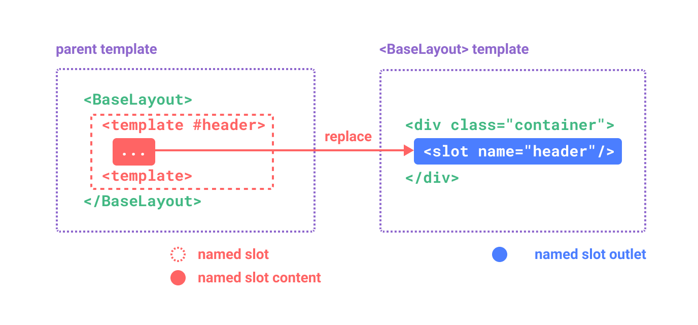
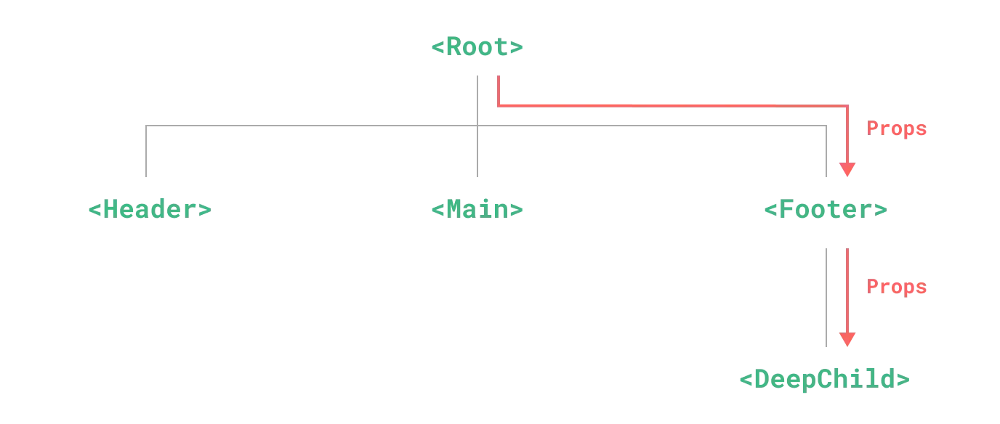
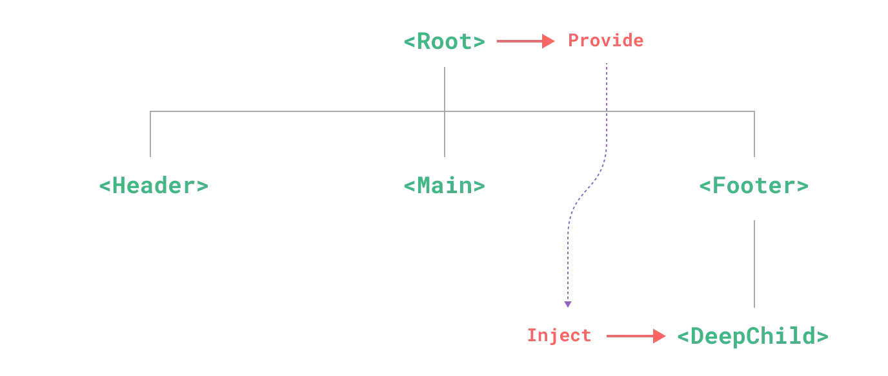

# vue3查缺补漏-组件

> 首先说明，本文不适合从0到1的学习 vue！初学者请参阅[vue3官网](https://cn.vuejs.org/)
>
> vue 的上手难度低，很多细节及原理不需要了解就能开发一般前端项目了。很多人即便是几年 vue 工作经验的也很难说对 vue 有多了解。本系列文章旨在通过一次全面复习，一方面温习 vue 核心概念，另一方面查缺补漏，将以下几处陈列出来，供反复复习：
>
> - 新增或错漏知识点
> - 了解但未用过
> - 对原理其实一知半解
> - 可优化性能或提高编码质量
>
> 复习顺序与官网目录顺序一致，如有错误，欢迎指正😊

## 1. 组件基础

### 定义一个组件

- [单文件组件](https://cn.vuejs.org/guide/scaling-up/sfc.html)（SFC）
- 包含 Vue 特定选项的 JavaScript 对象

```js
import { ref } from 'vue'

export default {
  setup() {
    const count = ref(0)
    return { count }
  },
  template: `
    <button @click="count++">
      You clicked me {{ count }} times.
    </button>`
  // 也可以针对一个 DOM 内联模板：
  // template: '#my-template-element'
}
```

> 选项式API风格可替换 setup 选项
>
> template 可以是字符串模板，也可以是 ID 选择器
>
> 可通过[渲染函数](https://cn.vuejs.org/guide/extras/render-function.html#basic-usage)替换模板语法（setup 中返回渲染函数，或选项式API中定义 render 方法）
>
> 可通过具名导出在一个 js 文件中导出多个组件

### 动态组件

通过 Vue 的 `<component>` 元素和特殊的 `is` attribute 实现

```html
<!-- currentTab 改变时组件也改变 -->
<component :is="tabs[currentTab]"></component>
```

`is`的值可以是

- 被注册的组件名
- 导入的组件对象

可以使用 is attribute 来创建一般的 HTML 元素。

```vue
<template>
  <div>
    <component :is="currentComponent"></component>
    <button @click="toggleComponent">Toggle Component</button>
  </div>
</template>
<script setup>
  import { ref } from 'vue';

  const currentComponent = ref('div');

  const toggleComponent = () => {
    currentComponent.value = currentComponent.value === 'div' ? 'span' : 'div';
  };
</script>
```

当使用 `<component :is="...">` 来在多个组件间作切换时，被切换掉的组件会被卸载。我们可以通过 `<KeepAlive>` 组件强制被切换掉的组件仍然保持“存活”的状态。

## 2. 注册

如果你全局注册了一个组件，即使它并没有被实际使用，它仍然会出现在打包后的 JS 文件中。

### 组件名格式

在单文件组件和内联字符串模板中推荐使用 PascalCase 作为组件名的注册格式，但在 DOM 内模板中是不可用的，详情参见 [DOM 内模板解析注意事项](https://cn.vuejs.org/guide/essentials/component-basics.html#in-dom-template-parsing-caveats)。

## 3. Props

props声明的三种格式：

```js
// 使用字符串数组声明
const props = defineProps(['foo'])
/**
 * 使用对象声明
 * 对于每个属性，key 是 prop 的名称，而值则是该 prop 预期类型的构造函数
 * 下例中，属性名 title 的值的预期类型为 String
 */
const props = defineProps({ title: String })
// 使用带校验选项的对象声明
const props = defineProps({
  title: { type: String, default: '' }
})
```

### prop 名字格式

官方推荐组件属性的声明使用 camelCase 形式

模板表达式中传递属性时使用 kebab-case 形式

组件名使用 PascalCase 形式

例如：

`<MyComponent greeting-message="hello" />`

`defineProps({ greetingMessage: String })`

### 使用一个对象绑定多个 prop

如果你想要将一个对象的所有属性都当作 props 传入，你可以使用[没有参数的v-bind](https://cn.vuejs.org/guide/essentials/template-syntax.html#dynamically-binding-multiple-attributes)，即只使用 `v-bind` 而非 `:prop-name`。

例如:

对象:

`const post = { id: 1, title: 'My Journey with Vue' }`

模板:

`<BlogPost v-bind="post" />`

等价于:

`<BlogPost :id="post.id" :title="post.title" />`

### 单向数据流

> 牢记这个原则

所有的 props 都遵循着**单向绑定**原则，props 因父组件的更新而变化，自然地将新的状态向下流往子组件，而不会逆向传递。这避免了子组件意外修改父组件的状态的情况，不然应用的数据流将很容易变得混乱而难以理解。

另外，每次父组件更新后，所有的子组件中的 props 都会被更新到最新值，这意味着你不应该在子组件中去更改一个 prop。若你这么做了，Vue 会在控制台上向你抛出警告：

```js
const props = defineProps(['foo'])

// ❌ 警告！prop 是只读的！
props.foo = 'bar'
```

当**对象或数组**作为 props 被传入时，虽然子组件无法更改 props 绑定，但仍然**可以**更改对象或数组内部的值。

你应该尽可能避免这样的更改，除非父子组件在设计上本来就需要紧密耦合。在大多数场景下，子组件应该[抛出一个事件](https://cn.vuejs.org/guide/components/events.html)来通知父组件做出改变。

### prop 校验

Vue 组件可以更细致地声明对传入的 props 的校验要求。要声明对 props 的校验，你可以向 `defineProps()` 宏提供一个带有 props 校验选项的对象，例如：

```js
defineProps({
  // 基础类型检查
  // （给出 `null` 和 `undefined` 值则会跳过任何类型检查）
  propA: Number,
  // 多种可能的类型
  propB: [String, Number],
  // 必传，且为 String 类型
  propC: {
    type: String,
    required: true
  },
  // Number 类型的默认值
  propD: {
    type: Number,
    default: 100
  },
  // 对象类型的默认值
  propE: {
    type: Object,
    // 对象或数组的默认值
    // 必须从一个工厂函数返回。
    // 该函数接收组件所接收到的原始 prop 作为参数。
    default(rawProps) {
      return { message: 'hello' }
    }
  },
  // 自定义类型校验函数
  propF: {
    validator(value) {
      // The value must match one of these strings
      return ['success', 'warning', 'danger'].includes(value)
    }
  },
  // 函数类型的默认值
  propG: {
    type: Function,
    // 不像对象或数组的默认，这不是一个
    // 工厂函数。这会是一个用来作为默认值的函数
    default() {
      return 'Default function'
    }
  }
})
```

defineProps() 宏中的参数不可以访问 `<script setup>` 中定义的其他变量，因为在编译时整个表达式都会被移到外部的函数中。

关于**默认值**的两个容易忽视的细节：

- 除 Boolean 外的未传递的可选 prop 将会有一个默认值 undefined。Boolean 类型的未传递 prop 将被转换为 false。
- 如果声明了 default 值，那么在 prop 的值被解析为 undefined 时，无论 prop 是未被传递还是显式指明的 undefined，都会改为 default 值。

```vue
<script setup>
  defineProps({ bool: Boolean })
</script>
<template>
  <div>{{ bool }}</div>
</template>
```

### 运行时类型检查

校验选项中的 `type` 可以是下列这些原生构造函数：

`String`, `Number`, `Boolean`, `Array`, `Object`, `Date`, `Function`, `Symbol`
除此之外，`type`也可以是自定义的类和构造函数，Vue 将会通过 `instanceof` 来检查类型是否匹配。

### Boolean 类型转换

为了更贴近原生 boolean attributes 的行为，声明为 `Boolean` 类型的 props 有特别的类型转换规则。以带有如下声明的 `<MyComponent>` 组件为例：

`defineProps({ disabled: Boolean })`

该组件可以被这样使用：

```vue
<!-- 等同于传入 :disabled="true" -->
<MyComponent disabled />

<!-- 等同于传入 :disabled="false" -->
<MyComponent />
```

当一个 prop 被声明为允许多种类型时，Boolean 的转换规则也将被应用。然而，当同时允许 String 和 Boolean 时，有一种边缘情况——只有当 Boolean 出现在 String 之前时，Boolean 转换规则才适用：

```js
// disabled 将被转换为 true
defineProps({ disabled: [Boolean, Number] })

// disabled 将被转换为 true
defineProps({ disabled: [Boolean, String] })

// disabled 将被转换为 true
defineProps({ disabled: [Number, Boolean] })

// disabled 将被解析为空字符串 (disabled="")
defineProps({ disabled: [String, Boolean] })
```

## 4. 事件

### 触发与监听事件

> DOM存在很多原生事件，可通过浏览器打印查看，例如 `onclick`, `onblur`, `oncontextmenu`等等，vue 的 `v-on` 指令可方便的监听这些事件。
>
> 在使用监听事件时，需要注意基础篇提到的[模板语法](https://www.yuque.com/ymzhao_ustb/wwpvxx/otqfrdxwglstl5ke#RMIRb)以及它的[有限的全局对象列表](https://github.com/vuejs/core/blob/main/packages/shared/src/globalsAllowList.ts#L3)，还需温习下[事件处理](https://www.yuque.com/ymzhao_ustb/wwpvxx/otqfrdxwglstl5ke#jLHsX)部分。

在组件的模板表达式中，可以直接使用 `$emit` 方法触发自定义事件 (例如：在 `v-on` 的处理函数中)：

MyComponent.vue：`<button @click="$emit('someEvent')">click me</button>`

父组件中：`<MyComponent @some-event="callback" />`

像组件与 prop 一样，事件的名字也提供了自动的格式转换。

> 参见官网[组件实例](https://cn.vuejs.org/api/component-instance.html)部分，`$emit`是组件公共实例上暴露的内置属性和方法，可以在组件的模板表达式中使用。

### 声明触发的事件

> 声明一个 emit 以供在 setup 语法糖中使用

```vue
<script setup>
  const emit = defineEmits(['inFocus', 'submit'])

  function buttonClick() {
    emit('submit')
  }
</script>
```

### 事件校验

和对 props 添加类型校验的方式类似，所有触发的事件也可以使用对象形式来描述。

```vue
<script setup>
const emit = defineEmits({
  // 没有校验
  click: null,

  // 校验 submit 事件
  submit: ({ email, password }) => {
    if (email && password) {
      return true
    } else {
      console.warn('Invalid submit event payload!')
      return false
    }
  }
})

function submitForm(email, password) {
  emit('submit', { email, password })
}
</script>
```

## 5. 组件 v-model

`v-model` 可以在组件上使用以实现双向绑定。

首先让我们回忆一下 v-model 在原生元素上的用法：

`<input v-model="searchText" />`

在代码背后，模板编译器会对 v-model 进行更冗长的等价展开。等价于：

```vue
<input :value="searchText" @input="searchText = $event.target.value" />
```

而当使用在一个组件上时，v-model 会被展开为如下的形式：

```html
<CustomInput 
  :model-value="searchText"
  @update:model-value="newValue => searchText = newValue" />
```

要让这个例子实际工作起来，`CustomInput` 组件内部需要做两件事：

- 将内部原生 `<input>` 元素的 `value` attribute 绑定到 `modelValue` prop
- 当原生的 `input` 事件触发时，触发一个携带了新值的 `update:modelValue` 自定义事件

实现如下：

```vue
<script setup>
  defineProps(['modelValue'])
  defineEmits(['update:modelValue'])
</script>
<template>
  <input
    :value="modelValue"
    @input="$emit('update:modelValue', $event.target.value)"
  />
</template>
```

现在 `v-model` 可以在这个组件上正常工作了：

`<CustomInput v-model="searchText" />`

另一种在组件内实现 `v-model` 的方式是使用一个可写的，同时具有 getter 和 setter 的 `computed` 属性：

```vue
<script setup>
  import { computed } from 'vue'

  const props = defineProps(['modelValue'])
  const emit = defineEmits(['update:modelValue'])

  const value = computed({
    get: () => props.modelValue,
    set: val => emit('update:modelValue', val)
  })
</script>
<template>
  <input v-model="value"/>
</template>
```

> 注意这两种方法的区别

### v-model 的参数

`v-model`可以指定参数，`modelValue`是默认的绑定属性值

### 多个 v-model 绑定

可在单个组件实例上创建多个 v-model 双向绑定。组件上的每一个 v-model 都会同步不同的 prop

### 处理 v-model 修饰符

在学习输入绑定时，我们知道了 v-model 有一些[内置的修饰符](https://cn.vuejs.org/guide/essentials/forms.html#modifiers)，例如 .trim，.number 和 .lazy。在某些场景下，你可能想要一个自定义组件的 v-model 支持自定义的修饰符。

```html
<UserName
  v-model.abc.def="data"
  v-model:first-name.capitalize="first"
  v-model:last-name.uppercase="last"
/>
```

```vue
<script setup>
const props = defineProps({
  modelValue: Object,
  firstName: String,
  lastName: String,
  modelModifiers: { default: () => ({}) },
  firstNameModifiers: { default: () => ({}) },
  lastNameModifiers: { default: () => ({}) }
})
defineEmits(['update:modelValue', 'update:firstName', 'update:lastName'])

console.log(props.modelModifiers) // { abc: true, def: true }
console.log(props.firstNameModifiers) // { capitalize: true }
console.log(props.lastNameModifiers) // { uppercase: true}
</script>
```

> 对于组件的绑定属性值（modelValue/propName），可在组件中通过特定属性名（modelModifiers/propNameModifiers）来获取它的内置及自定义修饰符。
>
> 自定义修饰符的实现不包含上上述示例代码内。

## 6. 透传 Attributes

> 组件实例属性 `$attrs` 对象包含了除组件所声明的 `props` 和 `emits` 之外的所有其他 attribute。
>
> 注意：
>
> - 和 props 有所不同，透传 attributes 在 JavaScript 中保留了它们原始的大小写，所以像 `foo-bar` 这样的一个 attribute 需要通过 `$attrs['foo-bar']` 来访问。
> - 像 `@click` 这样的一个 `v-on` 事件监听器将在此对象下被暴露为一个函数 `$attrs.onClick`。
>
> [$attrs 实例演示](https://play.vuejs.org/#eNp9UtFugjAU/ZWmL2hiIOKbAaMzPmwP27Ltbd0DKxdWhZa0hZkY/n1tASWZ+taec+69p73nhDdV5Tc14CWOFJWs0kiBrqsV4ayshNRoK8oKZVKUyPMDe7Fyj3DCqeBKo6zmdI5iNJmieIUsJgrwC5FPPEd507EyvK0MrTIKOhdmfqShrIpEgzkjFDkfPCkhJjj5pgSjdQkNcD03gJt0gcIeCgkObKdg1ArPsFZmeMZyf68ENy8/2QEEUzOBFSBfKs2MOYKXyDGWS4pC/D45TMsaZgNOf4AeruB7dbQYwa8SFMgGCD5zOpE56I7evT/D0ZzPZCnSujDqO+QbmI+rrcdO9lDz1Nge6ZzbR7c/xvMPtTtq4Gp4lDVqla3TE2z2aT/31tMvdhf+wtUR3ppfHLJwOzonVCvYaC0VavsIDdlJIWMcdiXTavLp9Yv0vkwChrQkri4+t5iMOLvb60FyVUtv1pXfDVTKGrSmBaOHPi0Er7Zdr646CozkX3zaP0+ZErM=)
>
> 此部分概念较多且容易忽视，不了解的移步官网

“透传 attribute”指的是传递给一个组件，却没有被该组件声明为 [props](https://cn.vuejs.org/guide/components/props.html) 或 [emits](https://cn.vuejs.org/guide/components/events.html#defining-custom-events) 的 attribute 或者 v-on 事件监听器。最常见的例子就是 class、style 和 id。

当一个组件以单个元素为根作渲染时，透传的 attribute 会自动被添加到根元素上。

### 对 class 和 style 的合并

如果一个子组件的根元素已经有了 class 或 style attribute，它会和从父组件上继承的值合并。

### v-on 监听器继承

同样的规则也适用于 v-on 事件监听器：

MyButton.vue: `<button>click me</button>`

调用：`<MyButton @click="onClick" />`

`click` 监听器会被添加到 `<MyButton>` 的根元素，即那个原生的 `<button>` 元素之上。当原生的 `<button>` 被点击，会触发父组件的 `onClick` 方法。同样的，如果原生 `button` 元素自身也通过 `v-on` 绑定了一个事件监听器，则这个监听器和从父组件继承的监听器都会被触发。

### 深层组件继承

有些情况下一个组件会在根节点上渲染另一个组件。例如：

MyButton.vue: `<BaseButton />`

此时 `<MyButton>` 接收的透传 attribute 会直接继续传给 `<BaseButton>`。

请注意：

- 透传的 attribute 不会包含 `<MyButton>` 上声明过的 props 或是针对 `emits` 声明事件的 `v-on` 侦听函数，换句话说，声明过的 props 和侦听函数被 `<MyButton>`“消费”了。
- 透传的 attribute 若符合声明，也可以作为 props 传入 `<BaseButton>`。

### 禁用 Attributes 继承

如果你**不想要**一个组件自动地继承 attribute，你可以在组件选项中设置 `inheritAttrs: false`。

从 3.3 开始你也可以直接在 `<script setup>` 中使用 `defineOptions`：

`defineOptions({ inheritAttrs: false })`

最常见的需要禁用 attribute 继承的场景就是 attribute 需要应用在根节点以外的其他元素上。

例如，有时候我们可能为了样式，需要在 `<button>` 元素外包装一层 `<div>`，将上面的 MyButton.vue 更改如下：

```vue
<div class="btn-wrapper">
  <button class="btn">click me</button>
</div>
```

我们想要所有像 class 和 v-on 监听器这样的透传 attribute 都应用在内部的 `<button>` 上而不是外层的 `<div>` 上。我们可以通过设定 `inheritAttrs: false` 和使用 `v-bind="$attrs"` 来实现：

```vue
<div class="btn-wrapper">
  <button class="btn" v-bind="$attrs">click me</button>
</div>
```

小提示：基础中有提及，[没有参数的v-bind](https://cn.vuejs.org/guide/essentials/template-syntax.html#dynamically-binding-multiple-attributes) 会将一个对象的所有属性都作为 attribute 应用到目标元素上。

### 多根节点的 Attributes 继承

有着多个根节点的组件没有自动 attribute 透传行为。如果 $attrs 没有被显式绑定，将会抛出一个运行时警告。

如果 $attrs 被显式绑定，则不会有警告：

```vue
<header>...</header>
<main v-bind="$attrs">...</main>
<footer>...</footer>
```

### 在 JavaScript 中访问透传 Attributes

如果需要，你可以在 `<script setup>` 中使用 `useAttrs()` API 来访问一个组件的所有透传 attribute

如果没有使用 `<script setup>`，`attrs` 会作为 `setup()` 上下文对象的一个属性暴露

```js
export default {
  setup(props, ctx) {
    // 透传 attribute 被暴露为 ctx.attrs
    console.log(ctx.attrs)
  }
}
```

需要注意的是，虽然这里的 `attrs` 对象总是反映为最新的透传 attribute，但它并不是响应式的 (考虑到性能因素)。你不能通过侦听器去监听它的变化。如果你需要响应性，可以使用 prop。或者你也可以使用 `onUpdated()` 使得在每次更新时结合最新的 `attrs` 执行副作用。

## 7. 插槽

组件可以通过插槽接收模板内容，使得子组件在它的模板中渲染这些片段。

`<slot>` 元素是一个插槽出口 (slot outlet)，标示了父元素提供的插槽内容 (slot content) 将在哪里被渲染。

插槽内容可以是任意合法的模板内容，不局限于文本。例如我们可以传入多个元素，甚至是组件

### 渲染作用域

插槽内容可以访问到父组件的数据作用域，因为插槽内容本身是在父组件模板中定义的。

插槽内容**无法访问**子组件的数据。Vue 模板中的表达式只能访问其定义时所处的作用域，这和 JavaScript 的词法作用域规则是一致的。

### 默认内容

`<slot>`标签内的内容是插槽的默认内容，在外部未提供插槽内容时渲染

### 具名插槽

插槽可以命名，外部提供多个插槽内容给组件，组件将其渲染至指定插槽出口

- 插槽内容：

`<template v-slot:slotName>Content</template>`

`v-slot`指令可简写为 `#`：

`<template #slotName>Content</template>`

> 注意：
>
> 不具名插槽也可以使用 `<template #default>` 指定
>
> 插槽命名区分大小写

- 插槽出口：

`<slot name="slotName">Default Content</slot>`



示例：

BaseLayout组件：

```html
<div class="container">
  <header>
    <slot name="header"></slot>
  </header>
  <main>
    <slot></slot>
  </main>
  <footer>
    <slot name="footer"></slot>
  </footer>
</div>
```

引用该组件：

```html
<BaseLayout>
  <template #header>
    <h1>Here might be a page title</h1>
  </template>
  <template #default>
    <p>A paragraph for the main content.</p>
    <p>And another one.</p>
  </template>
  <template #footer>
    <p>Here's some contact info</p>
  </template>
</BaseLayout>
```

当一个组件同时接收默认插槽和具名插槽时，所有位于顶级的非 `<template>` 节点都被隐式地视为默认插槽的内容。

```html
<BaseLayout>
  <template #header>
    <h1>Here might be a page title</h1>
  </template>
  <!-- 隐式的默认插槽 -->
  <p>A paragraph for the main content.</p>
  <p>And another one.</p>
  <template #footer>
    <p>Here's some contact info</p>
  </template>
</BaseLayout>
```

> 同时接收默认插槽和具名插槽时，使用 `<template>` 标签更清晰

### 动态插槽名

[动态指令参数](https://cn.vuejs.org/guide/essentials/template-syntax.html#dynamic-arguments)在 `v-slot` 上也是有效的：

`<template v-slot:[dynamicSlotName]></template>`

`<template #[dynamicSlotName]></template>`

注意这里的表达式和动态指令参数受相同的[语法限制](https://cn.vuejs.org/guide/essentials/template-syntax.html#directives)。

### 作用域插槽

插槽出口（slot标签）可绑定属性，将子组件的数据传递给引用它的父组件。

> 需求在于，在某些场景下插槽的内容可能想要同时使用父组件域内和子组件域内的数据

`<MyComponent> `的模板：

```html
<div>
  <slot :text="greetingMessage" :count="1"></slot>
</div>
```

### 默认作用域插槽

当需要接收插槽 props 时，默认插槽和具名插槽的使用方式有一些小区别。下面我们将先展示默认插槽如何接受 props，通过子组件标签上的 v-slot 指令，直接接收到了一个插槽 props 对象：

```html
<MyComponent v-slot="slotProps">
  {{ slotProps.text }} {{ slotProps.count }}
</MyComponent>
```

子组件传入插槽的 props 作为了 v-slot 指令的值，可以在插槽内的表达式中访问。

> 注意，`v-slot`在组件上，与具名插槽上通过该指令指定插槽不同

### 具名作用域插槽

具名作用域插槽的工作方式也是类似的，插槽 props 可以作为 v-slot 指令的值被访问到：

`v-slot:name="slotProps"`

当使用缩写时是这样：

```html
<MyComponent>
  <template #header="headerProps">
    {{ headerProps }}
  </template>
  <template #default="defaultProps">
    {{ defaultProps }}
  </template>
  <template #footer="footerProps">
    {{ footerProps }}
  </template>
</MyComponent>
```

> 注意：
>
> 具名插槽的使用：`<template v-slot:slotName>`，缩写 `<template #slotName>`
>
> 具名作用域插槽：`<template v-slot:slotName="slotProps">`，缩写 `<template #slotName="slotProps">`
>
> 再次对比默认插槽，
>
> 默认插槽使用：不使用 `<template>` 标签，`<template v-slot:default>`，`<template #default>`
>
> 默认作用域插槽：不使用 `<template>` 标签时，使用组件v-slot指令；使用 `<template>` 标签时与具名作用域插槽一致

向具名插槽中传入 props：

`<slot name="header" message="hello"></slot>`

注意插槽上的 `name` 是一个 Vue 特别保留的 attribute，不会作为 props 传递给插槽。因此最终 `headerProps` 的结果是 `{ message: 'hello' }`。

注意：如果你同时使用了具名插槽与默认插槽，则需要为默认插槽使用显式的 `<template>` 标签。尝试直接为组件添加 v-slot 指令将导致编译错误。

[作用域插槽高级列表组件示例](https://cn.vuejs.org/guide/components/slots.html#fancy-list-example)

## 8. 依赖注入

prop 逐级透传在组件树中不仅实现繁琐，中间链路上的组件可能根本不需要它们



provide 和 inject 可以帮助我们解决这一问题。



父组件**提供**依赖，后代组件中**注入**该依赖

### Provide（提供）

`provide()` 函数接收两个参数。第一个参数被称为**注入名**，可以是一个字符串或是一个 `Symbol`。后代组件会用注入名来查找期望注入的值。一个组件可以多次调用 `provide()`，使用不同的注入名，注入不同的依赖值。
第二个参数是提供的值，值可以是任意类型，包括响应式的状态。

```js
<script setup>
import { provide } from 'vue'

provide(/* 注入名 */ 'message', /* 值 */ 'hello!')
</script>
```

### 应用层 Provide

除了在一个组件中提供依赖，我们还可以在整个应用层面提供依赖

```js
import { createApp } from 'vue'

const app = createApp({})

app.provide(/* 注入名 */ 'message', /* 值 */ 'hello!')
```

在应用级别提供的数据在该应用内的所有组件中都可以注入。这在你编写[插件](https://cn.vuejs.org/guide/reusability/plugins.html)时会特别有用，因为插件一般都不会使用组件形式来提供值。

### Inject (注入)

```js
<script setup>
import { inject } from 'vue'

const message = inject('message')
</script>
```

如果提供的值是一个 ref，注入进来的会是该 ref 对象，而**不会**自动解包为其内部的值。这使得注入方组件能够通过 ref 对象保持了和供给方的响应性链接。

### 注入默认值

```js
// 如果没有祖先组件提供 "message"
// `value` 会是 "这是默认值"
const value = inject('message', '这是默认值')
```

在一些场景中，默认值可能需要通过调用一个函数或初始化一个类来取得。为了避免在用不到默认值的情况下进行不必要的计算或产生副作用，我们可以使用工厂函数来创建默认值：

`const value = inject('key', () => new ExpensiveClass(), true)`

第三个参数表示默认值应该被当作一个工厂函数。

### 和响应式数据配合使用

当提供 / 注入响应式的数据时，**建议尽可能将任何对响应式状态的变更都保持在供给方组件中**。这样可以确保所提供状态的声明和变更操作都内聚在同一个组件内，使其更容易维护。

如果你想确保提供的数据不能被注入方的组件更改，你可以使用 readonly() 来包装提供的值

```js
<script setup>
import { ref, provide, readonly } from 'vue'

const count = ref(0)
provide('read-only-count', readonly(count))
</script>
```

### 使用 Symbol 作注入名

如果你正在构建大型的应用，包含非常多的依赖提供，或者你正在编写提供给其他开发者使用的组件库，建议最好使用 Symbol 来作为注入名以避免潜在的冲突。

我们通常推荐在一个单独的文件中导出这些注入名 Symbol：

```js
// keys.js
export const myInjectionKey = Symbol()
```

```js
// 在供给方组件中
import { provide } from 'vue'
import { myInjectionKey } from './keys.js'

provide(myInjectionKey, { /*
  要提供的数据
*/ });
```

```js
// 注入方组件
import { inject } from 'vue'
import { myInjectionKey } from './keys.js'

const injected = inject(myInjectionKey)
```

## 9. 异步组件

[异步组件](https://cn.vuejs.org/guide/components/async.html)
